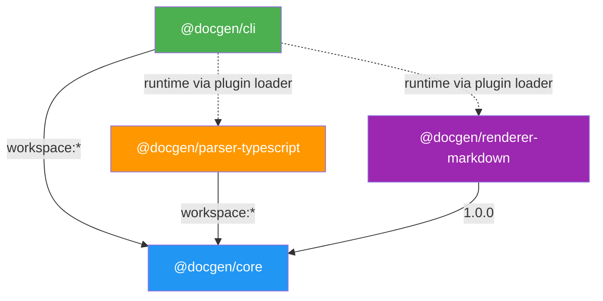
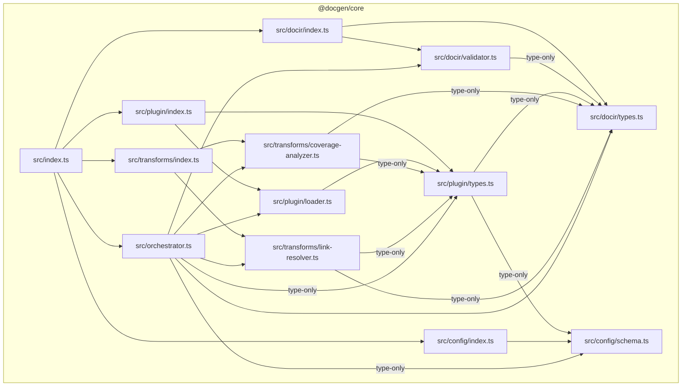
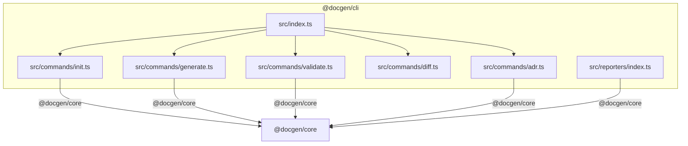

# DocGen — Dependency Graph

> Analysis of all import relationships across the DocGen monorepo.

---

## 1. Package-Level Dependency Graph



**Key:** Solid arrows = compile-time dependency. Dashed arrows = runtime (dynamic plugin loading).

### Package Dependency Table

| Package | Depends On | Dependency Type |
|---------|-----------|-----------------|
| `@docgen/cli` | `@docgen/core` | Compile-time (workspace:*) |
| `@docgen/parser-typescript` | `@docgen/core` | Compile-time (workspace:*) |
| `@docgen/renderer-markdown` | `@docgen/core` | Compile-time (1.0.0) |
| `@docgen/core` | — | No internal dependencies |

### External Dependencies by Package

| Package | External Deps |
|---------|--------------|
| `@docgen/core` | zod, yaml, glob, chalk, fast-glob |
| `@docgen/cli` | commander, inquirer, chalk, ora |
| `@docgen/parser-typescript` | ts-morph |
| `@docgen/renderer-markdown` | (none beyond @docgen/core) |

---

## 2. File-Level Dependency Graph per Package

### @docgen/core — Internal Imports



#### Detailed Import Edges — @docgen/core

| From | To | Imports | Type-Only? |
|------|-----|---------|------------|
| `orchestrator.ts` | `docir/types.ts` | `DocIR`, `createEmptyDocIR` | Mixed (type + runtime) |
| `orchestrator.ts` | `docir/validator.ts` | `validateDocIR`, `computeAggregateCoverage` | Runtime |
| `orchestrator.ts` | `config/schema.ts` | `DocGenConfig`, `LanguageConfig` | Type-only |
| `orchestrator.ts` | `plugin/types.ts` | `PluginConfig`, `Logger`, `OutputArtifact` | Type-only |
| `orchestrator.ts` | `plugin/loader.ts` | `loadPlugins`, `PluginRegistry` | Mixed |
| `orchestrator.ts` | `transforms/coverage-analyzer.ts` | `CoverageAnalyzer` | Runtime |
| `orchestrator.ts` | `transforms/link-resolver.ts` | `LinkResolver` | Runtime |
| `plugin/types.ts` | `docir/types.ts` | `DocIR`, `SupportedLanguage` | Type-only |
| `plugin/types.ts` | `config/schema.ts` | `DocGenConfig`, `LanguageConfig`, `OutputConfig` | Type-only |
| `plugin/loader.ts` | `plugin/types.ts` | `DocGenPlugin`, `ParserPlugin`, `RendererPlugin`, `TransformerPlugin`, `Logger`, `isParserPlugin`, `isRendererPlugin`, `isTransformerPlugin` | Mixed |
| `docir/validator.ts` | `docir/types.ts` | `DocIR`, `CoverageScore`, `ModuleNode` | Type-only |
| `transforms/coverage-analyzer.ts` | `docir/types.ts` | `DocIR`, `ModuleNode`, `MemberNode`, `CoverageScore` | Type-only |
| `transforms/coverage-analyzer.ts` | `plugin/types.ts` | `TransformerPlugin`, `PluginConfig`, `PluginValidationResult` | Type-only |
| `transforms/link-resolver.ts` | `docir/types.ts` | `DocIR`, `TypeRef` | Type-only |
| `transforms/link-resolver.ts` | `plugin/types.ts` | `TransformerPlugin`, `PluginConfig`, `PluginValidationResult` | Type-only |

### @docgen/cli — Internal Imports



#### Detailed Import Edges — @docgen/cli

| From | To | Imports |
|------|-----|---------|
| `index.ts` | `commands/init.ts` | `initCommand` |
| `index.ts` | `commands/generate.ts` | `generateCommand` |
| `index.ts` | `commands/validate.ts` | `validateCommand` |
| `index.ts` | `commands/diff.ts` | `diffCommand` |
| `index.ts` | `commands/adr.ts` | `adrCommand` |
| `commands/init.ts` | `@docgen/core` | `generateDefaultConfig` |
| `commands/generate.ts` | `@docgen/core` | `loadConfig`, `Orchestrator`, `createConsoleLogger`, `GenerateResult` (type) |
| `commands/validate.ts` | `@docgen/core` | `loadConfig`, `Orchestrator`, `createConsoleLogger`, `ValidateResult` (type) |
| `commands/adr.ts` | `@docgen/core` | `loadConfig` |
| `reporters/index.ts` | `@docgen/core` | `PipelineResult` (type) |

### @docgen/parser-typescript — Imports

| From | To | Imports |
|------|-----|---------|
| `index.ts` | `@docgen/core` | `ParserPlugin`, `ParserInput`, `ParserOutput`, `ParseError`, `ParseStats`, `PluginManifest`, `PluginConfig`, `PluginValidationResult`, `ModuleNode`, `MemberNode`, `MemberKind`, `Visibility`, `ParamNode`, `TypeRef`, `ThrowsNode`, `DocTag`, `DecoratorNode`, `CodeExample`, `GenericParam`, `DependencyRef`, `createEmptyCoverage` |
| `index.ts` | `ts-morph` | `Project`, `SourceFile`, `ClassDeclaration`, `InterfaceDeclaration`, `FunctionDeclaration`, `EnumDeclaration`, `TypeAliasDeclaration`, `MethodDeclaration`, `PropertyDeclaration`, `ConstructorDeclaration`, `ParameterDeclaration`, `GetAccessorDeclaration`, `SetAccessorDeclaration`, `JSDoc`, `JSDocTag`, `Type`, `Scope`, `SyntaxKind`, `Node` |
| `index.ts` | `fast-glob` | default import `fg` |

### @docgen/renderer-markdown — Imports

| From | To | Imports |
|------|-----|---------|
| `index.ts` | `@docgen/core` | `RendererPlugin`, `RendererOutput`, `OutputFile`, `PluginManifest`, `PluginConfig`, `PluginValidationResult`, `DocIR`, `ModuleNode`, `MemberNode`, `CoverageScore` |

---

## 3. Circular Dependencies

**None detected.** The dependency graph is a clean DAG (directed acyclic graph):

```
@docgen/core ← @docgen/parser-typescript
@docgen/core ← @docgen/renderer-markdown
@docgen/core ← @docgen/cli
```

Within `@docgen/core`, all imports flow in one direction:
- `docir/types.ts` is the leaf (no internal imports)
- `docir/validator.ts` depends only on `docir/types.ts`
- `plugin/types.ts` depends on `docir/types.ts` and `config/schema.ts`
- `plugin/loader.ts` depends on `plugin/types.ts`
- `transforms/*` depend on `docir/types.ts` and `plugin/types.ts`
- `orchestrator.ts` depends on all submodules (top of the tree)
- `index.ts` re-exports everything

---

## 4. Architecture Summary

```
┌─────────────────────────────────────────────────────────────┐
│                       @docgen/cli                           │
│  ┌──────┐ ┌──────────┐ ┌──────────┐ ┌──────┐ ┌─────┐     │
│  │ init │ │ generate │ │ validate │ │ diff │ │ adr │     │
│  └───┬──┘ └────┬─────┘ └────┬─────┘ └──┬───┘ └──┬──┘     │
│      └──────────┴────────────┴──────────┴────────┘         │
└──────────────────────────┬──────────────────────────────────┘
                           │
              ┌────────────▼────────────┐
              │      @docgen/core       │
              │  ┌───────────────────┐  │
              │  │   Orchestrator    │  │
              │  │ (parse→transform  │  │
              │  │    →render)       │  │
              │  └─────────┬────────┘  │
              │            │            │
              │  ┌─────────▼────────┐  │
              │  │ Plugin Registry  │  │
              │  │ (loader.ts)      │  │
              │  └─────────┬────────┘  │
              │            │            │
              │  ┌─────────▼────────┐  │
              │  │    DocIR Types   │  │
              │  │ (types.ts)       │  │
              │  └──────────────────┘  │
              │                        │
              │  ┌──────────────────┐  │
              │  │  Config Schema   │  │
              │  │ (schema.ts)      │  │
              │  └──────────────────┘  │
              │                        │
              │  ┌──────────────────┐  │
              │  │   Transforms     │  │
              │  │ • CoverageAnalyzer│ │
              │  │ • LinkResolver   │  │
              │  └──────────────────┘  │
              └───────┬────────┬───────┘
                      │        │
         ┌────────────▼─┐  ┌──▼────────────────┐
         │ @docgen/      │  │ @docgen/           │
         │ parser-       │  │ renderer-          │
         │ typescript    │  │ markdown           │
         │ (ts-morph)    │  │ (GFM output)       │
         └───────────────┘  └────────────────────┘
```
