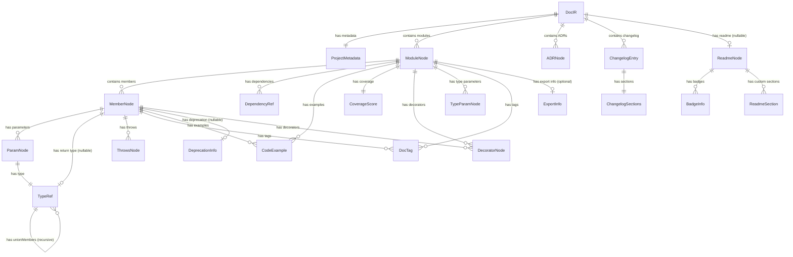

# DocIR Specification

> **Version:** 1.0.0
> **Source of truth:** `packages/core/src/docir/types.ts` and `packages/core/src/docir/validator.ts`

---

## 1. Introduction

**DocIR** (Document Intermediate Representation) is the single contract between all parsers and all renderers in DocGen. Every parser MUST produce a valid DocIR. Every renderer MUST consume a valid DocIR. Nothing else is allowed to cross the parser/renderer boundary.

DocIR is a JSON-serializable tree that captures the full documentable surface of a software project: its modules, members, parameters, types, ADRs, changelog entries, and README content. By normalizing every source language into one canonical shape, DocIR lets DocGen add new input languages and output formats without any combinatorial coupling.

---

## 2. Design Principles

| Principle | Rationale |
|---|---|
| **Language-agnostic** | A single IR works for Java, TypeScript, Python, and any future language. Parsers handle language-specific concerns; the IR does not. |
| **Lossless** | Every documentable artifact from source code (parameters, types, generics, decorators, visibility, deprecation, cross-references) has a dedicated field. No information is discarded during parsing. |
| **Serializable** | The entire DocIR is valid JSON. It can be written to disk, cached, diffed, transmitted over HTTP, and round-tripped without loss. |
| **Validatable** | A full Zod schema (`DocIRSchema`) enforces structural correctness at runtime. A semantic validation pass (`validateDocIR()`) catches duplicate IDs and broken cross-references. |

---

## 3. Complete Type Reference

### 3.1 DocIR (top-level root)

**Purpose:** The root container for the entire documentation model of a project.

| Field | Type | Required | Description |
|---|---|---|---|
| `metadata` | `ProjectMetadata` | Yes | Project-level metadata (name, version, languages, timestamps). |
| `modules` | `ModuleNode[]` | Yes | All documentable units (classes, interfaces, namespaces, etc.). |
| `adrs` | `ADRNode[]` | Yes | Architecture Decision Records. |
| `changelog` | `ChangelogEntry[]` | Yes | Version-by-version changelog entries. |
| `readme` | `ReadmeNode \| null` | Yes | Project README content, or `null` if none. |

**Validation rules:**
- `metadata.name` must be a non-empty string (`z.string().min(1)`).
- `modules`, `adrs`, and `changelog` must be arrays (may be empty).
- `readme` must be a valid `ReadmeNode` object or `null`.

**JSON example:**

```json
{
  "metadata": {
    "name": "my-project",
    "version": "2.1.0",
    "description": "An example project",
    "languages": ["typescript"],
    "repository": "https://github.com/org/my-project",
    "generatedAt": "2025-03-15T10:30:00.000Z",
    "generatorVersion": "1.0.0"
  },
  "modules": [],
  "adrs": [],
  "changelog": [],
  "readme": null
}
```

---

### 3.2 ProjectMetadata

**Purpose:** Captures project-level information sourced from configuration files and git.

| Field | Type | Required | Description |
|---|---|---|---|
| `name` | `string` | Yes | Project name. Must be non-empty. |
| `version` | `string` | Yes | Semantic version string of the project. |
| `description` | `string` | No | Short project description. |
| `languages` | `SupportedLanguage[]` | Yes | Languages present in the project. |
| `repository` | `string` | No | Repository URL (e.g., GitHub). |
| `generatedAt` | `string` | Yes | ISO 8601 timestamp of when the DocIR was generated. |
| `generatorVersion` | `string` | Yes | Version of the DocGen generator that produced this IR. |

**Validation rules:**
- `name`: `z.string().min(1)` -- must be non-empty.
- `version`, `generatedAt`, `generatorVersion`: `z.string()` -- required, no length constraint.
- `languages`: `z.array(z.enum(["java", "typescript", "python"]))`.
- `description`, `repository`: `z.string().optional()`.

**JSON example:**

```json
{
  "name": "docgen-core",
  "version": "1.0.0",
  "description": "Core documentation generation library",
  "languages": ["typescript", "java"],
  "repository": "https://github.com/org/docgen",
  "generatedAt": "2025-03-15T10:30:00.000Z",
  "generatorVersion": "1.0.0"
}
```

---

### 3.3 SupportedLanguage

**Purpose:** Enumerates the programming languages that DocGen parsers can process.

**Type:** `"java" | "typescript" | "python"`

**Zod schema:** `z.enum(["java", "typescript", "python"])`

There is no dedicated object for this type. It appears as a string literal union wherever a language value is required (e.g., `ProjectMetadata.languages`, `ModuleNode.language`).

---

### 3.4 ModuleNode

**Purpose:** Represents a single documentable unit: a class, interface, module, namespace, enum, type alias, or standalone function.

| Field | Type | Required | Description |
|---|---|---|---|
| `id` | `string` | Yes | Fully qualified name (unique across the project). Min length 1. |
| `name` | `string` | Yes | Short (unqualified) name. Min length 1. |
| `filePath` | `string` | Yes | Relative path to the source file. Min length 1. |
| `language` | `SupportedLanguage` | Yes | Source language of this module. |
| `kind` | `ModuleKind` | Yes | What kind of construct this module represents. |
| `description` | `string` | Yes | Human-readable description (may be empty string). |
| `tags` | `DocTag[]` | Yes | JSDoc/Javadoc/docstring tags attached to the module. |
| `members` | `MemberNode[]` | Yes | Methods, properties, fields, etc. inside the module. |
| `dependencies` | `DependencyRef[]` | Yes | Imports, injections, and inheritance dependencies. |
| `examples` | `CodeExample[]` | Yes | Code examples demonstrating module usage. |
| `coverage` | `CoverageScore` | Yes | Documentation coverage metrics for this module. |
| `decorators` | `DecoratorNode[]` | Yes | Decorators/annotations applied to the module. |
| `typeParameters` | `TypeParamNode[]` | Yes | Generic type parameters (e.g., `<T extends Base>`). |
| `extends` | `string` | No | Name of the parent class, if any. |
| `implements` | `string[]` | No | Names of implemented interfaces, if any. |
| `exports` | `ExportInfo` | No | Export information (default, named, re-export). |

**ModuleKind enum values:** `"class"` | `"interface"` | `"module"` | `"namespace"` | `"enum"` | `"type-alias"` | `"function"`

**Validation rules:**
- `id`, `name`, `filePath`: `z.string().min(1)` -- must each be non-empty.
- `language`: `z.enum(["java", "typescript", "python"])`.
- `kind`: `z.enum(["class", "interface", "module", "namespace", "enum", "type-alias", "function"])`.
- `description`: `z.string()` -- required but may be empty.
- All array fields (`tags`, `members`, `dependencies`, `examples`, `decorators`, `typeParameters`): required arrays; each element validated by its own schema.
- `extends`: `z.string().optional()`.
- `implements`: `z.array(z.string()).optional()`.
- `exports`: optional; when present, validated by `ExportInfo` schema.

**JSON example:**

```json
{
  "id": "com.example.UserService",
  "name": "UserService",
  "filePath": "src/services/UserService.ts",
  "language": "typescript",
  "kind": "class",
  "description": "Handles user CRUD operations and authentication.",
  "tags": [
    { "tag": "see", "description": "AuthService for token management" }
  ],
  "members": [],
  "dependencies": [
    { "name": "DatabaseClient", "source": "../db/client", "kind": "import" },
    { "name": "BaseService", "source": "./BaseService", "kind": "inheritance" }
  ],
  "examples": [
    {
      "title": "Create a user",
      "language": "typescript",
      "code": "const svc = new UserService(db);\nawait svc.create({ name: 'Alice' });",
      "description": "Basic user creation flow."
    }
  ],
  "coverage": {
    "overall": 72,
    "breakdown": {
      "description": true,
      "parameters": 80,
      "returnType": true,
      "examples": true,
      "throws": 0,
      "members": 66
    },
    "undocumented": ["internalSync", "migrateOldSchema"]
  },
  "decorators": [
    { "name": "Injectable", "arguments": {}, "raw": "@Injectable()" }
  ],
  "typeParameters": [],
  "extends": "BaseService",
  "implements": ["ICrudService", "IAuditable"],
  "exports": {
    "isDefault": true,
    "isNamed": false
  }
}
```

---

### 3.5 MemberNode

**Purpose:** Represents an individual member inside a module -- a method, property, field, constructor, getter, setter, index signature, or enum member.

| Field | Type | Required | Description |
|---|---|---|---|
| `name` | `string` | Yes | Member name. Min length 1. |
| `kind` | `MemberKind` | Yes | What kind of member this is. |
| `visibility` | `Visibility` | Yes | Access level. |
| `isStatic` | `boolean` | Yes | Whether the member is static. |
| `isAbstract` | `boolean` | Yes | Whether the member is abstract. |
| `isAsync` | `boolean` | Yes | Whether the member is async. |
| `signature` | `string` | Yes | Full type signature as a human-readable string. |
| `description` | `string` | Yes | Human-readable description (may be empty). |
| `parameters` | `ParamNode[]` | Yes | Function/method parameters. Empty for non-callable members. |
| `returnType` | `TypeRef \| null` | Yes | Return type reference, or `null` for void/constructors. |
| `throws` | `ThrowsNode[]` | Yes | Exceptions this member may throw. |
| `tags` | `DocTag[]` | Yes | Documentation tags attached to this member. |
| `examples` | `CodeExample[]` | Yes | Code examples for this member. |
| `deprecated` | `DeprecationInfo \| null` | Yes | Deprecation info, or `null` if not deprecated. |
| `since` | `string` | No | Version when this member was introduced. |
| `overrides` | `string` | No | Parent class member name that this member overrides. |
| `decorators` | `DecoratorNode[]` | Yes | Decorators/annotations applied to this member. |

**MemberKind enum values:** `"method"` | `"property"` | `"field"` | `"constructor"` | `"getter"` | `"setter"` | `"index-signature"` | `"enum-member"`

**Visibility enum values:** `"public"` | `"protected"` | `"private"` | `"internal"`

**Validation rules:**
- `name`: `z.string().min(1)`.
- `kind`: `z.enum(["method", "property", "field", "constructor", "getter", "setter", "index-signature", "enum-member"])`.
- `visibility`: `z.enum(["public", "protected", "private", "internal"])`.
- `isStatic`, `isAbstract`, `isAsync`: `z.boolean()`.
- `signature`, `description`: `z.string()`.
- `returnType`: `TypeRefSchema.nullable()`.
- `deprecated`: validated as an object with `message` (required), `since` (optional), `replacement` (optional), or `null`.
- `since`, `overrides`: `z.string().optional()`.

**JSON example:**

```json
{
  "name": "findById",
  "kind": "method",
  "visibility": "public",
  "isStatic": false,
  "isAbstract": false,
  "isAsync": true,
  "signature": "async findById(id: string): Promise<User | null>",
  "description": "Retrieves a user by their unique identifier.",
  "parameters": [
    {
      "name": "id",
      "type": {
        "raw": "string",
        "name": "string",
        "isArray": false,
        "isNullable": false,
        "isUnion": false
      },
      "description": "The unique user identifier.",
      "isOptional": false,
      "isRest": false
    }
  ],
  "returnType": {
    "raw": "Promise<User | null>",
    "name": "Promise",
    "typeArguments": [
      {
        "raw": "User | null",
        "name": "User",
        "isArray": false,
        "isNullable": true,
        "isUnion": true,
        "unionMembers": [
          { "raw": "User", "name": "User", "isArray": false, "isNullable": false, "isUnion": false, "link": "com.example.User" },
          { "raw": "null", "name": "null", "isArray": false, "isNullable": true, "isUnion": false }
        ],
        "link": "com.example.User"
      }
    ],
    "isArray": false,
    "isNullable": false,
    "isUnion": false
  },
  "throws": [
    { "type": "DatabaseError", "description": "If the database connection fails." }
  ],
  "tags": [
    { "tag": "param", "name": "id", "description": "The unique user identifier." },
    { "tag": "returns", "description": "The user, or null if not found." }
  ],
  "examples": [
    {
      "title": "Find an existing user",
      "language": "typescript",
      "code": "const user = await svc.findById('abc-123');",
      "description": "Returns the User object when the ID exists."
    }
  ],
  "deprecated": null,
  "since": "1.0.0",
  "decorators": []
}
```

---

### 3.6 ParamNode

**Purpose:** Describes a single parameter of a method, function, or constructor.

| Field | Type | Required | Description |
|---|---|---|---|
| `name` | `string` | Yes | Parameter name. Min length 1. |
| `type` | `TypeRef` | Yes | The parameter's type reference. |
| `description` | `string` | Yes | Human-readable description of the parameter. |
| `isOptional` | `boolean` | Yes | Whether the parameter is optional. |
| `isRest` | `boolean` | Yes | Whether this is a rest/variadic parameter. |
| `defaultValue` | `string` | No | Default value expression, if any. |

**Validation rules:**
- `name`: `z.string().min(1)`.
- `type`: validated by the recursive `TypeRefSchema`.
- `description`: `z.string()` -- required but may be empty.
- `isOptional`, `isRest`: `z.boolean()`.
- `defaultValue`: `z.string().optional()`.

**JSON example:**

```json
{
  "name": "options",
  "type": {
    "raw": "QueryOptions",
    "name": "QueryOptions",
    "isArray": false,
    "isNullable": false,
    "isUnion": false,
    "link": "com.example.QueryOptions"
  },
  "description": "Pagination and filtering options.",
  "isOptional": true,
  "isRest": false,
  "defaultValue": "{}"
}
```

---

### 3.7 TypeRef

**Purpose:** A recursive structure that fully describes a type expression, including generics, unions, arrays, nullability, and cross-references to other modules.

| Field | Type | Required | Description |
|---|---|---|---|
| `raw` | `string` | Yes | The original type string as it appears in source (e.g., `"Promise<User[]>"`). |
| `name` | `string` | Yes | The base type name (e.g., `"Promise"`). |
| `typeArguments` | `TypeRef[]` | No | Generic type arguments (recursive). |
| `isArray` | `boolean` | Yes | Whether this type is an array. |
| `isNullable` | `boolean` | Yes | Whether this type is nullable. |
| `isUnion` | `boolean` | Yes | Whether this type is a union. |
| `unionMembers` | `TypeRef[]` | No | Individual members of a union type (recursive). |
| `link` | `string` | No | Cross-reference to a `ModuleNode.id` within the same DocIR. |

**Validation rules:**
- `TypeRefSchema` is defined with `z.lazy()` to allow recursion.
- `raw`, `name`: `z.string()`.
- `isArray`, `isNullable`, `isUnion`: `z.boolean()`.
- `typeArguments`, `unionMembers`: `z.array(TypeRefSchema).optional()`.
- `link`: `z.string().optional()`.

**JSON example (complex nested type):**

```json
{
  "raw": "Map<string, User[]>",
  "name": "Map",
  "typeArguments": [
    {
      "raw": "string",
      "name": "string",
      "isArray": false,
      "isNullable": false,
      "isUnion": false
    },
    {
      "raw": "User[]",
      "name": "User",
      "isArray": true,
      "isNullable": false,
      "isUnion": false,
      "link": "com.example.User"
    }
  ],
  "isArray": false,
  "isNullable": false,
  "isUnion": false
}
```

---

### 3.8 TypeParamNode

**Purpose:** Represents a generic type parameter declaration (e.g., `T`, `K extends keyof T`).

| Field | Type | Required | Description |
|---|---|---|---|
| `name` | `string` | Yes | The type parameter name (e.g., `"T"`). |
| `constraint` | `string` | No | Constraint clause (e.g., `"extends BaseEntity"`). |
| `default` | `string` | No | Default type value (e.g., `"unknown"`). |

**Validation rules:**
- `name`: `z.string()`.
- `constraint`, `default`: `z.string().optional()`.

**JSON example:**

```json
{
  "name": "T",
  "constraint": "extends BaseEntity",
  "default": "User"
}
```

---

### 3.9 DocTag

**Purpose:** Represents a single documentation tag from JSDoc, Javadoc, or Python docstrings (e.g., `@param`, `@returns`, `@see`).

| Field | Type | Required | Description |
|---|---|---|---|
| `tag` | `string` | Yes | The tag name without the `@` prefix (e.g., `"param"`, `"returns"`). Min length 1. |
| `name` | `string` | No | For `@param`: the parameter name. |
| `type` | `string` | No | For `@param`/`@returns`: the type annotation. |
| `description` | `string` | Yes | The tag's descriptive text. |

**Validation rules:**
- `tag`: `z.string().min(1)`.
- `name`, `type`: `z.string().optional()`.
- `description`: `z.string()`.

**JSON example:**

```json
{
  "tag": "param",
  "name": "userId",
  "type": "string",
  "description": "The unique identifier of the user to fetch."
}
```

---

### 3.10 ThrowsNode

**Purpose:** Documents an exception or error that a member may throw.

| Field | Type | Required | Description |
|---|---|---|---|
| `type` | `string` | Yes | The exception/error type name. |
| `description` | `string` | Yes | When/why this exception is thrown. |

**Validation rules:**
- `type`: `z.string()`.
- `description`: `z.string()`.

**JSON example:**

```json
{
  "type": "NotFoundError",
  "description": "Thrown when the requested resource does not exist."
}
```

---

### 3.11 DeprecationInfo

**Purpose:** Captures deprecation metadata for a member that is no longer recommended for use.

| Field | Type | Required | Description |
|---|---|---|---|
| `since` | `string` | No | The version in which the member was deprecated. |
| `message` | `string` | Yes | Human-readable deprecation message. |
| `replacement` | `string` | No | Suggested replacement API or approach. |

**Validation rules:**
- `message`: `z.string()` -- required.
- `since`, `replacement`: `z.string().optional()`.

**JSON example:**

```json
{
  "since": "2.0.0",
  "message": "Use findByUuid() instead. This method will be removed in v3.",
  "replacement": "findByUuid"
}
```

---

### 3.12 CodeExample

**Purpose:** A code snippet demonstrating usage of a module or member.

| Field | Type | Required | Description |
|---|---|---|---|
| `title` | `string` | No | Short title for the example. |
| `language` | `string` | Yes | Language identifier for syntax highlighting (e.g., `"typescript"`, `"java"`). |
| `code` | `string` | Yes | The code snippet itself. |
| `description` | `string` | No | Prose explanation of what the example demonstrates. |

**Validation rules:**
- `language`, `code`: `z.string()`.
- `title`, `description`: `z.string().optional()`.

**JSON example:**

```json
{
  "title": "Batch delete users",
  "language": "typescript",
  "code": "await userService.deleteMany(['id-1', 'id-2']);",
  "description": "Deletes multiple users in a single transaction."
}
```

---

### 3.13 DecoratorNode

**Purpose:** Represents a decorator or annotation applied to a module or member (e.g., `@Injectable()`, `@Controller('/api')`).

| Field | Type | Required | Description |
|---|---|---|---|
| `name` | `string` | Yes | Decorator name without the `@` prefix. |
| `arguments` | `Record<string, unknown>` | Yes | Key-value map of decorator arguments. |
| `raw` | `string` | Yes | The original decorator text as written in source. |

**Validation rules:**
- `name`: `z.string()`.
- `arguments`: `z.record(z.unknown())`.
- `raw`: `z.string()`.

**JSON example:**

```json
{
  "name": "Controller",
  "arguments": { "path": "/api/users" },
  "raw": "@Controller('/api/users')"
}
```

---

### 3.14 DependencyRef

**Purpose:** Records a dependency relationship from a module to another symbol.

| Field | Type | Required | Description |
|---|---|---|---|
| `name` | `string` | Yes | The name of the depended-upon symbol. |
| `source` | `string` | Yes | The import path or module specifier. |
| `kind` | `"import" \| "injection" \| "inheritance"` | Yes | How the dependency is acquired. |

**Kind values:**

| Value | Meaning |
|---|---|
| `"import"` | Standard ES/Python/Java import. |
| `"injection"` | Dependency injection (e.g., constructor injection via IoC container). |
| `"inheritance"` | The module extends or implements the referenced symbol. |

**Validation rules:**
- `name`, `source`: `z.string()`.
- `kind`: `z.enum(["import", "injection", "inheritance"])`.

**JSON example:**

```json
{
  "name": "Logger",
  "source": "@nestjs/common",
  "kind": "injection"
}
```

---

### 3.15 ExportInfo

**Purpose:** Describes how a module is exported from its file.

| Field | Type | Required | Description |
|---|---|---|---|
| `isDefault` | `boolean` | Yes | Whether this is a default export. |
| `isNamed` | `boolean` | Yes | Whether this is a named export. |
| `exportedName` | `string` | No | The exported name if it differs from the module name. |

**Validation rules:**
- `isDefault`, `isNamed`: `z.boolean()`.
- `exportedName`: `z.string().optional()`.

**JSON example:**

```json
{
  "isDefault": false,
  "isNamed": true,
  "exportedName": "UserService"
}
```

---

### 3.16 CoverageScore

**Purpose:** Quantifies how well a module (or the whole project) is documented.

| Field | Type | Required | Description |
|---|---|---|---|
| `overall` | `number` | Yes | Aggregate score from 0 to 100. |
| `breakdown.description` | `boolean` | Yes | Whether the module has a non-empty description. |
| `breakdown.parameters` | `number` | Yes | Percentage (0-100) of parameters that are documented. |
| `breakdown.returnType` | `boolean` | Yes | Whether return types are documented. |
| `breakdown.examples` | `boolean` | Yes | Whether at least one code example exists. |
| `breakdown.throws` | `number` | Yes | Percentage (0-100) of thrown exceptions that are documented. |
| `breakdown.members` | `number` | Yes | Percentage (0-100) of public members that are documented. |
| `undocumented` | `string[]` | Yes | Names of undocumented members. |

**Validation rules:**
- `overall`: `z.number().min(0).max(100)`.
- `breakdown.parameters`, `breakdown.throws`, `breakdown.members`: `z.number().min(0).max(100)`.
- `breakdown.description`, `breakdown.returnType`, `breakdown.examples`: `z.boolean()`.
- `undocumented`: `z.array(z.string())`.

**JSON example:**

```json
{
  "overall": 85,
  "breakdown": {
    "description": true,
    "parameters": 90,
    "returnType": true,
    "examples": true,
    "throws": 50,
    "members": 80
  },
  "undocumented": ["_internalHelper", "legacyMigrate"]
}
```

---

### 3.17 ADRNode

**Purpose:** Represents an Architecture Decision Record -- a lightweight document capturing a significant architectural choice.

| Field | Type | Required | Description |
|---|---|---|---|
| `id` | `string` | Yes | ADR identifier (e.g., `"ADR-001"`). Min length 1. |
| `title` | `string` | Yes | Short title of the decision. Min length 1. |
| `status` | `ADRStatus` | Yes | Current lifecycle status. |
| `context` | `string` | Yes | Background and problem statement. |
| `decision` | `string` | Yes | What was decided and why. |
| `consequences` | `string` | Yes | Expected positive and negative outcomes. |
| `date` | `string` | Yes | ISO 8601 date when the decision was made. |
| `authors` | `string[]` | No | People who authored the ADR. |
| `supersededBy` | `string` | No | ID of the ADR that supersedes this one. |
| `relatedTo` | `string[]` | No | IDs of related ADRs. |
| `tags` | `string[]` | No | Free-form tags for categorization. |

**ADRStatus enum values:** `"proposed"` | `"accepted"` | `"deprecated"` | `"superseded"` | `"rejected"`

**Validation rules:**
- `id`, `title`: `z.string().min(1)`.
- `status`: `z.enum(["proposed", "accepted", "deprecated", "superseded", "rejected"])`.
- `context`, `decision`, `consequences`, `date`: `z.string()`.
- `authors`, `relatedTo`, `tags`: `z.array(z.string()).optional()`.
- `supersededBy`: `z.string().optional()`.

**JSON example:**

```json
{
  "id": "ADR-003",
  "title": "Use DocIR as the intermediate representation",
  "status": "accepted",
  "context": "We need a single contract between parsers and renderers to avoid N*M coupling.",
  "decision": "Introduce DocIR, a JSON-serializable IR that all parsers produce and all renderers consume.",
  "consequences": "All parsers must conform to the DocIR schema. Adding a new renderer requires no parser changes.",
  "date": "2025-01-15",
  "authors": ["alice", "bob"],
  "relatedTo": ["ADR-001", "ADR-002"],
  "tags": ["architecture", "contracts"]
}
```

---

### 3.18 ChangelogEntry

**Purpose:** Represents a single version entry in a project changelog.

| Field | Type | Required | Description |
|---|---|---|---|
| `version` | `string` | Yes | The version string (e.g., `"2.1.0"`). |
| `date` | `string` | Yes | ISO 8601 date of the release. |
| `description` | `string` | No | Optional prose summary of the release. |
| `sections` | `ChangelogSections` | Yes | Categorized lists of changes. |

**Validation rules:**
- `version`, `date`: `z.string()`.
- `description`: `z.string().optional()`.
- `sections`: required object validated by `ChangelogSections` schema.

**JSON example:**

```json
{
  "version": "2.1.0",
  "date": "2025-03-01",
  "description": "Performance improvements and new batch API.",
  "sections": {
    "added": ["Batch delete endpoint", "Rate limiting middleware"],
    "changed": ["Upgraded database driver to v5"],
    "deprecated": ["Legacy /v1/users endpoint"],
    "removed": [],
    "fixed": ["Memory leak in connection pool"],
    "security": ["Patched XSS vulnerability in search"]
  }
}
```

---

### 3.19 ChangelogSections

**Purpose:** Categorizes changes within a single changelog entry following the Keep a Changelog convention.

| Field | Type | Required | Description |
|---|---|---|---|
| `added` | `string[]` | Yes | New features. |
| `changed` | `string[]` | Yes | Changes to existing functionality. |
| `deprecated` | `string[]` | Yes | Newly deprecated features. |
| `removed` | `string[]` | Yes | Removed features. |
| `fixed` | `string[]` | Yes | Bug fixes. |
| `security` | `string[]` | Yes | Security-related changes. |

**Validation rules:**
- All six fields are required arrays of strings: `z.array(z.string())`.

**JSON example:**

```json
{
  "added": ["New export format: PDF"],
  "changed": [],
  "deprecated": [],
  "removed": ["Dropped Node 14 support"],
  "fixed": ["Fixed timezone handling in dates"],
  "security": []
}
```

---

### 3.20 ReadmeNode

**Purpose:** Structured representation of a project README, allowing renderers to produce formatted output.

| Field | Type | Required | Description |
|---|---|---|---|
| `title` | `string` | Yes | The project title. |
| `description` | `string` | Yes | Project description paragraph. |
| `badges` | `BadgeInfo[]` | Yes | Status badges (CI, coverage, version, etc.). |
| `installation` | `string` | No | Installation instructions. |
| `quickStart` | `string` | No | Quick start / getting started guide. |
| `apiSummary` | `string` | No | Auto-generated summary from modules. |
| `contributing` | `string` | No | Contribution guidelines. |
| `license` | `string` | No | License text or identifier. |
| `customSections` | `ReadmeSection[]` | Yes | Additional custom sections in display order. |

**Validation rules:**
- `title`, `description`: `z.string()`.
- `badges`: `z.array(BadgeInfoSchema)`.
- `installation`, `quickStart`, `apiSummary`, `contributing`, `license`: `z.string().optional()`.
- `customSections`: `z.array(ReadmeSectionSchema)`.

**JSON example:**

```json
{
  "title": "DocGen",
  "description": "Automated documentation generation for polyglot projects.",
  "badges": [
    { "label": "build", "value": "passing", "color": "green", "url": "https://ci.example.com" },
    { "label": "coverage", "value": "92%", "color": "brightgreen" }
  ],
  "installation": "npm install @docgen/core",
  "quickStart": "npx docgen init && npx docgen generate",
  "apiSummary": "Exports: DocIR, validateDocIR, createEmptyDocIR",
  "contributing": "See CONTRIBUTING.md for guidelines.",
  "license": "MIT",
  "customSections": [
    { "title": "Architecture", "content": "DocGen uses a pipeline of parsers and renderers.", "order": 1 }
  ]
}
```

---

### 3.21 BadgeInfo

**Purpose:** Describes a single status badge for the README (e.g., build status, coverage percentage).

| Field | Type | Required | Description |
|---|---|---|---|
| `label` | `string` | Yes | Badge label text (e.g., `"build"`). |
| `value` | `string` | Yes | Badge value text (e.g., `"passing"`). |
| `color` | `string` | Yes | Badge color (e.g., `"green"`, `"red"`, `"brightgreen"`). |
| `url` | `string` | No | Link URL when the badge is clicked. |

**Validation rules:**
- `label`, `value`, `color`: `z.string()`.
- `url`: `z.string().optional()`.

**JSON example:**

```json
{
  "label": "npm",
  "value": "v2.1.0",
  "color": "blue",
  "url": "https://www.npmjs.com/package/@docgen/core"
}
```

---

### 3.22 ReadmeSection

**Purpose:** A custom section within the README, allowing arbitrary content in a defined order.

| Field | Type | Required | Description |
|---|---|---|---|
| `title` | `string` | Yes | Section heading. |
| `content` | `string` | Yes | Markdown content of the section. |
| `order` | `number` | Yes | Display order (lower numbers appear first). |

**Validation rules:**
- `title`, `content`: `z.string()`.
- `order`: `z.number()`.

**JSON example:**

```json
{
  "title": "Troubleshooting",
  "content": "If generation fails, check that all source files are saved and the config path is correct.",
  "order": 99
}
```

---

## 4. Relationships Between Nodes

The following Mermaid entity-relationship diagram shows how the top-level `DocIR` connects to its child node types.



**Key observations:**

- `DocIR` is the root; everything hangs off of it.
- `ModuleNode` is the richest node, combining members, dependencies, examples, coverage, decorators, and type parameters.
- `MemberNode` mirrors much of `ModuleNode`'s richness at the individual API level.
- `TypeRef` is the only recursive structure -- it can contain itself via `typeArguments` and `unionMembers`.
- `CoverageScore` appears both at module level and can be aggregated across the project.

---

## 5. Validation

### 5.1 DocIRSchema (Zod)

The `DocIRSchema` is a Zod object schema exported from `validator.ts`. It validates the complete structural shape of a DocIR instance at runtime. Every field, nested object, enum value, array element, and recursive type is checked.

The schema is composed hierarchically from smaller schemas:

| Schema | Validates |
|---|---|
| `TypeRefSchema` | `TypeRef` (recursive via `z.lazy()`) |
| `ParamNodeSchema` | `ParamNode` |
| `DocTagSchema` | `DocTag` |
| `ThrowsNodeSchema` | `ThrowsNode` |
| `CodeExampleSchema` | `CodeExample` |
| `DecoratorNodeSchema` | `DecoratorNode` |
| `CoverageScoreSchema` | `CoverageScore` |
| `MemberNodeSchema` | `MemberNode` |
| `ModuleNodeSchema` | `ModuleNode` |
| `ADRNodeSchema` | `ADRNode` |
| `ChangelogEntrySchema` | `ChangelogEntry` |
| `ReadmeNodeSchema` | `ReadmeNode` |
| `DocIRSchema` | `DocIR` (top-level, composes all above) |

### 5.2 validateDocIR(docir: unknown): ValidationResult

This is the primary validation entry point. It performs two phases:

**Phase 1 -- Schema validation:**
Calls `DocIRSchema.safeParse(docir)`. If the parse fails, it returns immediately with `valid: false` and an array of `ValidationError` objects mapped from Zod issues.

**Phase 2 -- Semantic validation (only runs if Phase 1 passes):**

| Check | Severity | Description |
|---|---|---|
| Duplicate module ID detection | Warning | Iterates all `modules` and flags any `id` that appears more than once. |
| Broken cross-reference detection | Warning | For every `MemberNode.returnType` that has a `link`, verifies the target `ModuleNode.id` exists in the IR. |
| Duplicate ADR ID detection | Warning | Iterates all `adrs` and flags any `id` that appears more than once. |

Semantic issues are reported as **warnings**, not errors, because the data is structurally valid but may contain logical inconsistencies.

### 5.3 ValidationResult

```typescript
interface ValidationResult {
  valid: boolean;          // true if schema validation passed
  errors: ValidationError[];   // empty when valid is true
  warnings: ValidationWarning[]; // semantic warnings (may be non-empty even when valid is true)
}
```

### 5.4 ValidationError

```typescript
interface ValidationError {
  path: string;    // Dot-separated path to the invalid field (e.g., "modules.0.name")
  message: string; // Human-readable error message
  code: string;    // Zod error code (e.g., "invalid_type", "too_small")
}
```

### 5.5 ValidationWarning

```typescript
interface ValidationWarning {
  path: string;        // Dot-separated path to the problematic field
  message: string;     // Human-readable warning message
  suggestion?: string; // Optional suggestion for how to fix the issue
}
```

---

## 6. Coverage Scoring Algorithm

### 6.1 Module-Level Scoring

The `CoverageScore.overall` field stores a value from 0 to 100 for each module. The recommended formula for computing it during parsing is a weighted sum:

| Component | Weight | Scoring |
|---|---|---|
| `description` | 20% | 100 if the module has a non-empty description, else 0 |
| `members` | 30% | Percentage of public members with non-empty descriptions |
| `parameters` | 25% | Percentage of parameters across all members that have descriptions |
| `returnType` | 15% | 100 if return types are documented, else 0 |
| `examples` | 10% | 100 if at least one code example exists, else 0 |

**Formula:**

```
overall = (description * 0.20) + (members * 0.30) + (parameters * 0.25)
        + (returnType * 0.15) + (examples * 0.10)
```

### 6.2 Aggregate Scoring (computeAggregateCoverage)

The `computeAggregateCoverage(modules: ModuleNode[])` function computes a project-wide `CoverageScore` by aggregating across all modules.

**Behavior when `modules` is empty:** Returns a zeroed `CoverageScore` (overall = 0, all breakdown fields false or 0, empty undocumented list).

**Aggregation rules:**

| Field | Aggregation |
|---|---|
| `overall` | Arithmetic mean of all module `overall` scores, rounded to nearest integer. |
| `breakdown.description` | `true` if more than 50% of modules have `description = true`. |
| `breakdown.parameters` | Arithmetic mean of all module `parameters` scores, rounded. |
| `breakdown.returnType` | `true` if more than 50% of modules have `returnType = true`. |
| `breakdown.examples` | `true` if more than 50% of modules have `examples = true`. |
| `breakdown.throws` | Hard-coded to `0` in the current implementation. |
| `breakdown.members` | Arithmetic mean of all module `members` scores, rounded. |
| `undocumented` | Flat list of all undocumented members, qualified with their module ID (e.g., `"com.example.UserService.internalSync"`). |

### 6.3 Threshold Logic

The boolean breakdown fields (`description`, `returnType`, `examples`) use a **majority threshold** at the aggregate level: they are `true` only when strictly more than 50% of modules satisfy the condition. This means a project with exactly half its modules documented will report `false`.

---

## 7. Factory Functions

### 7.1 createEmptyDocIR(metadata)

**Signature:**

```typescript
function createEmptyDocIR(
  metadata: Partial<ProjectMetadata> & { name: string }
): DocIR
```

**Purpose:** Creates a minimal, valid DocIR with empty collections and sensible defaults. Useful as a starting point for parsers.

**Default behavior:**

| Field | Default |
|---|---|
| `metadata.name` | From input (required). |
| `metadata.version` | `"0.0.0"` if not provided. |
| `metadata.description` | From input, or `undefined`. |
| `metadata.languages` | `[]` if not provided. |
| `metadata.repository` | From input, or `undefined`. |
| `metadata.generatedAt` | `new Date().toISOString()` (current timestamp). |
| `metadata.generatorVersion` | `"1.0.0"` (hard-coded). |
| `modules` | `[]` |
| `adrs` | `[]` |
| `changelog` | `[]` |
| `readme` | `null` |

**Example usage:**

```typescript
const ir = createEmptyDocIR({ name: "my-project", languages: ["typescript"] });
// ir.metadata.version === "0.0.0"
// ir.modules === []
// ir.readme === null
```

### 7.2 createEmptyCoverage()

**Signature:**

```typescript
function createEmptyCoverage(): CoverageScore
```

**Purpose:** Creates a zeroed-out coverage score. Useful as a default when a parser has not yet computed coverage.

**Returned value:**

```json
{
  "overall": 0,
  "breakdown": {
    "description": false,
    "parameters": 0,
    "returnType": false,
    "examples": false,
    "throws": 0,
    "members": 0
  },
  "undocumented": []
}
```

---

## 8. Versioning Strategy

### Current Version

The current DocIR schema version is **1.0.0**, as set by the `createEmptyDocIR` factory function in the `generatorVersion` field.

### Version Tracking

Schema evolution is tracked through the `ProjectMetadata.generatorVersion` field. Every DocIR instance records the version of the generator that produced it. This allows consumers to:

1. **Detect version mismatches** -- A renderer can check whether it supports the generator version of a given DocIR.
2. **Migrate forward** -- Future tooling can read `generatorVersion` and apply transformations to upgrade older DocIR instances to the current schema.
3. **Cache invalidation** -- A version change signals that cached DocIR outputs should be regenerated.

### Compatibility Guarantees

- **Patch versions** (1.0.x): Bug fixes to validation logic or factory defaults. No schema shape changes.
- **Minor versions** (1.x.0): New optional fields may be added. Existing fields are never removed or have their types changed. Older DocIR instances remain valid.
- **Major versions** (x.0.0): Breaking changes to required fields, type changes, or field removals. Migration tooling will be provided.
