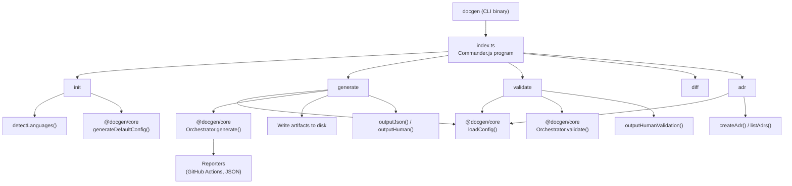

# @docgen/cli -- Technical Reference

## 1. Overview

The `@docgen/cli` package is the command-line interface for DocGen, a universal multi-language documentation generator. It serves as the user-facing entry point that orchestrates the full documentation pipeline -- from project initialization and source code parsing to documentation generation, validation, and architecture decision record management.

| Field         | Value                                                        |
|---------------|--------------------------------------------------------------|
| npm package   | `@docgen/cli` v1.0.0                                        |
| Binary        | `docgen`                                                     |
| Entry point   | `dist/index.js` (compiled from `src/index.ts`)               |
| Dependencies  | `@docgen/core` (workspace), `commander` ^12.0.0, `inquirer` ^9.2.0, `chalk` ^4.1.2, `ora` ^5.4.1 |

The CLI registers five top-level commands via Commander.js and delegates all heavy lifting (config loading, orchestration, validation) to `@docgen/core`.

## 2. Installation & Setup

Global installation:

```bash
npm install -g @docgen/cli
```

One-off execution via npx:

```bash
npx docgen
```

After installation, initialize a project:

```bash
cd my-project
docgen init
```

This creates a `.docgen.yaml` configuration file with auto-detected language settings.

## 3. Architecture

### 3.1 Command Registration Pattern

The CLI entrypoint (`src/index.ts`, 57 lines) uses Commander.js to declare a program named `"docgen"` with version `"1.0.0"`. Each command is registered on the `program` instance with its options and an action handler imported from the `commands/` directory. The file ends with `program.parse()` to hand off to Commander's argument parser.

The shebang line `#!/usr/bin/env node` ensures the compiled output is directly executable as a CLI binary.

### 3.2 Source Layout

```
src/
  index.ts              # CLI entrypoint, command registration (57 lines)
  commands/
    init.ts             # Project initialization (116 lines)
    generate.ts         # Documentation generation (118 lines)
    validate.ts         # Coverage validation (90 lines)
    diff.ts             # Doc diff against git ref (17 lines, stub)
    adr.ts              # Architecture Decision Records (114 lines)
  reporters/
    index.ts            # CI output formatters (82 lines)
```

### 3.3 Structural Diagram



### 3.4 Dependency Flow

All commands that interact with the documentation pipeline depend on `@docgen/core` for:

- **`loadConfig(workDir)`** -- reads and parses `.docgen.yaml`
- **`Orchestrator`** -- central pipeline runner for generation and validation
- **`createConsoleLogger(verbose)`** -- structured logging with optional verbose mode
- **`generateDefaultConfig(opts)`** -- produces a default YAML config string

The `chalk` dependency is imported by the reporters module. `inquirer` and `ora` are declared dependencies available for interactive prompts and spinners (reserved for future interactive flows).

## 4. Public API Reference -- Commands

---

### 4.1 `docgen init`

**Source:** `src/commands/init.ts` (116 lines)

**Signature:**

```typescript
interface InitOptions {
  force: boolean;
}

async function initCommand(options: InitOptions): Promise<void>
```

**Options:**

| Flag      | Type    | Default | Description                           |
|-----------|---------|---------|---------------------------------------|
| `--force` | boolean | `false` | Overwrite existing `.docgen.yaml`     |

#### Behavior

1. Resolves the working directory via `process.cwd()`.
2. Checks for an existing `.docgen.yaml`. If found and `--force` is not set, prints an error and exits with code 1.
3. Runs `detectLanguages(workDir)` to auto-detect project languages.
4. If no languages are detected, warns the user and defaults to `{ name: "typescript", source: "src" }`.
5. Derives `projectName` from `path.basename(workDir)`.
6. Calls `generateDefaultConfig({ projectName, languages })` from `@docgen/core` to produce the YAML content.
7. Writes `.docgen.yaml` to disk.
8. Prints next-step instructions.

#### Language Detection Algorithm

The `detectLanguages(workDir)` function probes the filesystem in a fixed order:

| Language   | Directories checked          | File extensions   | Fallback                      |
|------------|------------------------------|-------------------|-------------------------------|
| Java       | `src/main/java`, `src`       | `.java`           | None                          |
| TypeScript | `src`, `lib`, `packages`     | `.ts`, `.tsx`     | `tsconfig.json` in root       |
| Python     | `src`, `lib`, `.`            | `.py`             | None                          |

For each language, the algorithm iterates through the candidate directories in order, stopping at the first match. The function returns an array of `{ name: string; source: string }` objects.

#### `hasFilesWithExtension(dir, ext, depth = 3)`

A recursive file scanner that searches for files matching a given extension:

- **Max depth:** 3 levels (configurable via the `depth` parameter).
- **Exclusions:** Skips directories starting with `.` and `node_modules`.
- **Error handling:** Returns `false` on any filesystem error (e.g., permission denied).
- **Short-circuit:** Returns `true` as soon as the first matching file is found.

#### Generated Config

The generated `.docgen.yaml` is produced by `@docgen/core`'s `generateDefaultConfig()`, which accepts:

```typescript
{
  projectName: string;
  languages: Array<{ name: string; source: string }>;
}
```

#### Console Output

```
Detected languages: typescript, python

Created .docgen.yaml with 2 language(s) configured.

Next steps:
  1. Review .docgen.yaml and adjust paths/settings
  2. Run: docgen validate     (check doc coverage)
  3. Run: docgen generate     (generate documentation)
```

#### Exit Codes

| Code | Condition                                          |
|------|----------------------------------------------------|
| 0    | Config created successfully                        |
| 1    | `.docgen.yaml` exists and `--force` was not passed |

---

### 4.2 `docgen generate`

**Source:** `src/commands/generate.ts` (118 lines)

**Signature:**

```typescript
interface GenerateOptions {
  format?: string[];
  output?: string;
  json?: boolean;
  verbose?: boolean;
  watch?: boolean;
}

async function generateCommand(options: GenerateOptions): Promise<void>
```

**Options:**

| Flag                    | Type     | Default | Description                                        |
|-------------------------|----------|---------|----------------------------------------------------|
| `-f, --format <formats...>` | string[] | (all enabled) | Output format(s): `markdown`, `html`, `pdf`, `confluence` |
| `-o, --output <dir>`   | string   | (from config) | Override output directory                       |
| `--json`                | boolean  | `false` | Output result as JSON (for CI pipelines)            |
| `-v, --verbose`         | boolean  | `false` | Enable verbose logging                              |
| `-w, --watch`           | boolean  | `false` | Watch for changes and regenerate                    |

#### Pipeline

1. **Load config:** `loadConfig(workDir)` reads `.docgen.yaml` from the current directory.
2. **Apply output override:** If `--output` is specified, overrides `config.output.markdown.outputDir` and `config.output.html.outputDir` by appending `"markdown"` and `"html"` subdirectories respectively.
3. **Create orchestrator:** Instantiates `new Orchestrator({ config, workDir, logger })`.
4. **Generate:** Calls `orchestrator.generate(options.format)`, which runs the full parsing and rendering pipeline.
5. **Write artifacts:** Iterates over `result.artifacts`, resolves each file path via `getOutputDir()`, creates directories as needed, and writes content to disk. String content is written as UTF-8; binary content (e.g., PDF buffers) is written as raw bytes.
6. **Output:** Delegates to `outputJson()` or `outputHuman()` depending on the `--json` flag.
7. **Exit code:** If `config.validation.coverage.enforce` is `true` and `result.coverage.passed` is `false`, exits with code 1.

#### `getOutputDir(config, format)`

Routes artifact output to the correct directory based on format:

```typescript
function getOutputDir(config: any, format: string): string {
  switch (format) {
    case "markdown": return config.output.markdown.outputDir;
    case "html":     return config.output.html.outputDir;
    case "pdf":      return config.output.pdf.outputDir;
    default:         return "docs";
  }
}
```

#### JSON Output Schema (`outputJson`)

When `--json` is passed, the command writes to stdout:

```json
{
  "success": true,
  "modules": 12,
  "artifacts": 24,
  "coverage": {
    "overall": 87.5,
    "threshold": 80,
    "passed": true
  },
  "duration": 1523
}
```

Fields:

| Field       | Type    | Description                                |
|-------------|---------|--------------------------------------------|
| `success`   | boolean | Always `true` (errors throw before this)   |
| `modules`   | number  | Count of `result.docir.modules`            |
| `artifacts` | number  | Count of `result.artifacts`                |
| `coverage`  | object  | Coverage result from the orchestrator      |
| `duration`  | number  | Pipeline execution time in milliseconds    |

#### Human Output Format (`outputHuman`)

When `--json` is not passed, the command renders a bordered summary box:

```
+======================================+
|     DocGen - Generation Complete     |
+======================================+

  Modules parsed:    12
  Files generated:   24
  Coverage:          87.5% (threshold: 80%)
  Status:            PASSED
  Duration:          1523ms
```

#### Error Handling

All errors are caught in a try/catch block. The error message is logged via `logger.error()`. When `--verbose` is set, the full error object (including stack trace) is printed to stderr. The process then exits with code 1.

#### Exit Codes

| Code | Condition                                                                 |
|------|---------------------------------------------------------------------------|
| 0    | Generation completed and coverage passed (or enforcement is off)          |
| 1    | Unhandled error, or `config.validation.coverage.enforce && !result.coverage.passed` |

---

### 4.3 `docgen validate`

**Source:** `src/commands/validate.ts` (90 lines)

**Signature:**

```typescript
interface ValidateOptions {
  json?: boolean;
  threshold?: number;
  verbose?: boolean;
}

async function validateCommand(options: ValidateOptions): Promise<void>
```

**Options:**

| Flag                   | Type   | Default      | Description                          |
|------------------------|--------|--------------|--------------------------------------|
| `--json`               | boolean| `false`      | Output result as JSON                |
| `--threshold <number>` | number | (from config)| Override coverage threshold (parsed via `parseInt`) |
| `-v, --verbose`        | boolean| `false`      | Enable verbose logging               |

#### Behavior

1. **Load config:** `loadConfig(workDir)`.
2. **Threshold override:** If `--threshold` is provided, sets `config.validation.coverage.threshold` to the given value.
3. **Create orchestrator:** `new Orchestrator({ config, workDir, logger })`.
4. **Validate:** Calls `orchestrator.validate()` which returns a `ValidateResult`.
5. **Output:** JSON mode outputs the full `ValidateResult` via `JSON.stringify(result, null, 2)`. Human mode calls `outputHumanValidation()`.
6. **Exit code:** Exits 1 if coverage failed or any violations have `level === "error"`.

#### JSON Output

When `--json` is passed, the full `ValidateResult` object is serialized to stdout. This includes all coverage data, the undocumented items list, and the full violations array.

#### Human Output Format (`outputHumanValidation`)

```
+======================================+
|    DocGen - Validation Report        |
+======================================+

  Coverage:    87.5% (threshold: 80%)
  Status:      PASSED

  Undocumented (3):
    - MyClass.helperMethod
    - utils.formatDate
    - config.DEFAULT_TIMEOUT

  Errors (1):
    x [missing-description] Module 'Parser' has no description

  Warnings (2):
    ! [short-description] Function 'run' description is under 10 chars
    ! [no-examples] Class 'Builder' has no usage examples

  Duration: 842ms
```

Display limits:

| Section        | Max items shown | Overflow message                    |
|----------------|-----------------|-------------------------------------|
| Undocumented   | 20              | `... and N more`                    |
| Errors         | 10              | (silently truncated)                |
| Warnings       | 10              | (silently truncated)                |

#### Exit Codes

| Code | Condition                                                              |
|------|------------------------------------------------------------------------|
| 0    | Coverage passed and no error-level violations                          |
| 1    | `!result.coverage.passed` or `result.violations.some(v => v.level === "error")` |

---

### 4.4 `docgen diff`

**Source:** `src/commands/diff.ts` (17 lines)

**Signature:**

```typescript
interface DiffOptions {
  base: string;
  json?: boolean;
}

async function diffCommand(options: DiffOptions): Promise<void>
```

**Options:**

| Flag            | Type   | Default    | Description                       |
|-----------------|--------|------------|-----------------------------------|
| `--base <ref>`  | string | `"HEAD~1"` | Git ref to compare against        |
| `--json`        | boolean| (unused)   | Output diff as JSON               |

#### Status: Stub Implementation

This command currently prints a placeholder message and does not perform any actual diff logic:

```
Comparing documentation against HEAD~1...

[diff] This feature requires git integration and a cached DocIR snapshot.
[diff] Full implementation coming in Phase 2.
```

#### Planned Implementation (Phase 2)

1. Load current DocIR (from `docgen generate --dry-run`).
2. Checkout the base git ref and generate a DocIR snapshot.
3. Deep diff the two DocIR structures.
4. Report: added modules, removed modules, changed members, coverage delta.

---

### 4.5 `docgen adr <action> [title]`

**Source:** `src/commands/adr.ts` (114 lines)

**Signature:**

```typescript
interface AdrOptions {
  status: string;
}

async function adrCommand(
  action: string,
  title: string | undefined,
  options: AdrOptions
): Promise<void>
```

**Arguments:**

| Argument   | Type   | Required | Description                            |
|------------|--------|----------|----------------------------------------|
| `<action>` | string | Yes      | Action to perform: `new`, `list`       |
| `[title]`  | string | No       | ADR title (required for `new` action)  |

**Options:**

| Flag               | Type   | Default      | Description   |
|--------------------|--------|--------------|---------------|
| `-s, --status`     | string | `"proposed"` | ADR status    |

#### ADR Directory Resolution

1. Attempts to load config via `loadConfig(workDir)` and uses `config.adr.directory`.
2. If config loading fails (no `.docgen.yaml`), falls back to `"docs/decisions"`.
3. The directory is resolved to an absolute path via `path.resolve(workDir, ...)`.

#### Action: `new`

Creates a new Architecture Decision Record file.

**Validation:** If `title` is not provided, prints an error and exits with code 1.

**ID Assignment:** Reads all files in the ADR directory matching the pattern `/^ADR-\d+/`, counts them, and assigns the next sequential number. IDs are zero-padded to three digits: `ADR-001`, `ADR-002`, etc.

**File Naming:** The file name is constructed as:

```
ADR-NNN-kebab-case-title.md
```

Where the title is lowercased and non-alphanumeric characters are replaced with hyphens.

**Template:** The generated Markdown file contains:

```markdown
# ADR-NNN: Title

## Status

proposed

## Date

YYYY-MM-DD

## Context

<!-- What is the issue that we're seeing that is motivating this decision or change? -->

## Decision

<!-- What is the change that we're proposing and/or doing? -->

## Consequences

<!-- What becomes easier or more difficult to do because of this change? -->

## Related

<!-- Links to related ADRs, issues, or documents -->
```

The date is set to the current date in ISO format (date portion only). The status is taken from the `--status` option.

**Output:** Prints the created file path.

#### Action: `list`

Lists all ADR files in the configured directory.

**Behavior:**

1. If the directory does not exist, prints a message suggesting the `new` action and returns.
2. Reads all `.md` files, sorted alphabetically.
3. If no files are found, prints "No ADRs found."
4. For each file, parses the title from the first `# ` heading and the status from the `## Status` section.
5. Displays a formatted table with status (padded to 12 characters) and title.

**Example output:**

```
Architecture Decision Records (3):

  proposed     ADR-001: Use Event Sourcing
  accepted     ADR-002: Adopt TypeScript
  deprecated   ADR-003: Custom ORM Layer
```

#### Action: Unknown

Prints an error message listing available actions and exits with code 1.

---

## 5. Reporters

**Source:** `src/reporters/index.ts` (82 lines)

### Reporter Interface

```typescript
export interface Reporter {
  report(result: PipelineResult): void;
}
```

All reporters accept a `PipelineResult` from `@docgen/core` and produce formatted output for their target environment.

---

### 5.1 `GitHubActionsReporter`

**Class:** `GitHubActionsReporter implements Reporter`

Formats output specifically for GitHub Actions CI environments.

#### Step Summary

Writes a Markdown table to the file specified by the `GITHUB_STEP_SUMMARY` environment variable (if set):

```markdown
## DocGen Report

| Metric   | Value |
|----------|-------|
| Modules  | 12    |
| Members  | 87    |
| Coverage | 85%   |
| Files    | 24    |
| Time     | 1523ms|
```

#### Error Annotations

For each error in `result.errors`, outputs a GitHub Actions error annotation:

```
::error title=DocGen <phase>::<message>
```

#### Low-Coverage Warnings

For each module with `coverage.total < 50`, outputs a warning annotation:

```
::warning file=<filePath>::Low doc coverage (<coverage>%) for <moduleName>
```

#### Output Variables

Sets two GitHub Actions output variables:

```
::set-output name=coverage::<coverageAverage>
::set-output name=modules::<modulesTotal>
```

These can be referenced in subsequent workflow steps.

---

### 5.2 `JsonReporter`

**Class:** `JsonReporter implements Reporter`

Outputs a structured JSON object to stdout for machine consumption.

#### Output Schema

```json
{
  "success": true,
  "stats": {
    "modulesTotal": 12,
    "membersTotal": 87,
    "coverageAverage": 85,
    "filesGenerated": 24,
    "totalTimeMs": 1523
  },
  "errors": [],
  "modules": [
    {
      "id": "mod-001",
      "name": "Parser",
      "coverage": 92,
      "undocumented": ["parseExpression", "tokenize"]
    }
  ]
}
```

| Field      | Type     | Description                                              |
|------------|----------|----------------------------------------------------------|
| `success`  | boolean  | Overall pipeline success status                          |
| `stats`    | object   | Aggregate statistics from the pipeline                   |
| `errors`   | array    | List of pipeline errors with phase and message           |
| `modules`  | array    | Per-module summary: id, name, coverage %, undocumented items |

---

## 6. Configuration

All commands that interact with the documentation pipeline load configuration from `.docgen.yaml` in the current working directory via `loadConfig(workDir)` from `@docgen/core`.

Key configuration sections referenced by the CLI:

| Config path                           | Used by      | Purpose                                    |
|---------------------------------------|--------------|---------------------------------------------|
| `output.markdown.enabled`             | `generate`   | Whether markdown output is active           |
| `output.markdown.outputDir`           | `generate`   | Target directory for markdown files         |
| `output.html.enabled`                 | `generate`   | Whether HTML output is active               |
| `output.html.outputDir`              | `generate`   | Target directory for HTML files             |
| `output.pdf.outputDir`               | `generate`   | Target directory for PDF files              |
| `validation.coverage.threshold`       | `validate`   | Minimum coverage percentage                 |
| `validation.coverage.enforce`         | `generate`   | Whether to fail on insufficient coverage    |
| `adr.directory`                       | `adr`        | Directory for ADR files                     |

The `init` command creates this configuration file. The `diff` command does not currently read config.

---

## 7. Error Handling

### General Pattern

All command handlers (`generate`, `validate`) wrap their logic in a `try/catch` block:

```typescript
try {
  // pipeline logic
} catch (err) {
  logger.error((err as Error).message);
  if (options.verbose) {
    console.error(err);  // full stack trace
  }
  process.exit(1);
}
```

### Logger

The `createConsoleLogger(verbose)` function from `@docgen/core` creates a logger instance. In verbose mode, additional debug-level output is emitted during pipeline execution.

### Verbose Mode

When `-v` or `--verbose` is passed:

- The logger outputs debug-level messages during pipeline execution.
- On error, the full error object (including stack trace) is printed to stderr via `console.error(err)`.

### Exit Code Summary

| Code | Meaning                                                                |
|------|------------------------------------------------------------------------|
| 0    | Command completed successfully, all checks passed                      |
| 1    | Error occurred, or validation/coverage checks failed                   |

Specific exit-1 triggers by command:

| Command    | Exits 1 when                                                        |
|------------|---------------------------------------------------------------------|
| `init`     | `.docgen.yaml` exists without `--force`                             |
| `generate` | Unhandled error, or enforced coverage threshold not met              |
| `validate` | Coverage not passed, or any violation with `level === "error"`       |
| `adr new`  | Title argument not provided                                          |
| `adr`      | Unknown action provided                                              |

---

## 8. Integration Guide

### CI/CD Usage Patterns

#### Basic CI Pipeline

```bash
# Install and validate
npm install -g @docgen/cli
docgen validate --json --threshold 80
```

The `--json` flag produces machine-parseable output suitable for CI log analysis and artifact storage.

#### Generate and Publish

```bash
docgen generate --format markdown html --output ./build/docs --json
```

This generates both markdown and HTML outputs into a single build directory and returns a JSON summary for pipeline consumption.

### JSON Output for Machine Consumption

Both `generate --json` and `validate --json` produce structured JSON on stdout. Exit codes are reliable indicators of success (0) or failure (1), making them suitable for conditional CI steps:

```bash
docgen validate --json > validation-report.json
if [ $? -ne 0 ]; then
  echo "Documentation coverage check failed"
  exit 1
fi
```

### GitHub Actions Integration

The `GitHubActionsReporter` class provides native integration with GitHub Actions:

```yaml
- name: Generate Documentation
  run: docgen generate --format markdown

- name: Check Coverage
  id: docgen
  run: docgen validate --threshold 80
```

The reporter automatically:

1. Writes a formatted summary table to the GitHub Actions step summary.
2. Emits `::error` annotations for pipeline errors, which appear inline in PR diffs.
3. Emits `::warning` annotations for modules with less than 50% documentation coverage.
4. Sets `coverage` and `modules` output variables accessible via `${{ steps.docgen.outputs.coverage }}`.

### ADR Workflow

Architecture Decision Records can be managed directly from the CLI:

```bash
# Create a new ADR
docgen adr new "Adopt Event Sourcing" --status proposed

# List all existing ADRs
docgen adr list
```

ADR files are stored in the directory configured by `adr.directory` in `.docgen.yaml` (default: `docs/decisions`).
