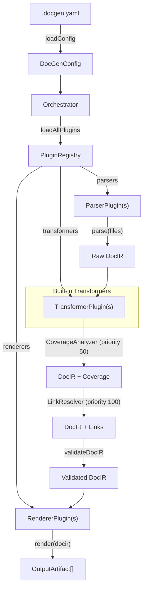

# @docgen/core -- Technical Reference

## 1. Overview

`@docgen/core` is the central engine of the DocGen documentation generation system. It defines the **DocIR** (Document Intermediate Representation), which serves as the universal contract between all parsers and renderers, implements the plugin system that makes DocGen extensible, and provides the orchestrator that drives the full parse-transform-render pipeline.

As the central hub of the DocGen architecture, `@docgen/core` is the only package that every other `@docgen/*` package depends on. Parsers produce DocIR, transformers enrich it, and renderers consume it -- all coordinated through this package.

**Key responsibilities:**

- Define and validate the DocIR data model (the single source of truth for documentation data)
- Provide the plugin system: loading, resolution, registration, and type-safe contracts for parsers, transformers, and renderers
- Supply configuration loading and validation from `.docgen.yaml`
- Run built-in transforms (coverage analysis and cross-reference link resolution)
- Orchestrate the full documentation generation pipeline

| Field            | Value                                                                     |
| ---------------- | ------------------------------------------------------------------------- |
| npm package name | `@docgen/core`                                                            |
| Version          | `1.0.0`                                                                   |
| Entry point      | `dist/index.js`                                                           |
| Type definitions | `dist/index.d.ts`                                                         |
| Description      | Core engine for DocGen -- DocIR types, plugin system, and orchestrator     |

---

## 2. Installation & Setup

### Install

```bash
npm install @docgen/core
```

### Dependencies

| Dependency  | Version    | Purpose                              |
| ----------- | ---------- | ------------------------------------ |
| `zod`       | `^3.23.0`  | Runtime schema validation            |
| `yaml`      | `^2.4.0`   | YAML config file parsing             |
| `glob`      | `^10.3.0`  | File glob pattern matching           |
| `fast-glob` | `^3.3.0`   | High-performance file globbing       |
| `chalk`     | `^4.1.2`   | Terminal color output                 |

### Dev Dependencies

| Dependency    | Version    | Purpose            |
| ------------- | ---------- | ------------------ |
| `typescript`  | `^5.4.0`   | TypeScript compiler|
| `@types/node` | `^20.0.0`  | Node.js type defs  |
| `vitest`      | `^1.6.0`   | Test runner         |

### Peer Dependencies

None. This package is self-contained and does not declare peer dependencies.

### Runtime Requirements

- **Node.js >= 20** (as indicated by `@types/node ^20.0.0`)
- A valid `.docgen.yaml` configuration file in the project root (or an ancestor directory)

---

## 3. Architecture

### Internal Module Structure

```
src/
  index.ts                        # Package entry point; re-exports all public API
  orchestrator.ts                  # Pipeline coordinator (parse -> transform -> render)
  docir/
    types.ts                      # DocIR interfaces, type aliases, and factory functions
    validator.ts                  # Zod schemas, runtime validation, aggregate coverage
    index.ts                      # Barrel export for docir/
  plugin/
    types.ts                      # Plugin interfaces, type guards, Logger, OutputArtifact
    loader.ts                     # Plugin resolution, loading, registration, PluginRegistry
    index.ts                      # Barrel export for plugin/
  config/
    schema.ts                     # Zod config schema, loadConfig, generateDefaultConfig, ConfigError
    index.ts                      # Barrel export for config/
  transforms/
    coverage-analyzer.ts          # Built-in transformer: documentation coverage scoring
    link-resolver.ts              # Built-in transformer: cross-reference link resolution
    index.ts                      # Barrel export for transforms/
```

### Data Flow

1. **Configuration** is loaded from `.docgen.yaml` and validated with Zod.
2. The **Orchestrator** collects plugin names from the config and loads them via the **Plugin Loader**.
3. **Parsers** receive source file paths and produce a raw `DocIR`.
4. **Transformers** (including the built-in `CoverageAnalyzer` and `LinkResolver`) enrich the DocIR sequentially, sorted by priority.
5. The enriched DocIR is **validated** against the Zod schema plus semantic checks.
6. **Renderers** consume the validated DocIR and produce `OutputArtifact[]`.

### Component Interaction Diagram



### Design Patterns

| Pattern                      | Where Used                       | Rationale                                                                                                     |
| ---------------------------- | -------------------------------- | ------------------------------------------------------------------------------------------------------------- |
| **Intermediate Representation** | `DocIR` types                 | Decouples parsers from renderers. Any parser can feed any renderer because they all share the same IR.        |
| **Strategy Pattern**         | Plugin system                    | Parsers, transformers, and renderers are interchangeable strategies selected at runtime via configuration.      |
| **Pipeline Pattern**         | `Orchestrator`                   | The parse-transform-validate-render stages are composed sequentially, each stage feeding the next.             |
| **Registry Pattern**         | `PluginRegistry`                 | Centralized lookup for parsers (by language), transformers (sorted list), and renderers (by format).           |
| **Factory Pattern**          | `createEmptyDocIR`, `createEmptyCoverage` | Provide safe default construction of complex data structures with sensible zero-values.                |
| **Chain of Responsibility**  | Transformer priority ordering    | Transformers are sorted by `priority` and executed in order; each passes its result to the next.               |
| **Type Guard Pattern**       | `isParserPlugin`, `isTransformerPlugin`, `isRendererPlugin` | Runtime discrimination of plugin types without `instanceof`, enabling duck-typing.    |

---

## 4. Public API Reference

### 4.1 DocIR Data Model

#### 4.1.1 `DocIR`

| Field       | Source                         | Description                                                     |
| ----------- | ------------------------------ | --------------------------------------------------------------- |
| **Kind**    | `interface`                    | Top-level document intermediate representation                  |
| **File**    | `src/docir/types.ts:8`        | The complete doc model for a project                            |

```typescript
interface DocIR {
  metadata: ProjectMetadata;
  modules: ModuleNode[];
  adrs: ADRNode[];
  changelog: ChangelogEntry[];
  readme: ReadmeNode | null;
}
```

**Properties:**

| Property    | Type                  | Description                                          |
| ----------- | --------------------- | ---------------------------------------------------- |
| `metadata`  | `ProjectMetadata`     | Project-level metadata extracted from config and git  |
| `modules`   | `ModuleNode[]`        | All documentable units (classes, interfaces, etc.)    |
| `adrs`      | `ADRNode[]`           | Architecture Decision Records                        |
| `changelog` | `ChangelogEntry[]`    | Changelog entries by version                         |
| `readme`    | `ReadmeNode \| null`  | README structure, or null if not generated            |

---

#### 4.1.2 `ProjectMetadata`

| Field    | Source                  | Description                                       |
| -------- | ----------------------- | ------------------------------------------------- |
| **Kind** | `interface`             | Project-level metadata extracted from config + git |
| **File** | `src/docir/types.ts:17` |                                                   |

```typescript
interface ProjectMetadata {
  name: string;
  version: string;
  description?: string;
  languages: SupportedLanguage[];
  repository?: string;
  generatedAt: string;       // ISO 8601
  generatorVersion: string;
}
```

**Properties:**

| Property           | Type                  | Required | Description                              |
| ------------------ | --------------------- | -------- | ---------------------------------------- |
| `name`             | `string`              | Yes      | Project name                             |
| `version`          | `string`              | Yes      | Project version (SemVer)                 |
| `description`      | `string`              | No       | Project description                      |
| `languages`        | `SupportedLanguage[]` | Yes      | Languages used in the project            |
| `repository`       | `string`              | No       | Repository URL                           |
| `generatedAt`      | `string`              | Yes      | ISO 8601 timestamp of generation         |
| `generatorVersion` | `string`              | Yes      | Version of the DocGen generator          |

---

#### 4.1.3 `SupportedLanguage`

| Field    | Source                   | Description        |
| -------- | ------------------------ | ------------------ |
| **Kind** | `type alias`             | Language enum type |
| **File** | `src/docir/types.ts:27`  |                    |

```typescript
type SupportedLanguage = "java" | "typescript" | "python";
```

---

#### 4.1.4 `ModuleNode`

| Field    | Source                   | Description                                              |
| -------- | ------------------------ | -------------------------------------------------------- |
| **Kind** | `interface`              | A documentable unit: class, interface, module, namespace  |
| **File** | `src/docir/types.ts:32`  |                                                          |

```typescript
interface ModuleNode {
  id: string;
  name: string;
  filePath: string;
  language: SupportedLanguage;
  kind: ModuleKind;
  description: string;
  tags: DocTag[];
  members: MemberNode[];
  dependencies: DependencyRef[];
  examples: CodeExample[];
  coverage: CoverageScore;
  decorators: DecoratorNode[];
  typeParameters: TypeParamNode[];
  extends?: string;
  implements?: string[];
  exports?: ExportInfo;
}
```

**Properties:**

| Property         | Type               | Required | Description                                   |
| ---------------- | ------------------ | -------- | --------------------------------------------- |
| `id`             | `string`           | Yes      | Fully qualified name (unique identifier)       |
| `name`           | `string`           | Yes      | Short display name                             |
| `filePath`       | `string`           | Yes      | Relative source file path                      |
| `language`       | `SupportedLanguage`| Yes      | Source language                                |
| `kind`           | `ModuleKind`       | Yes      | What kind of documentable unit this is         |
| `description`    | `string`           | Yes      | Documentation description (may be empty)       |
| `tags`           | `DocTag[]`         | Yes      | Documentation tags (@see, @author, etc.)       |
| `members`        | `MemberNode[]`     | Yes      | Methods, properties, fields within this module |
| `dependencies`   | `DependencyRef[]`  | Yes      | Import/injection/inheritance dependencies      |
| `examples`       | `CodeExample[]`    | Yes      | Code examples for this module                  |
| `coverage`       | `CoverageScore`    | Yes      | Documentation coverage score                   |
| `decorators`     | `DecoratorNode[]`  | Yes      | Decorator/annotation metadata                  |
| `typeParameters` | `TypeParamNode[]`  | Yes      | Generic type parameters                        |
| `extends`        | `string`           | No       | Parent class/interface name                    |
| `implements`     | `string[]`         | No       | Implemented interfaces                         |
| `exports`        | `ExportInfo`       | No       | Export metadata                                |

---

#### 4.1.5 `ModuleKind`

| Field    | Source                   | Description                      |
| -------- | ------------------------ | -------------------------------- |
| **Kind** | `type alias`             | Discriminator for module types   |
| **File** | `src/docir/types.ts:51`  |                                  |

```typescript
type ModuleKind =
  | "class"
  | "interface"
  | "module"
  | "namespace"
  | "enum"
  | "type-alias"
  | "function";
```

---

#### 4.1.6 `MemberNode`

| Field    | Source                   | Description                            |
| -------- | ------------------------ | -------------------------------------- |
| **Kind** | `interface`              | Individual member within a module      |
| **File** | `src/docir/types.ts:63`  |                                        |

```typescript
interface MemberNode {
  name: string;
  kind: MemberKind;
  visibility: Visibility;
  isStatic: boolean;
  isAbstract: boolean;
  isAsync: boolean;
  signature: string;
  description: string;
  parameters: ParamNode[];
  returnType: TypeRef | null;
  throws: ThrowsNode[];
  tags: DocTag[];
  examples: CodeExample[];
  deprecated: DeprecationInfo | null;
  since?: string;
  overrides?: string;
  decorators: DecoratorNode[];
}
```

**Properties:**

| Property      | Type                       | Required | Description                                    |
| ------------- | -------------------------- | -------- | ---------------------------------------------- |
| `name`        | `string`                   | Yes      | Member name                                    |
| `kind`        | `MemberKind`               | Yes      | Member category                                |
| `visibility`  | `Visibility`               | Yes      | Access level                                   |
| `isStatic`    | `boolean`                  | Yes      | Whether the member is static                   |
| `isAbstract`  | `boolean`                  | Yes      | Whether the member is abstract                 |
| `isAsync`     | `boolean`                  | Yes      | Whether the member is async                    |
| `signature`   | `string`                   | Yes      | Full type signature as string                  |
| `description` | `string`                   | Yes      | Documentation description                      |
| `parameters`  | `ParamNode[]`              | Yes      | Method/constructor parameters                  |
| `returnType`  | `TypeRef \| null`          | Yes      | Return type reference, null if void/none        |
| `throws`      | `ThrowsNode[]`             | Yes      | Declared thrown exceptions                     |
| `tags`        | `DocTag[]`                 | Yes      | Documentation tags                             |
| `examples`    | `CodeExample[]`            | Yes      | Code examples                                  |
| `deprecated`  | `DeprecationInfo \| null`  | Yes      | Deprecation info, null if not deprecated        |
| `since`       | `string`                   | No       | Version when this member was introduced         |
| `overrides`   | `string`                   | No       | Parent class member this overrides              |
| `decorators`  | `DecoratorNode[]`          | Yes      | Decorator/annotation metadata                  |

---

#### 4.1.7 `MemberKind`

| Field    | Source                   | Description                      |
| -------- | ------------------------ | -------------------------------- |
| **Kind** | `type alias`             | Discriminator for member types   |
| **File** | `src/docir/types.ts:83`  |                                  |

```typescript
type MemberKind =
  | "method"
  | "property"
  | "field"
  | "constructor"
  | "getter"
  | "setter"
  | "index-signature"
  | "enum-member";
```

---

#### 4.1.8 `Visibility`

| Field    | Source                   | Description                |
| -------- | ------------------------ | -------------------------- |
| **Kind** | `type alias`             | Access visibility levels   |
| **File** | `src/docir/types.ts:93`  |                            |

```typescript
type Visibility = "public" | "protected" | "private" | "internal";
```

---

#### 4.1.9 `ParamNode`

| Field    | Source                   | Description                        |
| -------- | ------------------------ | ---------------------------------- |
| **Kind** | `interface`              | Parameter definition for a member  |
| **File** | `src/docir/types.ts:97`  |                                    |

```typescript
interface ParamNode {
  name: string;
  type: TypeRef;
  description: string;
  isOptional: boolean;
  isRest: boolean;
  defaultValue?: string;
}
```

**Properties:**

| Property       | Type      | Required | Description                                  |
| -------------- | --------- | -------- | -------------------------------------------- |
| `name`         | `string`  | Yes      | Parameter name                               |
| `type`         | `TypeRef` | Yes      | Type reference                               |
| `description`  | `string`  | Yes      | Documentation description                    |
| `isOptional`   | `boolean` | Yes      | Whether the parameter is optional            |
| `isRest`       | `boolean` | Yes      | Whether this is a rest/variadic parameter    |
| `defaultValue` | `string`  | No       | Default value expression as string           |

---

#### 4.1.10 `TypeRef`

| Field    | Source                    | Description                                 |
| -------- | ------------------------- | ------------------------------------------- |
| **Kind** | `interface`               | Type reference with cross-linking support    |
| **File** | `src/docir/types.ts:106`  |                                              |

```typescript
interface TypeRef {
  raw: string;
  name: string;
  typeArguments?: TypeRef[];
  isArray: boolean;
  isNullable: boolean;
  isUnion: boolean;
  unionMembers?: TypeRef[];
  link?: string;
}
```

**Properties:**

| Property        | Type        | Required | Description                                           |
| --------------- | ----------- | -------- | ----------------------------------------------------- |
| `raw`           | `string`    | Yes      | Original type string (e.g., `"Promise<User[]>"`)      |
| `name`          | `string`    | Yes      | Base type name (e.g., `"Promise"`)                     |
| `typeArguments` | `TypeRef[]` | No       | Generic type arguments                                |
| `isArray`       | `boolean`   | Yes      | Whether the type is an array type                     |
| `isNullable`    | `boolean`   | Yes      | Whether the type is nullable                          |
| `isUnion`       | `boolean`   | Yes      | Whether the type is a union type                      |
| `unionMembers`  | `TypeRef[]` | No       | Member types of the union                             |
| `link`          | `string`    | No       | Cross-reference to a `ModuleNode.id` in the same DocIR|

---

#### 4.1.11 `TypeParamNode`

| Field    | Source                    | Description                   |
| -------- | ------------------------- | ----------------------------- |
| **Kind** | `interface`               | Generic type parameter        |
| **File** | `src/docir/types.ts:117`  |                               |

```typescript
interface TypeParamNode {
  name: string;
  constraint?: string;
  default?: string;
}
```

**Properties:**

| Property     | Type     | Required | Description                                     |
| ------------ | -------- | -------- | ----------------------------------------------- |
| `name`       | `string` | Yes      | Type parameter name (e.g., `"T"`)               |
| `constraint` | `string` | No       | Constraint clause (e.g., `"extends BaseEntity"`) |
| `default`    | `string` | No       | Default type                                    |

---

#### 4.1.12 `DocTag`

| Field    | Source                    | Description                     |
| -------- | ------------------------- | ------------------------------- |
| **Kind** | `interface`               | Documentation tag (JSDoc-style) |
| **File** | `src/docir/types.ts:125`  |                                 |

```typescript
interface DocTag {
  tag: string;
  name?: string;
  type?: string;
  description: string;
}
```

**Properties:**

| Property      | Type     | Required | Description                                             |
| ------------- | -------- | -------- | ------------------------------------------------------- |
| `tag`         | `string` | Yes      | Tag name (e.g., `"param"`, `"returns"`, `"see"`)        |
| `name`        | `string` | No       | For `@param`: the parameter name                        |
| `type`        | `string` | No       | For `@param`/`@returns`: the type                       |
| `description` | `string` | Yes      | Tag description text                                    |

---

#### 4.1.13 `ThrowsNode`

| Field    | Source                    | Description                        |
| -------- | ------------------------- | ---------------------------------- |
| **Kind** | `interface`               | Thrown exception documentation      |
| **File** | `src/docir/types.ts:132`  |                                    |

```typescript
interface ThrowsNode {
  type: string;
  description: string;
}
```

---

#### 4.1.14 `DeprecationInfo`

| Field    | Source                    | Description                  |
| -------- | ------------------------- | ---------------------------- |
| **Kind** | `interface`               | Deprecation metadata         |
| **File** | `src/docir/types.ts:137`  |                              |

```typescript
interface DeprecationInfo {
  since?: string;
  message: string;
  replacement?: string;
}
```

---

#### 4.1.15 `CodeExample`

| Field    | Source                    | Description          |
| -------- | ------------------------- | -------------------- |
| **Kind** | `interface`               | Code example block   |
| **File** | `src/docir/types.ts:143`  |                      |

```typescript
interface CodeExample {
  title?: string;
  language: string;
  code: string;
  description?: string;
}
```

---

#### 4.1.16 `DecoratorNode`

| Field    | Source                    | Description                       |
| -------- | ------------------------- | --------------------------------- |
| **Kind** | `interface`               | Decorator/annotation metadata     |
| **File** | `src/docir/types.ts:150`  |                                   |

```typescript
interface DecoratorNode {
  name: string;
  arguments: Record<string, unknown>;
  raw: string;
}
```

**Properties:**

| Property    | Type                       | Required | Description                                          |
| ----------- | -------------------------- | -------- | ---------------------------------------------------- |
| `name`      | `string`                   | Yes      | Decorator name                                       |
| `arguments` | `Record<string, unknown>`  | Yes      | Parsed arguments                                     |
| `raw`       | `string`                   | Yes      | Raw source text (e.g., `"@Controller('/api/users')"`) |

---

#### 4.1.17 `DependencyRef`

| Field    | Source                    | Description               |
| -------- | ------------------------- | ------------------------- |
| **Kind** | `interface`               | Module dependency record  |
| **File** | `src/docir/types.ts:156`  |                           |

```typescript
interface DependencyRef {
  name: string;
  source: string;
  kind: "import" | "injection" | "inheritance";
}
```

---

#### 4.1.18 `ExportInfo`

| Field    | Source                    | Description           |
| -------- | ------------------------- | --------------------- |
| **Kind** | `interface`               | Export metadata        |
| **File** | `src/docir/types.ts:162`  |                       |

```typescript
interface ExportInfo {
  isDefault: boolean;
  isNamed: boolean;
  exportedName?: string;
}
```

---

#### 4.1.19 `CoverageScore`

| Field    | Source                    | Description                              |
| -------- | ------------------------- | ---------------------------------------- |
| **Kind** | `interface`               | Documentation coverage score for a module|
| **File** | `src/docir/types.ts:170`  |                                          |

```typescript
interface CoverageScore {
  overall: number;          // 0-100
  breakdown: {
    description: boolean;
    parameters: number;     // % of params documented
    returnType: boolean;
    examples: boolean;
    throws: number;         // % of thrown exceptions documented
    members: number;        // % of public members documented
  };
  undocumented: string[];   // Names of undocumented members
}
```

---

#### 4.1.20 `ADRNode`

| Field    | Source                    | Description                          |
| -------- | ------------------------- | ------------------------------------ |
| **Kind** | `interface`               | Architecture Decision Record         |
| **File** | `src/docir/types.ts:185`  |                                      |

```typescript
interface ADRNode {
  id: string;
  title: string;
  status: ADRStatus;
  context: string;
  decision: string;
  consequences: string;
  date: string;
  authors?: string[];
  supersededBy?: string;
  relatedTo?: string[];
  tags?: string[];
}
```

---

#### 4.1.21 `ADRStatus`

| Field    | Source                    | Description          |
| -------- | ------------------------- | -------------------- |
| **Kind** | `type alias`              | ADR lifecycle status |
| **File** | `src/docir/types.ts:199`  |                      |

```typescript
type ADRStatus = "proposed" | "accepted" | "deprecated" | "superseded" | "rejected";
```

---

#### 4.1.22 `ChangelogEntry`

| Field    | Source                    | Description                     |
| -------- | ------------------------- | ------------------------------- |
| **Kind** | `interface`               | Changelog entry for one version |
| **File** | `src/docir/types.ts:208`  |                                 |

```typescript
interface ChangelogEntry {
  version: string;
  date: string;
  description?: string;
  sections: ChangelogSections;
}
```

---

#### 4.1.23 `ChangelogSections`

| Field    | Source                    | Description                          |
| -------- | ------------------------- | ------------------------------------ |
| **Kind** | `interface`               | Keep-a-Changelog style section lists |
| **File** | `src/docir/types.ts:215`  |                                      |

```typescript
interface ChangelogSections {
  added: string[];
  changed: string[];
  deprecated: string[];
  removed: string[];
  fixed: string[];
  security: string[];
}
```

---

#### 4.1.24 `ReadmeNode`

| Field    | Source                    | Description                |
| -------- | ------------------------- | -------------------------- |
| **Kind** | `interface`               | Structured README data     |
| **File** | `src/docir/types.ts:226`  |                            |

```typescript
interface ReadmeNode {
  title: string;
  description: string;
  badges: BadgeInfo[];
  installation?: string;
  quickStart?: string;
  apiSummary?: string;
  contributing?: string;
  license?: string;
  customSections: ReadmeSection[];
}
```

---

#### 4.1.25 `BadgeInfo`

| Field    | Source                    | Description        |
| -------- | ------------------------- | ------------------ |
| **Kind** | `interface`               | Badge metadata     |
| **File** | `src/docir/types.ts:238`  |                    |

```typescript
interface BadgeInfo {
  label: string;
  value: string;
  color: string;
  url?: string;
}
```

---

#### 4.1.26 `ReadmeSection`

| Field    | Source                    | Description             |
| -------- | ------------------------- | ----------------------- |
| **Kind** | `interface`               | Custom README section   |
| **File** | `src/docir/types.ts:245`  |                         |

```typescript
interface ReadmeSection {
  title: string;
  content: string;
  order: number;
}
```

---

### 4.2 Factory Functions

#### 4.2.1 `createEmptyDocIR`

| Field    | Source                    | Description                                    |
| -------- | ------------------------- | ---------------------------------------------- |
| **Kind** | `function`                | Create an empty DocIR with sensible defaults   |
| **File** | `src/docir/types.ts:254`  |                                                |

```typescript
function createEmptyDocIR(
  metadata: Partial<ProjectMetadata> & { name: string }
): DocIR
```

**Parameters:**

| Name       | Type                                        | Required | Description                                                    |
| ---------- | ------------------------------------------- | -------- | -------------------------------------------------------------- |
| `metadata` | `Partial<ProjectMetadata> & { name: string }` | Yes   | Partial metadata; only `name` is required. Other fields default to sensible values. |

**Returns:** `DocIR` -- A new DocIR instance with empty `modules`, `adrs`, `changelog` arrays and `readme: null`.

**Default values applied:**

| Field              | Default                      |
| ------------------ | ---------------------------- |
| `version`          | `"0.0.0"`                    |
| `languages`        | `[]`                         |
| `generatedAt`      | Current ISO 8601 timestamp   |
| `generatorVersion` | `"1.0.0"`                    |

**Example:**

```typescript
import { createEmptyDocIR } from "@docgen/core";

const docir = createEmptyDocIR({
  name: "my-project",
  version: "2.1.0",
  languages: ["typescript"],
});
```

---

#### 4.2.2 `createEmptyCoverage`

| Field    | Source                    | Description                          |
| -------- | ------------------------- | ------------------------------------ |
| **Kind** | `function`                | Create an empty coverage score       |
| **File** | `src/docir/types.ts:275`  |                                      |

```typescript
function createEmptyCoverage(): CoverageScore
```

**Parameters:** None.

**Returns:** `CoverageScore` -- A zero-valued coverage score.

```typescript
// Returned value:
{
  overall: 0,
  breakdown: {
    description: false,
    parameters: 0,
    returnType: false,
    examples: false,
    throws: 0,
    members: 0,
  },
  undocumented: [],
}
```

---

### 4.3 Zod Schemas

#### 4.3.1 `DocIRSchema`

| Field    | Source                        | Description                                   |
| -------- | ----------------------------- | --------------------------------------------- |
| **Kind** | `z.ZodObject` (Zod schema)    | Runtime validation schema for the full DocIR  |
| **File** | `src/docir/validator.ts:199`  |                                               |

```typescript
const DocIRSchema: z.ZodObject<...>
```

Validates the complete DocIR structure including all nested types. Uses `z.lazy()` for recursive `TypeRef` definitions. Enforces:

- `metadata.name` must be non-empty
- `modules[].id` and `modules[].name` must be non-empty
- `members[].name` must be non-empty
- Coverage `overall` must be 0-100
- `language` must be one of `"java"`, `"typescript"`, `"python"`
- `kind` must be a valid `ModuleKind` or `MemberKind` respectively
- `visibility` must be one of `"public"`, `"protected"`, `"private"`, `"internal"`

---

#### 4.3.2 `DocGenConfigSchema`

| Field    | Source                       | Description                                        |
| -------- | ---------------------------- | -------------------------------------------------- |
| **Kind** | `z.ZodObject` (Zod schema)   | Runtime validation schema for `.docgen.yaml` config|
| **File** | `src/config/schema.ts:106`   |                                                    |

```typescript
const DocGenConfigSchema: z.ZodObject<...>
```

Validates and provides defaults for the full configuration file structure. See Section 5 for all config options.

---

### 4.4 Validation

#### 4.4.1 `ValidationResult`

| Field    | Source                        | Description                       |
| -------- | ----------------------------- | --------------------------------- |
| **Kind** | `interface`                   | Result of DocIR validation        |
| **File** | `src/docir/validator.ts:217`  |                                   |

```typescript
interface ValidationResult {
  valid: boolean;
  errors: ValidationError[];
  warnings: ValidationWarning[];
}
```

---

#### 4.4.2 `ValidationError`

| Field    | Source                        | Description                     |
| -------- | ----------------------------- | ------------------------------- |
| **Kind** | `interface`                   | Schema validation error         |
| **File** | `src/docir/validator.ts:223`  |                                 |

```typescript
interface ValidationError {
  path: string;    // Dot-delimited path to the failing field
  message: string; // Human-readable error message
  code: string;    // Zod issue code
}
```

---

#### 4.4.3 `ValidationWarning`

| Field    | Source                        | Description                     |
| -------- | ----------------------------- | ------------------------------- |
| **Kind** | `interface`                   | Semantic validation warning     |
| **File** | `src/docir/validator.ts:229`  |                                 |

```typescript
interface ValidationWarning {
  path: string;
  message: string;
  suggestion?: string;
}
```

---

#### 4.4.4 `validateDocIR`

| Field    | Source                        | Description                                       |
| -------- | ----------------------------- | ------------------------------------------------- |
| **Kind** | `function`                    | Validate a DocIR instance against schema + semantics|
| **File** | `src/docir/validator.ts:236`  |                                                   |

```typescript
function validateDocIR(docir: unknown): ValidationResult
```

**Parameters:**

| Name    | Type      | Required | Description                     |
| ------- | --------- | -------- | ------------------------------- |
| `docir` | `unknown` | Yes      | The DocIR instance to validate  |

**Returns:** `ValidationResult`

**Validation steps:**

1. **Schema validation** via `DocIRSchema.safeParse()` -- catches structural errors.
2. **Semantic validations** (only if schema is valid):
   - Detects duplicate `ModuleNode.id` values (warning)
   - Detects broken cross-references in `member.returnType.link` (warning)
   - Detects duplicate `ADRNode.id` values (warning)

**Example:**

```typescript
import { validateDocIR } from "@docgen/core";

const result = validateDocIR(myDocIR);
if (!result.valid) {
  for (const err of result.errors) {
    console.error(`${err.path}: ${err.message}`);
  }
}
for (const warn of result.warnings) {
  console.warn(`${warn.path}: ${warn.message}`);
}
```

---

#### 4.4.5 `computeAggregateCoverage`

| Field    | Source                        | Description                                        |
| -------- | ----------------------------- | -------------------------------------------------- |
| **Kind** | `function`                    | Compute aggregate coverage score across all modules|
| **File** | `src/docir/validator.ts:297`  |                                                    |

```typescript
function computeAggregateCoverage(modules: ModuleNode[]): CoverageScore
```

**Parameters:**

| Name      | Type           | Required | Description                     |
| --------- | -------------- | -------- | ------------------------------- |
| `modules` | `ModuleNode[]` | Yes      | Array of modules to aggregate   |

**Returns:** `CoverageScore` -- Aggregated coverage across all modules.

**Aggregation logic:**

- `overall`: Arithmetic mean of all module `coverage.overall` values, rounded.
- `breakdown.description`: `true` if more than 50% of modules have descriptions.
- `breakdown.parameters`: Arithmetic mean of all module parameter coverage, rounded.
- `breakdown.returnType`: `true` if more than 50% of modules have return type coverage.
- `breakdown.examples`: `true` if more than 50% of modules have examples.
- `breakdown.throws`: Always `0` (reserved for future implementation).
- `breakdown.members`: Arithmetic mean of all module member coverage, rounded.
- `undocumented`: Flattened list of all undocumented items, prefixed with module ID.

Returns a zero-valued `CoverageScore` if the modules array is empty.

---

### 4.5 Plugin System

#### 4.5.1 `PluginType`

| Field    | Source                     | Description                |
| -------- | -------------------------- | -------------------------- |
| **Kind** | `type alias`               | Plugin category enum       |
| **File** | `src/plugin/types.ts:8`    |                            |

```typescript
type PluginType = "parser" | "transformer" | "renderer";
```

---

#### 4.5.2 `DocGenPlugin`

| Field    | Source                     | Description                           |
| -------- | -------------------------- | ------------------------------------- |
| **Kind** | `interface`                | Base interface all plugins must implement |
| **File** | `src/plugin/types.ts:11`   |                                       |

```typescript
interface DocGenPlugin {
  readonly name: string;
  readonly version: string;
  readonly type: PluginType;
  readonly supports: string[];

  initialize(config: PluginConfig): Promise<void>;
  validate(): Promise<PluginValidationResult>;
  cleanup(): Promise<void>;
}
```

**Properties:**

| Property   | Type         | Description                                                 |
| ---------- | ------------ | ----------------------------------------------------------- |
| `name`     | `string`     | Unique plugin identifier (e.g., `"@docgen/parser-typescript"`) |
| `version`  | `string`     | SemVer version string                                        |
| `type`     | `PluginType` | Plugin category                                              |
| `supports` | `string[]`   | What this plugin handles (e.g., `["typescript", "tsx"]`)     |

**Methods:**

| Method       | Parameters                | Returns                            | Description                                |
| ------------ | ------------------------- | ---------------------------------- | ------------------------------------------ |
| `initialize` | `config: PluginConfig`    | `Promise<void>`                    | Initialize with resolved configuration     |
| `validate`   | (none)                    | `Promise<PluginValidationResult>`  | Self-check: verify dependencies, permissions|
| `cleanup`    | (none)                    | `Promise<void>`                    | Clean up resources                          |

---

#### 4.5.3 `PluginConfig`

| Field    | Source                     | Description                                |
| -------- | -------------------------- | ------------------------------------------ |
| **Kind** | `interface`                | Configuration passed to plugins on init    |
| **File** | `src/plugin/types.ts:30`   |                                            |

```typescript
interface PluginConfig {
  projectConfig: DocGenConfig;
  workDir: string;
  options: Record<string, unknown>;
  logger: Logger;
}
```

**Properties:**

| Property        | Type                      | Description                              |
| --------------- | ------------------------- | ---------------------------------------- |
| `projectConfig` | `DocGenConfig`            | Full resolved project configuration      |
| `workDir`       | `string`                  | Working directory (repository root)      |
| `options`       | `Record<string, unknown>` | Plugin-specific options from `.docgen.yaml`|
| `logger`        | `Logger`                  | Logger instance for output               |

---

#### 4.5.4 `PluginValidationResult`

| Field    | Source                     | Description                     |
| -------- | -------------------------- | ------------------------------- |
| **Kind** | `interface`                | Result of plugin self-validation|
| **File** | `src/plugin/types.ts:41`   |                                 |

```typescript
interface PluginValidationResult {
  valid: boolean;
  errors: string[];
  warnings: string[];
}
```

---

#### 4.5.5 `ParserPlugin`

| Field    | Source                     | Description                                          |
| -------- | -------------------------- | ---------------------------------------------------- |
| **Kind** | `interface`                | Parser plugins read source code and produce DocIR modules |
| **File** | `src/plugin/types.ts:50`   | Extends `DocGenPlugin`                               |

```typescript
interface ParserPlugin extends DocGenPlugin {
  readonly type: "parser";
  readonly language: SupportedLanguage;

  parse(files: string[], langConfig: LanguageConfig): Promise<DocIR>;
}
```

**Additional Properties:**

| Property   | Type                | Description                            |
| ---------- | ------------------- | -------------------------------------- |
| `language` | `SupportedLanguage` | The language this parser handles       |

**Additional Methods:**

| Method  | Parameters                                          | Returns          | Description                                      |
| ------- | --------------------------------------------------- | ---------------- | ------------------------------------------------ |
| `parse` | `files: string[]`, `langConfig: LanguageConfig`     | `Promise<DocIR>` | Parse source files and produce DocIR modules     |

---

#### 4.5.6 `TransformerPlugin`

| Field    | Source                     | Description                                                    |
| -------- | -------------------------- | -------------------------------------------------------------- |
| **Kind** | `interface`                | Transformer plugins enrich/modify the DocIR between parse and render |
| **File** | `src/plugin/types.ts:71`   | Extends `DocGenPlugin`                                         |

```typescript
interface TransformerPlugin extends DocGenPlugin {
  readonly type: "transformer";
  readonly priority: number;

  transform(docir: DocIR): Promise<DocIR>;
}
```

**Additional Properties:**

| Property   | Type     | Description                                       |
| ---------- | -------- | ------------------------------------------------- |
| `priority` | `number` | Execution order (lower = earlier). Default: 100   |

**Additional Methods:**

| Method      | Parameters       | Returns          | Description                                         |
| ----------- | ---------------- | ---------------- | --------------------------------------------------- |
| `transform` | `docir: DocIR`   | `Promise<DocIR>` | Transform the DocIR in place or return a new one    |

---

#### 4.5.7 `RendererPlugin`

| Field    | Source                     | Description                                             |
| -------- | -------------------------- | ------------------------------------------------------- |
| **Kind** | `interface`                | Renderer plugins consume DocIR and produce output files |
| **File** | `src/plugin/types.ts:94`   | Extends `DocGenPlugin`                                  |

```typescript
interface RendererPlugin extends DocGenPlugin {
  readonly type: "renderer";
  readonly format: string;

  render(docir: DocIR, outputConfig: OutputConfig): Promise<OutputArtifact[]>;
}
```

**Additional Properties:**

| Property | Type     | Description                                               |
| -------- | -------- | --------------------------------------------------------- |
| `format` | `string` | Output format identifier (e.g., `"markdown"`, `"html"`)  |

**Additional Methods:**

| Method   | Parameters                                       | Returns                    | Description                            |
| -------- | ------------------------------------------------ | -------------------------- | -------------------------------------- |
| `render` | `docir: DocIR`, `outputConfig: OutputConfig`     | `Promise<OutputArtifact[]>` | Render the DocIR to output files      |

---

#### 4.5.8 Type Guards

| Function               | Source                     | Signature                                                        | Description                                |
| ---------------------- | -------------------------- | ---------------------------------------------------------------- | ------------------------------------------ |
| `isParserPlugin`       | `src/plugin/types.ts:64`   | `(plugin: DocGenPlugin) => plugin is ParserPlugin`               | Returns `true` if `type === "parser"` and `"parse" in plugin`       |
| `isTransformerPlugin`  | `src/plugin/types.ts:85`   | `(plugin: DocGenPlugin) => plugin is TransformerPlugin`          | Returns `true` if `type === "transformer"` and `"transform" in plugin` |
| `isRendererPlugin`     | `src/plugin/types.ts:109`  | `(plugin: DocGenPlugin) => plugin is RendererPlugin`             | Returns `true` if `type === "renderer"` and `"render" in plugin`     |

---

#### 4.5.9 `OutputArtifact`

| Field    | Source                     | Description                       |
| -------- | -------------------------- | --------------------------------- |
| **Kind** | `interface`                | Represents a generated output file|
| **File** | `src/plugin/types.ts:116`  |                                   |

```typescript
interface OutputArtifact {
  filePath: string;
  content: string | Buffer;
  mimeType: string;
  size: number;
  metadata: {
    generatedAt: string;
    sourceModules: string[];
    format: string;
  };
}
```

**Properties:**

| Property              | Type               | Description                                |
| --------------------- | ------------------ | ------------------------------------------ |
| `filePath`            | `string`           | Relative path from output directory        |
| `content`             | `string \| Buffer` | File content (string for text, Buffer for binary) |
| `mimeType`            | `string`           | MIME type of the output file               |
| `size`                | `number`           | Size in bytes                              |
| `metadata.generatedAt`| `string`           | ISO 8601 generation timestamp              |
| `metadata.sourceModules` | `string[]`      | IDs of modules that contributed to this file|
| `metadata.format`     | `string`           | Output format identifier                   |

---

#### 4.5.10 `Logger`

| Field    | Source                     | Description                  |
| -------- | -------------------------- | ---------------------------- |
| **Kind** | `interface`                | Logger contract for plugins  |
| **File** | `src/plugin/types.ts:135`  |                              |

```typescript
interface Logger {
  debug(message: string, ...args: unknown[]): void;
  info(message: string, ...args: unknown[]): void;
  warn(message: string, ...args: unknown[]): void;
  error(message: string, ...args: unknown[]): void;
  success(message: string, ...args: unknown[]): void;
}
```

---

#### 4.5.11 `createConsoleLogger`

| Field    | Source                     | Description                              |
| -------- | -------------------------- | ---------------------------------------- |
| **Kind** | `function`                 | Console-based logger with color support  |
| **File** | `src/plugin/types.ts:144`  |                                          |

```typescript
function createConsoleLogger(verbose?: boolean): Logger
```

**Parameters:**

| Name      | Type      | Required | Default | Description                                     |
| --------- | --------- | -------- | ------- | ----------------------------------------------- |
| `verbose` | `boolean` | No       | `false` | When `true`, debug messages are printed to console |

**Returns:** `Logger` -- A logger implementation that writes to `console.log`/`console.warn`/`console.error` with level prefixes (`[debug]`, `[info]`, `[warn]`, `[error]`, `[ok]`).

---

### 4.6 Plugin Loading

#### 4.6.1 `PluginRegistry`

| Field    | Source                     | Description                                |
| -------- | -------------------------- | ------------------------------------------ |
| **Kind** | `interface`                | Central registry of loaded plugins         |
| **File** | `src/plugin/loader.ts:15`  |                                            |

```typescript
interface PluginRegistry {
  parsers: Map<string, ParserPlugin>;       // keyed by language name
  transformers: TransformerPlugin[];         // sorted by priority
  renderers: Map<string, RendererPlugin>;    // keyed by format name
}
```

---

#### 4.6.2 `PluginLoaderOptions`

| Field    | Source                     | Description                          |
| -------- | -------------------------- | ------------------------------------ |
| **Kind** | `interface`                | Options for the plugin loader        |
| **File** | `src/plugin/loader.ts:21`  |                                      |

```typescript
interface PluginLoaderOptions {
  pluginDirs?: string[];
  workDir: string;
  logger: Logger;
}
```

**Properties:**

| Property     | Type       | Required | Description                                       |
| ------------ | ---------- | -------- | ------------------------------------------------- |
| `pluginDirs` | `string[]` | No       | Additional directories to search for plugins      |
| `workDir`    | `string`   | Yes      | Working directory for relative path resolution    |
| `logger`     | `Logger`   | Yes      | Logger instance                                   |

---

#### 4.6.3 `loadPlugins`

| Field    | Source                     | Description                                       |
| -------- | -------------------------- | ------------------------------------------------- |
| **Kind** | `function`                 | Load and register all plugins based on configuration |
| **File** | `src/plugin/loader.ts:38`  |                                                   |

```typescript
async function loadPlugins(
  pluginNames: string[],
  options: PluginLoaderOptions
): Promise<PluginRegistry>
```

**Parameters:**

| Name          | Type                  | Required | Description                       |
| ------------- | --------------------- | -------- | --------------------------------- |
| `pluginNames` | `string[]`            | Yes      | Array of plugin identifiers       |
| `options`     | `PluginLoaderOptions` | Yes      | Loader options                    |

**Returns:** `Promise<PluginRegistry>` -- A fully populated plugin registry.

**Throws:** `PluginLoadError` -- If any plugin fails to load.

**Plugin resolution order:**

1. **File path** -- If the plugin name starts with `.` or `/`, resolve as a relative/absolute file path from `workDir`.
2. **npm package** -- Attempt `require.resolve(pluginName, { paths: [workDir] })`.
3. **Plugin directories** -- If npm resolution fails and `pluginDirs` are provided, search each directory.

**Plugin module expectations:**

- The module must export a class (as default or named export) that can be instantiated with `new PluginClass()`, OR
- The module must export a plain object that satisfies the `DocGenPlugin` interface (has `name`, `version`, `type`, `supports`, `initialize`, `validate`, `cleanup`).

**Registration behavior:**

- Parser plugins are keyed by `language`. If a parser for the same language is already registered, a warning is logged and the new parser replaces it.
- Transformer plugins are appended and then sorted by `priority` (ascending).
- Renderer plugins are keyed by `format`. If a renderer for the same format is already registered, a warning is logged and the new renderer replaces it.

---

#### 4.6.4 `PluginLoadError`

| Field    | Source                      | Description                           |
| -------- | --------------------------- | ------------------------------------- |
| **Kind** | `class`                     | Error thrown when plugin loading fails |
| **File** | `src/plugin/loader.ts:192`  | Extends `Error`                       |

```typescript
class PluginLoadError extends Error {
  readonly pluginName: string;
  readonly cause: Error;

  constructor(pluginName: string, cause: Error);
}
```

**Properties:**

| Property     | Type     | Description                           |
| ------------ | -------- | ------------------------------------- |
| `pluginName` | `string` | The name of the plugin that failed    |
| `cause`      | `Error`  | The underlying error                  |
| `name`       | `string` | Always `"PluginLoadError"`            |
| `message`    | `string` | `Failed to load plugin "<name>": <cause.message>` |

---

### 4.7 Configuration

#### 4.7.1 `loadConfig`

| Field    | Source                      | Description                                     |
| -------- | --------------------------- | ----------------------------------------------- |
| **Kind** | `function`                  | Find and load `.docgen.yaml` from a directory   |
| **File** | `src/config/schema.ts:140`  |                                                 |

```typescript
function loadConfig(workDir: string): DocGenConfig
```

**Parameters:**

| Name      | Type     | Required | Description                                          |
| --------- | -------- | -------- | ---------------------------------------------------- |
| `workDir` | `string` | Yes      | Directory to start searching from (walks up to root) |

**Returns:** `DocGenConfig` -- The validated, typed configuration object.

**Throws:** `ConfigError` in the following cases:

- No configuration file found (searched `.docgen.yaml`, `.docgen.yml`, `docgen.config.yaml`)
- Invalid YAML syntax
- Schema validation failure (with detailed per-field error messages)

**Search behavior:** Walks up from `workDir` to the filesystem root, checking for config files at each level.

**Config file names searched (in order):**

1. `.docgen.yaml`
2. `.docgen.yml`
3. `docgen.config.yaml`

---

#### 4.7.2 `generateDefaultConfig`

| Field    | Source                      | Description                                    |
| -------- | --------------------------- | ---------------------------------------------- |
| **Kind** | `function`                  | Generate a default `.docgen.yaml` for a new project |
| **File** | `src/config/schema.ts:195`  |                                                |

```typescript
function generateDefaultConfig(options: {
  projectName: string;
  languages: Array<{ name: string; source: string }>;
}): string
```

**Parameters:**

| Name                   | Type                                       | Required | Description                       |
| ---------------------- | ------------------------------------------ | -------- | --------------------------------- |
| `options.projectName`  | `string`                                   | Yes      | Project name                      |
| `options.languages`    | `Array<{ name: string; source: string }>`  | Yes      | Languages with their source dirs  |

**Returns:** `string` -- YAML content string ready to write to a file.

**Auto-configured defaults per language:**

| Language     | Include patterns                   | Exclude patterns                                         | Parser                       |
| ------------ | ---------------------------------- | -------------------------------------------------------- | ---------------------------- |
| `java`       | `["**/*.java"]`                    | `["**/test/**", "**/generated/**"]`                      | `@docgen/parser-java`        |
| `typescript` | `["**/*.ts", "**/*.tsx"]`          | `["**/*.test.ts", "**/*.spec.ts", "**/node_modules/**"]` | `@docgen/parser-typescript`  |
| `python`     | `["**/*.py"]`                      | `["**/test_*", "**/__pycache__/**"]`                     | `@docgen/parser-python`      |

---

#### 4.7.3 `ConfigError`

| Field    | Source                      | Description                            |
| -------- | --------------------------- | -------------------------------------- |
| **Kind** | `class`                     | Error thrown for configuration failures|
| **File** | `src/config/schema.ts:264`  | Extends `Error`                        |

```typescript
class ConfigError extends Error {
  constructor(message: string);
}
```

**Properties:**

| Property  | Type     | Description                |
| --------- | -------- | -------------------------- |
| `name`    | `string` | Always `"ConfigError"`     |
| `message` | `string` | Descriptive error message  |

---

#### 4.7.4 Exported Config Types

| Type               | Source                      | Description                          |
| ------------------ | --------------------------- | ------------------------------------ |
| `DocGenConfig`     | `src/config/schema.ts:123`  | Inferred type from `DocGenConfigSchema` |
| `LanguageConfig`   | `src/config/schema.ts:124`  | Language configuration block         |
| `OutputConfig`     | `src/config/schema.ts:125`  | All output format configurations     |
| `MarkdownOutput`   | `src/config/schema.ts:126`  | Markdown-specific output config      |
| `HtmlOutput`       | `src/config/schema.ts:127`  | HTML-specific output config          |
| `PdfOutput`        | `src/config/schema.ts:128`  | PDF-specific output config           |
| `ConfluenceOutput` | `src/config/schema.ts:129`  | Confluence-specific output config    |
| `ValidationConfig` | `src/config/schema.ts:130`  | Validation rules and thresholds      |

---

### 4.8 Transforms

#### 4.8.1 `CoverageAnalyzer`

| Field    | Source                                 | Description                                      |
| -------- | -------------------------------------- | ------------------------------------------------ |
| **Kind** | `class`                                | Built-in transformer: documentation coverage scoring |
| **File** | `src/transforms/coverage-analyzer.ts:8`| Implements `TransformerPlugin`                   |

```typescript
class CoverageAnalyzer implements TransformerPlugin {
  readonly name = "@docgen/transform-coverage";
  readonly version = "1.0.0";
  readonly type = "transformer";
  readonly supports = ["*"];
  readonly priority = 50;
}
```

**Fixed Properties:**

| Property   | Value                            | Description                                          |
| ---------- | -------------------------------- | ---------------------------------------------------- |
| `name`     | `"@docgen/transform-coverage"`   | Plugin identifier                                    |
| `version`  | `"1.0.0"`                        | Plugin version                                       |
| `type`     | `"transformer"`                  | Plugin type                                          |
| `supports` | `["*"]`                          | Applies to all languages                             |
| `priority` | `50`                             | Runs early so other transformers can use coverage data|

**Methods:**

| Method          | Returns          | Description                                           |
| --------------- | ---------------- | ----------------------------------------------------- |
| `initialize`    | `Promise<void>`  | No-op                                                 |
| `validate`      | `Promise<PluginValidationResult>` | Always returns `{ valid: true }` |
| `cleanup`       | `Promise<void>`  | No-op                                                 |
| `transform`     | `Promise<DocIR>` | Computes and attaches coverage to each `ModuleNode`   |

See Section 8 for the detailed scoring algorithm.

---

#### 4.8.2 `LinkResolver`

| Field    | Source                               | Description                                           |
| -------- | ------------------------------------ | ----------------------------------------------------- |
| **Kind** | `class`                              | Built-in transformer: cross-reference link resolution |
| **File** | `src/transforms/link-resolver.ts:8`  | Implements `TransformerPlugin`                        |

```typescript
class LinkResolver implements TransformerPlugin {
  readonly name = "@docgen/transform-link-resolver";
  readonly version = "1.0.0";
  readonly type = "transformer";
  readonly supports = ["*"];
  readonly priority = 100;
}
```

**Fixed Properties:**

| Property   | Value                                  | Description                          |
| ---------- | -------------------------------------- | ------------------------------------ |
| `name`     | `"@docgen/transform-link-resolver"`    | Plugin identifier                    |
| `version`  | `"1.0.0"`                              | Plugin version                       |
| `type`     | `"transformer"`                        | Plugin type                          |
| `supports` | `["*"]`                                | Applies to all languages             |
| `priority` | `100`                                  | Runs after CoverageAnalyzer          |

**Methods:**

| Method       | Returns          | Description                                                    |
| ------------ | ---------------- | -------------------------------------------------------------- |
| `initialize` | `Promise<void>`  | No-op                                                          |
| `validate`   | `Promise<PluginValidationResult>` | Always returns `{ valid: true }`          |
| `cleanup`    | `Promise<void>`  | No-op                                                          |
| `transform`  | `Promise<DocIR>` | Builds a module index and resolves type references to module links |

See Section 8 for the detailed resolution algorithm.

---

### 4.9 Orchestrator

#### 4.9.1 `OrchestratorOptions`

| Field    | Source                     | Description                              |
| -------- | -------------------------- | ---------------------------------------- |
| **Kind** | `interface`                | Constructor options for the Orchestrator |
| **File** | `src/orchestrator.ts:20`   |                                          |

```typescript
interface OrchestratorOptions {
  config: DocGenConfig;
  workDir: string;
  logger: Logger;
  formats?: string[];
}
```

**Properties:**

| Property  | Type           | Required | Description                                         |
| --------- | -------------- | -------- | --------------------------------------------------- |
| `config`  | `DocGenConfig` | Yes      | Validated project configuration                     |
| `workDir` | `string`       | Yes      | Working directory (repository root)                 |
| `logger`  | `Logger`       | Yes      | Logger instance                                     |
| `formats` | `string[]`     | No       | If set, only renderers matching these formats run   |

---

#### 4.9.2 `GenerateResult`

| Field    | Source                     | Description                            |
| -------- | -------------------------- | -------------------------------------- |
| **Kind** | `interface`                | Result of a full generation pipeline   |
| **File** | `src/orchestrator.ts:27`   |                                        |

```typescript
interface GenerateResult {
  docir: DocIR;
  artifacts: OutputArtifact[];
  coverage: {
    overall: number;
    threshold: number;
    passed: boolean;
  };
  duration: number;
}
```

**Properties:**

| Property             | Type               | Description                                       |
| -------------------- | ------------------ | ------------------------------------------------- |
| `docir`              | `DocIR`            | The fully transformed DocIR                       |
| `artifacts`          | `OutputArtifact[]` | All generated output files                        |
| `coverage.overall`   | `number`           | Aggregate coverage percentage (0-100)             |
| `coverage.threshold` | `number`           | Configured coverage threshold                     |
| `coverage.passed`    | `boolean`          | Whether `overall >= threshold`                    |
| `duration`           | `number`           | Pipeline execution time in milliseconds           |

---

#### 4.9.3 `ValidateResult`

| Field    | Source                     | Description                              |
| -------- | -------------------------- | ---------------------------------------- |
| **Kind** | `interface`                | Result of a validation-only pipeline run |
| **File** | `src/orchestrator.ts:38`   |                                          |

```typescript
interface ValidateResult {
  coverage: {
    overall: number;
    threshold: number;
    passed: boolean;
    undocumented: string[];
  };
  violations: Array<{
    rule: string;
    level: "error" | "warn";
    module: string;
    message: string;
  }>;
  duration: number;
}
```

**Properties:**

| Property                    | Type       | Description                                            |
| --------------------------- | ---------- | ------------------------------------------------------ |
| `coverage.overall`          | `number`   | Aggregate coverage percentage                          |
| `coverage.threshold`        | `number`   | Configured coverage threshold                          |
| `coverage.passed`           | `boolean`  | Whether `overall >= threshold`                         |
| `coverage.undocumented`     | `string[]` | Fully qualified names of undocumented items            |
| `violations`                | `Array`    | List of validation rule violations                     |
| `violations[].rule`         | `string`   | Rule identifier (e.g., `"require-description"`)        |
| `violations[].level`        | `string`   | `"error"` or `"warn"`                                  |
| `violations[].module`       | `string`   | Module ID where the violation occurred                 |
| `violations[].message`      | `string`   | Human-readable violation message                       |
| `duration`                  | `number`   | Validation execution time in milliseconds              |

---

#### 4.9.4 `Orchestrator`

| Field    | Source                     | Description                                               |
| -------- | -------------------------- | --------------------------------------------------------- |
| **Kind** | `class`                    | Coordinates the full parse -> transform -> render pipeline|
| **File** | `src/orchestrator.ts:54`   |                                                           |

```typescript
class Orchestrator {
  constructor(options: OrchestratorOptions);

  generate(formats?: string[]): Promise<GenerateResult>;
  validate(): Promise<ValidateResult>;
}
```

**Constructor:**

| Parameter | Type                  | Description                                  |
| --------- | --------------------- | -------------------------------------------- |
| `options` | `OrchestratorOptions` | Configuration, working directory, and logger |

**Public Methods:**

##### `generate(formats?: string[]): Promise<GenerateResult>`

Runs the full documentation generation pipeline:

1. **loadAllPlugins** -- Collects plugin names from config (language parsers, explicit plugins, renderers for enabled outputs) and loads them via `loadPlugins`. Registers built-in `CoverageAnalyzer` (priority 50) and `LinkResolver` (priority 100). Results are cached after first call.
2. **parseAll** -- Creates an empty DocIR from project config, then iterates over each configured language. For each language, resolves source files via `fast-glob`, initializes the parser, calls `parser.parse()`, and merges the resulting modules, ADRs, and changelog entries.
3. **transformAll** -- Runs each transformer in priority order, passing the DocIR through sequentially.
4. **validateDocIR** -- Validates the transformed DocIR. Logs errors and warnings but does not throw.
5. **renderAll** -- For each registered renderer (optionally filtered by `formats`), initializes, renders, collects artifacts, and cleans up.
6. **computeAggregateCoverage** -- Calculates final coverage metrics.

| Parameter | Type       | Required | Description                                           |
| --------- | ---------- | -------- | ----------------------------------------------------- |
| `formats` | `string[]` | No       | If provided, only renderers for these formats execute |

**Returns:** `Promise<GenerateResult>`

##### `validate(): Promise<ValidateResult>`

Runs the pipeline without rendering (parse + transform + validate only):

1. Loads all plugins
2. Parses all languages
3. Transforms the DocIR
4. Computes aggregate coverage
5. Checks validation rules (`require-description`, `require-param-docs`, `no-empty-descriptions`)

**Returns:** `Promise<ValidateResult>`

**Validation rules checked:**

| Rule                     | Applies To            | Triggers When                                   |
| ------------------------ | --------------------- | ----------------------------------------------- |
| `require-description`    | Modules, public members | `description` is empty                         |
| `require-param-docs`     | Public members         | Any parameter has an empty `description`        |
| `no-empty-descriptions`  | Public members         | `description` is `"TODO"` or `"..."`            |

---

## 5. Configuration

All configuration is defined in `.docgen.yaml` (or `.docgen.yml` or `docgen.config.yaml`) and validated at runtime by `DocGenConfigSchema`.

### Full Schema Reference

#### `project` (required)

| Option        | Type     | Default   | Description           |
| ------------- | -------- | --------- | --------------------- |
| `name`        | `string` | (required)| Project name          |
| `version`     | `string` | `"0.0.0"` | Project version       |
| `description` | `string` | --        | Project description   |
| `repository`  | `string` | --        | Repository URL        |

#### `languages` (required, min 1)

| Option    | Type                      | Default      | Description                       |
| --------- | ------------------------- | ------------ | --------------------------------- |
| `name`    | `"java" \| "typescript" \| "python"` | (required) | Language identifier    |
| `source`  | `string`                  | (required)   | Source root directory             |
| `include` | `string[]`                | `["**/*"]`   | Glob patterns to include         |
| `exclude` | `string[]`                | `[]`         | Glob patterns to exclude         |
| `parser`  | `string`                  | (required)   | Parser plugin name               |
| `options` | `Record<string, unknown>` | `{}`         | Language-specific parser options  |

#### `output.markdown`

| Option           | Type                          | Default        | Description                     |
| ---------------- | ----------------------------- | -------------- | ------------------------------- |
| `enabled`        | `boolean`                     | `false`        | Enable markdown output          |
| `outputDir`      | `string`                      | `"docs/api"`   | Output directory                |
| `templates`      | `string`                      | --             | Custom template directory       |
| `filePerModule`  | `boolean`                     | `true`         | One file per module             |
| `tableOfContents`| `boolean`                     | `true`         | Generate table of contents      |
| `linkStyle`      | `"relative" \| "absolute"`    | `"relative"`   | Link style in generated docs    |

#### `output.html`

| Option    | Type                           | Default                    | Description              |
| --------- | ------------------------------ | -------------------------- | ------------------------ |
| `enabled` | `boolean`                      | `false`                    | Enable HTML output       |
| `engine`  | `"docusaurus" \| "custom"`     | `"docusaurus"`             | HTML generation engine   |
| `outputDir`| `string`                      | `"docs-site"`              | Output directory         |
| `theme`   | `string`                       | `"@docgen/theme-default"`  | Theme package            |
| `sidebar` | `"auto" \| "manual"`           | `"auto"`                   | Sidebar generation mode  |
| `search`  | `boolean`                      | `true`                     | Enable search            |
| `baseUrl` | `string`                       | `"/"`                      | Base URL for site        |
| `options` | `Record<string, unknown>`      | `{}`                       | Engine-specific options   |

#### `output.pdf`

| Option               | Type                           | Default          | Description            |
| -------------------- | ------------------------------ | ---------------- | ---------------------- |
| `enabled`            | `boolean`                      | `false`          | Enable PDF output      |
| `engine`             | `"puppeteer" \| "pandoc"`      | `"puppeteer"`    | PDF generation engine  |
| `outputDir`          | `string`                       | `"docs/pdf"`     | Output directory       |
| `branding.logo`      | `string`                       | --               | Logo file path         |
| `branding.primaryColor` | `string`                    | `"#1B4F72"`      | Primary brand color    |
| `branding.companyName`  | `string`                    | --               | Company name in header |
| `options`            | `Record<string, unknown>`      | `{}`             | Engine-specific options|

#### `output.confluence`

| Option            | Type       | Default                | Description                            |
| ----------------- | ---------- | ---------------------- | -------------------------------------- |
| `enabled`         | `boolean`  | `false`                | Enable Confluence output               |
| `baseUrl`         | `string`   | --                     | Confluence instance URL                |
| `spaceKey`        | `string`   | --                     | Confluence space key                   |
| `parentPageId`    | `string`   | --                     | Parent page ID                         |
| `auth`            | `string`   | --                     | Auth token (`"env:VAR_NAME"` or direct)|
| `labels`          | `string[]` | `["auto-generated"]`   | Labels for generated pages             |
| `incrementalSync` | `boolean`  | `true`                 | Only update changed pages              |
| `options`         | `Record<string, unknown>` | `{}` | Additional options                     |

#### `validation.coverage`

| Option      | Type       | Default  | Description                              |
| ----------- | ---------- | -------- | ---------------------------------------- |
| `threshold` | `number`   | `80`     | Minimum coverage percentage (0-100)      |
| `enforce`   | `boolean`  | `false`  | Fail the build if coverage is below threshold |
| `exclude`   | `string[]` | `[]`     | Glob patterns to exclude from coverage   |

#### `validation.rules`

| Rule                    | Type                          | Default  | Description                                  |
| ----------------------- | ----------------------------- | -------- | -------------------------------------------- |
| `require-description`   | `"error" \| "warn" \| "off"` | `"warn"` | Require descriptions on modules and members  |
| `require-param-docs`    | `"error" \| "warn" \| "off"` | `"warn"` | Require docs for all parameters              |
| `require-return-docs`   | `"error" \| "warn" \| "off"` | `"off"`  | Require @returns documentation               |
| `require-examples`      | `"error" \| "warn" \| "off"` | `"off"`  | Require code examples                        |
| `require-since-tag`     | `"error" \| "warn" \| "off"` | `"off"`  | Require @since tag on members                |
| `no-empty-descriptions` | `"error" \| "warn" \| "off"` | `"warn"` | Reject placeholder descriptions (TODO, ...)  |

#### `adr`

| Option      | Type     | Default              | Description                     |
| ----------- | -------- | -------------------- | ------------------------------- |
| `directory` | `string` | `"docs/decisions"`   | ADR storage directory           |
| `template`  | `string` | --                   | Custom ADR template path        |
| `idFormat`  | `string` | `"ADR-{NNN}"`        | ID format pattern               |

#### `changelog`

| Option               | Type                                     | Default          | Description                     |
| -------------------- | ---------------------------------------- | ---------------- | ------------------------------- |
| `conventionalCommits`| `boolean`                                | `true`           | Parse conventional commits      |
| `groupBy`            | `"type" \| "scope" \| "component"`       | `"type"`         | Grouping strategy               |
| `outputFile`         | `string`                                 | `"CHANGELOG.md"` | Output file path                |
| `includeCommitHash`  | `boolean`                                | `false`          | Include commit hashes in output |

#### `plugins`

| Option    | Type       | Default | Description                              |
| --------- | ---------- | ------- | ---------------------------------------- |
| `plugins` | `string[]` | `[]`    | Additional plugin names/paths to load    |

### Example Configuration

```yaml
project:
  name: my-service
  version: 2.1.0
  description: User management microservice
  repository: https://github.com/org/my-service

languages:
  - name: typescript
    source: src
    include:
      - "**/*.ts"
      - "**/*.tsx"
    exclude:
      - "**/*.test.ts"
      - "**/*.spec.ts"
      - "**/node_modules/**"
    parser: "@docgen/parser-typescript"

  - name: java
    source: backend/src/main/java
    include:
      - "**/*.java"
    exclude:
      - "**/test/**"
      - "**/generated/**"
    parser: "@docgen/parser-java"

output:
  markdown:
    enabled: true
    outputDir: docs/api
    filePerModule: true
    tableOfContents: true
    linkStyle: relative
  html:
    enabled: true
    engine: docusaurus
    outputDir: docs-site
    theme: "@docgen/theme-default"
    sidebar: auto
    search: true
  pdf:
    enabled: false
  confluence:
    enabled: false

validation:
  coverage:
    threshold: 80
    enforce: false
  rules:
    require-description: warn
    require-param-docs: warn
    require-return-docs: "off"
    require-examples: "off"
    no-empty-descriptions: warn

adr:
  directory: docs/decisions

changelog:
  conventionalCommits: true
  outputFile: CHANGELOG.md

plugins: []
```

---

## 6. Error Handling

### Custom Error Classes

#### `ConfigError`

| Property  | Type     | Description                                         |
| --------- | -------- | --------------------------------------------------- |
| `name`    | `string` | `"ConfigError"`                                     |
| `message` | `string` | Detailed message including file path and issue list |

**Thrown by:** `loadConfig()`

**Error conditions:**

| Condition                    | Message Pattern                                                               |
| ---------------------------- | ----------------------------------------------------------------------------- |
| No config file found         | `No configuration file found. Run "docgen init" to create one...`             |
| Invalid YAML syntax          | `Invalid YAML in <path>: <parse error>`                                       |
| Schema validation failure    | `Configuration validation failed in <path>:\n  - <field>: <message>\n  - ...` |

**Recovery:** Provide a valid `.docgen.yaml` file. Use `generateDefaultConfig()` to scaffold one, or run `docgen init`.

---

#### `PluginLoadError`

| Property     | Type     | Description                                            |
| ------------ | -------- | ------------------------------------------------------ |
| `name`       | `string` | `"PluginLoadError"`                                    |
| `pluginName` | `string` | The identifier of the plugin that failed to load       |
| `cause`      | `Error`  | The underlying error (e.g., module not found, invalid export) |
| `message`    | `string` | `Failed to load plugin "<name>": <cause.message>`      |

**Thrown by:** `loadPlugins()`

**Error conditions:**

| Condition                           | Cause Message Pattern                                                      |
| ----------------------------------- | -------------------------------------------------------------------------- |
| Plugin not found anywhere           | `Could not resolve plugin "<name>". Ensure it is installed...`             |
| Module does not export valid plugin | `Module at "<path>" does not export a valid DocGenPlugin.`                 |
| Package does not export valid plugin| `Package "<name>" does not export a valid DocGenPlugin.`                   |

**Recovery:** Ensure the plugin is installed (`npm install <plugin-name>`), check that the module exports a class or object satisfying the `DocGenPlugin` interface, or verify the file path is correct.

---

### Error Propagation

1. **Configuration errors** (`ConfigError`) are thrown synchronously from `loadConfig()` and bubble up to the caller. They are typically fatal -- the pipeline cannot proceed without valid config.

2. **Plugin load errors** (`PluginLoadError`) are thrown during `loadPlugins()` (called by `Orchestrator.loadAllPlugins()`). They wrap the original error as `cause` for debugging. These are also typically fatal.

3. **Validation errors** from `validateDocIR()` do NOT throw. They are returned in a `ValidationResult` object. The `Orchestrator.generate()` method logs them but continues the pipeline. This allows partial documentation to still be generated.

4. **Validation rule violations** from `Orchestrator.validate()` are collected and returned in the `ValidateResult.violations` array, never thrown.

5. **Parser/transformer/renderer errors** propagate as-is from the plugin implementations. The orchestrator does not catch these -- they will cause the pipeline to abort.

---

## 7. Integration Guide

### Using with Other @docgen Packages

The typical integration pattern is to use `@docgen/core` as the foundation, with parser and renderer plugins providing the language-specific and format-specific functionality.

```typescript
import { loadConfig, Orchestrator, createConsoleLogger } from "@docgen/core";

// 1. Load configuration
const config = loadConfig(process.cwd());

// 2. Create orchestrator
const orchestrator = new Orchestrator({
  config,
  workDir: process.cwd(),
  logger: createConsoleLogger(true),
});

// 3. Generate documentation
const result = await orchestrator.generate();

console.log(`Coverage: ${result.coverage.overall}%`);
console.log(`Files generated: ${result.artifacts.length}`);
console.log(`Duration: ${result.duration}ms`);
```

### Validation-Only Mode

```typescript
const result = await orchestrator.validate();

if (!result.coverage.passed) {
  console.error(
    `Coverage ${result.coverage.overall}% is below threshold ${result.coverage.threshold}%`
  );
  for (const item of result.coverage.undocumented) {
    console.error(`  Undocumented: ${item}`);
  }
}

for (const v of result.violations) {
  console.warn(`[${v.level}] ${v.rule}: ${v.message}`);
}
```

### Writing a Custom Parser Plugin

```typescript
import type {
  ParserPlugin,
  PluginConfig,
  PluginValidationResult,
} from "@docgen/core";
import type { DocIR, SupportedLanguage } from "@docgen/core";
import type { LanguageConfig } from "@docgen/core";
import { createEmptyDocIR } from "@docgen/core";

export default class MyParser implements ParserPlugin {
  readonly name = "my-parser";
  readonly version = "1.0.0";
  readonly type = "parser" as const;
  readonly supports = ["typescript"];
  readonly language: SupportedLanguage = "typescript";

  async initialize(config: PluginConfig): Promise<void> {
    // Set up parser resources
  }

  async validate(): Promise<PluginValidationResult> {
    return { valid: true, errors: [], warnings: [] };
  }

  async cleanup(): Promise<void> {
    // Release resources
  }

  async parse(files: string[], langConfig: LanguageConfig): Promise<DocIR> {
    const docir = createEmptyDocIR({ name: "parsed" });
    // Populate docir.modules from source files
    return docir;
  }
}
```

### Writing a Custom Transformer Plugin

```typescript
import type { TransformerPlugin, PluginConfig } from "@docgen/core";
import type { DocIR } from "@docgen/core";

export default class MyTransformer implements TransformerPlugin {
  readonly name = "my-transformer";
  readonly version = "1.0.0";
  readonly type = "transformer" as const;
  readonly supports = ["*"];
  readonly priority = 200; // Run after built-in transforms

  async initialize(config: PluginConfig): Promise<void> {}
  async validate() { return { valid: true, errors: [], warnings: [] }; }
  async cleanup(): Promise<void> {}

  async transform(docir: DocIR): Promise<DocIR> {
    // Enrich or modify the DocIR
    return docir;
  }
}
```

### Common Patterns

1. **Always check `ValidationResult` before processing DocIR further.** Even if `valid` is `true`, warnings may indicate data quality issues.

2. **Use `createEmptyDocIR()` when constructing DocIR in tests or parsers.** It provides sensible defaults and a consistent starting point.

3. **Set transformer priority carefully.** The built-in `CoverageAnalyzer` runs at priority 50 and `LinkResolver` at priority 100. Custom transformers that depend on coverage data should use priority > 50. Custom transformers that need resolved links should use priority > 100.

4. **Use the `Logger` interface for all output.** Plugins should never write directly to `console.*`. This ensures consistent formatting and allows the orchestrator to control verbosity.

### Anti-Patterns to Avoid

1. **Do not mutate DocIR in place within transformers.** Always return a new object (or shallow copy). The pipeline assumes immutability between stages.

2. **Do not bypass the plugin system.** Avoid directly calling parsers or renderers outside the orchestrator unless you are writing tests. The orchestrator handles initialization, cleanup, and ordering.

3. **Do not rely on transformer execution order without setting `priority`.** Transformers without explicit priority may run in unpredictable order.

4. **Do not catch and swallow errors in plugins.** Let errors propagate so the orchestrator and CLI can report them properly.

5. **Do not register multiple parsers for the same language.** The last one wins silently (with a warning). If you need to combine parsers, write a composite parser plugin instead.

---

## 8. Internal Implementation Notes

### CoverageAnalyzer Scoring Algorithm

The `CoverageAnalyzer` computes a `CoverageScore` for each `ModuleNode` using a weighted average formula.

**Step 1: Identify scorable members**

Only members with visibility `"public"` or `"internal"` are considered. If a module has zero public/internal members, coverage is 100% if the module itself has a description, or 0% otherwise.

**Step 2: Compute individual scores**

| Score         | Computation                                                                              | Type      |
| ------------- | ---------------------------------------------------------------------------------------- | --------- |
| `description` | `true` if `mod.description.trim().length > 0`                                           | `boolean` |
| `members`     | `(documented members / total public members) * 100`, where "documented" means non-empty description | `number`  |
| `parameters`  | `(documented params / total params) * 100` across all methods with parameters            | `number`  |
| `returnType`  | `true` if >50% of methods with non-void return types have `@returns`/`@return` tags      | `boolean` |
| `examples`    | `true` if the module or any member has at least one example                               | `boolean` |
| `throws`      | `(fully-documented / total methods with throws) * 100`                                    | `number`  |

**Step 3: Weighted average**

```
overall = (description ? 20 : 0)
        + members * 0.30
        + parameters * 0.25
        + (returnType ? 15 : 0)
        + (examples ? 10 : 0)
```

The result is rounded and clamped to a maximum of 100.

**Weight breakdown:**

| Component     | Weight | Max Contribution |
| ------------- | ------ | ---------------- |
| `description` | 20%    | 20 points        |
| `members`     | 30%    | 30 points        |
| `parameters`  | 25%    | 25 points        |
| `returnType`  | 15%    | 15 points        |
| `examples`    | 10%    | 10 points        |
| **Total**     | **100%** | **100 points** |

---

### LinkResolver: Module Index Building and Recursive Type Resolution

**Step 1: Build module index**

The resolver constructs a `Map<string, string>` mapping both `ModuleNode.id` (fully qualified name) and `ModuleNode.name` (short name) to the module's `id`. This allows resolution by either full or short name.

```
moduleIndex = {
  "com.example.UserService" -> "com.example.UserService",
  "UserService"             -> "com.example.UserService",
  ...
}
```

**Step 2: Recursive type resolution**

For every member in every module, the resolver walks the type tree:

1. For each `TypeRef` where `link` is not already set, check if `typeRef.name` exists in the module index. If so, set `link` to the resolved module ID.
2. Recursively resolve `typeRef.typeArguments` (generic parameters like `Promise<User>`).
3. Recursively resolve `typeRef.unionMembers` (union types like `string | User`).

This enables renderers to generate hyperlinked cross-references between types.

---

### Orchestrator Pipeline

The complete pipeline executed by `Orchestrator.generate()`:

```
loadAllPlugins()
    |
    v
parseAll(registry)
    |-- For each language in config:
    |     Resolve files via fast-glob
    |     Initialize parser
    |     parser.parse(files, langConfig)
    |     Merge modules, ADRs, changelog into DocIR
    |     parser.cleanup()
    |
    v
transformAll(docir, registry)
    |-- CoverageAnalyzer.transform() [priority 50]
    |-- LinkResolver.transform()     [priority 100]
    |-- (any external transformers, sorted by priority)
    |
    v
validateDocIR(transformed)
    |-- Schema validation (Zod)
    |-- Semantic checks (duplicates, broken links)
    |-- Log errors/warnings (does not abort)
    |
    v
renderAll(docir, registry, formats?)
    |-- For each renderer (filtered by formats):
    |     Initialize renderer
    |     renderer.render(docir, outputConfig)
    |     Collect OutputArtifact[]
    |     renderer.cleanup()
    |
    v
computeAggregateCoverage(modules)
    |
    v
Return GenerateResult
```

---

### Plugin Resolution Order

When `loadPlugins` resolves a plugin name, it follows this strategy chain:

1. **File path** -- If the name starts with `.` or `/`, treat it as a relative or absolute path and `require()` it directly from `path.resolve(workDir, pluginName)`.

2. **npm package** -- Call `require.resolve(pluginName, { paths: [workDir] })` to find an installed npm package, then `require()` it.

3. **Plugin directories** -- If npm resolution fails and `pluginDirs` are specified in `PluginLoaderOptions`, iterate through each directory and attempt `require(path.join(dir, pluginName))`.

4. **Failure** -- If all strategies fail, throw an error with guidance to install the package or verify the path.

For each resolved module, the loader checks:
- If the export is a **function** (class constructor), instantiate it with `new`.
- If the export is an **object** satisfying the `DocGenPlugin` interface (duck-type check for `name`, `version`, `type`, `supports`, `initialize`, `validate`, `cleanup`), use it directly.
- Otherwise, throw an error indicating the module does not export a valid plugin.

The `Orchestrator.loadAllPlugins()` method additionally:
- Collects parser names from `config.languages[].parser`
- Collects explicit plugin names from `config.plugins[]`
- Maps enabled output formats to their conventional renderer packages:
  - `markdown` -> `@docgen/renderer-markdown`
  - `html` -> `@docgen/renderer-html`
  - `pdf` -> `@docgen/renderer-pdf`
  - `confluence` -> `@docgen/renderer-confluence`
- After loading external plugins, instantiates and registers the built-in `CoverageAnalyzer` and `LinkResolver` transformers
- Sorts all transformers by priority (ascending)
- Caches the `PluginRegistry` so subsequent calls return the same instance
