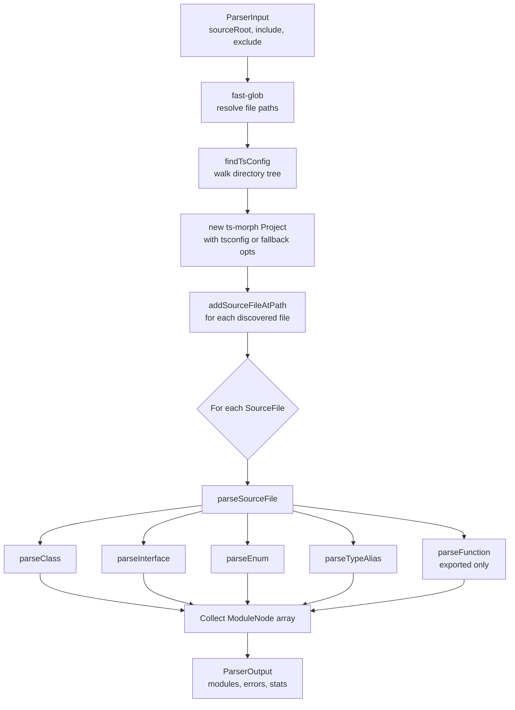

# @docgen/parser-typescript -- Technical Reference

## 1. Overview

**Package purpose:** Parses TypeScript and TSX source files using
[ts-morph](https://ts-morph.com/) and produces DocIR `ModuleNode` trees
consumable by downstream transformers and renderers.

**Where it fits:** The parse layer of the DocGen pipeline. The Orchestrator
discovers source files, invokes this parser, and receives a flat array of
`ModuleNode` objects representing every documentable declaration in the
codebase.

| Field | Value |
|---|---|
| npm package | `@docgen/parser-typescript` |
| Version | `1.0.0` |
| Entry point | `dist/index.js` |
| Source | `packages/parser-typescript/src/index.ts` (806 lines) |
| Peer dependency | `@docgen/core` (workspace) |
| Runtime deps | `ts-morph ^22.0.0`, `fast-glob` |
| Dev deps | `typescript ^5.4.0`, `vitest ^1.6.0` |
| Supported languages | `typescript`, `tsx`, `ts` |

---

## 2. Installation & Setup

```bash
npm install @docgen/parser-typescript
```

Peer dependency -- the package expects `@docgen/core` to be resolvable at
runtime:

```bash
npm install @docgen/core
```

**Runtime requirement:** Node >= 20 (enforced by the root workspace config).

No additional configuration files are required by the parser itself. It
locates the project's `tsconfig.json` automatically (see Section 8).

---

## 3. Architecture

`@docgen/parser-typescript` is a single-file implementation exporting one
class, `TypeScriptParser`, that satisfies the `ParserPlugin` contract from
`@docgen/core`.

### Key components

| Component | Role |
|---|---|
| `TypeScriptParser` class | Implements `ParserPlugin`; public API surface |
| `ts-morph` `Project` | Wraps the TypeScript compiler; provides AST nodes |
| `fast-glob` (`fg`) | Resolves include/exclude patterns to absolute file paths |
| JSDoc helpers | Family of private methods that extract doc comments |
| Type builders | Convert ts-morph `Type` objects into DocIR `TypeRef` nodes |

### Parse flow



---

## 4. Public API Reference

### TypeScriptParser class

```typescript
export class TypeScriptParser implements ParserPlugin {
  readonly manifest: PluginManifest & { type: "parser" };
  private project: Project | null;
}
```

#### `manifest` (readonly)

Static metadata describing the plugin to the loader.

```typescript
{
  name: "@docgen/parser-typescript",
  version: "1.0.0",
  type: "parser",
  description: "Parses TypeScript/TSX files using ts-morph",
  supports: ["typescript", "tsx", "ts"],
}
```

#### `initialize(config: PluginConfig): Promise<void>`

No-op. The ts-morph `Project` is created fresh inside each `parse()` call
so that it always reflects the correct `tsconfig.json` for the target source
root. Accepting and discarding `config` satisfies the plugin contract.

#### `validate(): Promise<PluginValidationResult>`

Always returns `{ valid: true, errors: [], warnings: [] }`. The parser has
no external dependencies that could be missing at validation time; ts-morph
is bundled as a direct dependency.

#### `cleanup(): Promise<void>`

Sets `this.project` to `null`, releasing the ts-morph Project and its
in-memory SourceFile graph. Should be called by the Orchestrator after
parsing completes.

#### `parse(input: ParserInput): Promise<ParserOutput>`

**Main entry point.** Performs end-to-end parsing of all TypeScript/TSX files
matched by `input.include` / `input.exclude` globs rooted at
`input.sourceRoot`.

**Algorithm:**

1. Map `input.include` patterns to absolute paths via `fast-glob`.
2. Locate the nearest `tsconfig.json` (or `tsconfig.base.json`) by walking
   up from `sourceRoot`.
3. Create a `ts-morph` `Project`, either backed by the discovered tsconfig
   or using fallback compiler options `{ strict: true, target: 99, module: 99 }`.
4. Add every discovered file to the Project.
5. Iterate source files; call `parseSourceFile` for each.
6. Catch per-file errors and push them into the `errors` array (non-fatal).
7. Build and return `ParseStats` with timing information.

**Returns:**

```typescript
{
  modules: ModuleNode[];   // All discovered declarations
  errors: ParseError[];    // Per-file parse failures
  stats: ParseStats;       // filesScanned, filesParsed, modulesFound, membersFound, parseTimeMs
}
```

---

### File-Level Parsing

#### `parseSourceFile(sourceFile: SourceFile, sourceRoot: string): ModuleNode[]`

**Private.** Dispatches the contents of one source file to type-specific
declaration parsers.

Iterates over:

1. `sourceFile.getClasses()` -- each produces one `ModuleNode` via `parseClass`.
2. `sourceFile.getInterfaces()` -- each via `parseInterface`.
3. `sourceFile.getEnums()` -- each via `parseEnum`.
4. `sourceFile.getTypeAliases()` -- each via `parseTypeAlias`.
5. `sourceFile.getFunctions()` -- **only exported functions** via
   `parseFunction` (guarded by `func.isExported()`).

`filePath` is computed as the relative path from `sourceRoot` to the
SourceFile's absolute path and threaded to every sub-parser for ID
construction.

---

### Declaration Parsers

Each declaration parser accepts a ts-morph AST node and a relative
`filePath`, and returns a complete `ModuleNode`.

---

#### `parseClass(cls: ClassDeclaration, filePath: string): ModuleNode`

Parses a class declaration into a `ModuleNode` with kind `"class"` or
`"abstract-class"`.

**Members extracted:**

| Source | Parser called |
|---|---|
| `cls.getConstructors()` | `parseConstructor` |
| `cls.getMethods()` | `parseMethod` |
| `cls.getProperties()` | `parseProperty` |
| `cls.getGetAccessors()` | `parseAccessor(_, "getter")` |
| `cls.getSetAccessors()` | `parseAccessor(_, "setter")` |

**Additional fields populated:**

- `dependencies` via `extractDependencies(cls)` -- captures `extends`,
  `implements`, and constructor-injection parameters.
- `decorators` via `extractDecorators(cls)`.
- `generics` via `extractGenerics(cls)`.
- `extends` from `cls.getExtends()?.getText()`.
- `implements` from `cls.getImplements().map(i => i.getText())`.
- `exported` from `cls.isExported()`.

**Example input:**

```typescript
/** A user entity. */
@Entity()
export abstract class BaseUser<T extends Role> extends EventEmitter implements Serializable {
  constructor(private db: Database) { super(); }
  async save(): Promise<void> { /* ... */ }
}
```

**Corresponding output (simplified):**

```json
{
  "id": "src.models.user.BaseUser",
  "name": "BaseUser",
  "filePath": "src/models/user.ts",
  "language": "typescript",
  "kind": "abstract-class",
  "description": "A user entity.",
  "members": [
    { "name": "constructor", "kind": "constructor", "parameters": [{ "name": "db", "type": { "name": "Database" } }] },
    { "name": "save", "kind": "method", "isAsync": true, "returnType": { "name": "Promise<void>" } }
  ],
  "dependencies": [
    { "name": "EventEmitter", "source": "extends", "kind": "inheritance" },
    { "name": "Serializable", "source": "implements", "kind": "inheritance" },
    { "name": "Database", "source": "db", "kind": "injection" }
  ],
  "decorators": [{ "name": "Entity", "arguments": {}, "raw": "@Entity()" }],
  "generics": [{ "name": "T", "constraint": { "name": "Role" } }],
  "extends": "EventEmitter",
  "implements": ["Serializable"],
  "exported": true
}
```

---

#### `parseInterface(iface: InterfaceDeclaration, filePath: string): ModuleNode`

Produces a `ModuleNode` with kind `"interface"`.

**Members:** Methods and properties are parsed inline (not delegated to
`parseMethod`/`parseProperty`) because interface members lack visibility
modifiers and other class-specific flags:

- All methods get `visibility: "public"`, `isStatic: false`,
  `isAsync: false`, `isAbstract: false`.
- All properties get `visibility: "public"`, `isStatic: false`.
- `signature` is set to the raw text of the member node (`method.getText()` / `prop.getText()`).
- `decorators` is always `[]` (interfaces do not support decorators).

**Extends handling:** If the interface extends other interfaces, the `extends`
field is a comma-separated string of all extended types:

```typescript
extends: iface.getExtends().length > 0
  ? iface.getExtends().map(e => e.getText()).join(", ")
  : undefined
```

**Dependencies:** Always `[]` (no dependency extraction for interfaces).

**Example input:**

```typescript
/** Options for the HTTP client. */
export interface HttpOptions {
  /** Base URL for all requests. */
  baseUrl: string;
  timeout?: number;
  retry(count: number): boolean;
}
```

**Corresponding output (simplified):**

```json
{
  "id": "src.http.HttpOptions",
  "name": "HttpOptions",
  "kind": "interface",
  "members": [
    { "name": "baseUrl", "kind": "property", "description": "Base URL for all requests.", "returnType": { "name": "string" } },
    { "name": "timeout", "kind": "property", "returnType": { "name": "number" } },
    { "name": "retry", "kind": "method", "parameters": [{ "name": "count", "type": { "name": "number" } }], "returnType": { "name": "boolean" } }
  ]
}
```

**Limitation:** Interface call signatures and index signatures are not
extracted.

---

#### `parseEnum(enumDecl: EnumDeclaration, filePath: string): ModuleNode`

Produces a `ModuleNode` with kind `"enum"`.

Each enum member becomes a `MemberNode` with:

- `kind`: `"enum-member"`
- `visibility`: `"public"`
- `isStatic`: `true`
- `signature`: the raw text of the member (e.g., `Red = "RED"`)
- `description`: extracted from the member's JSDoc (if any)

**Not extracted:** `generics`, `dependencies`, `decorators` (all `[]`).

**Example input:**

```typescript
/** HTTP status codes. */
export enum HttpStatus {
  /** Success */
  OK = 200,
  NOT_FOUND = 404,
}
```

**Corresponding output (simplified):**

```json
{
  "id": "src.constants.HttpStatus",
  "name": "HttpStatus",
  "kind": "enum",
  "description": "HTTP status codes.",
  "members": [
    { "name": "OK", "kind": "enum-member", "isStatic": true, "signature": "OK = 200", "description": "Success" },
    { "name": "NOT_FOUND", "kind": "enum-member", "isStatic": true, "signature": "NOT_FOUND = 404" }
  ]
}
```

---

#### `parseTypeAlias(typeAlias: TypeAliasDeclaration, filePath: string): ModuleNode`

Produces a `ModuleNode` with kind `"type-alias"`.

Has **no members** -- the `members` array is always empty. The type alias
body is captured only through the `description` (from JSDoc) and `generics`.

**Example input:**

```typescript
/** A callback that receives events. */
export type EventHandler<T extends Event> = (event: T) => void;
```

**Corresponding output (simplified):**

```json
{
  "id": "src.types.EventHandler",
  "name": "EventHandler",
  "kind": "type-alias",
  "description": "A callback that receives events.",
  "members": [],
  "generics": [{ "name": "T", "constraint": { "name": "Event" } }]
}
```

**Limitation:** The actual type body (right-hand side of the `=`) is not
stored as a dedicated field; only JSDoc captures it.

---

#### `parseFunction(func: FunctionDeclaration, filePath: string): ModuleNode`

Produces a `ModuleNode` with kind `"function"`. **Only invoked for exported
functions** (the `isExported()` guard is in `parseSourceFile`).

The function is represented as a module with a **single member** of kind
`"method"` carrying the full signature, parameters, return type, throws, and
examples. This design allows the downstream renderer to treat it uniformly
with class methods.

```typescript
members: [{
  name,
  kind: "method",
  visibility: "public",
  isAsync: func.isAsync(),
  signature: this.buildFunctionSignature(func),
  parameters: this.extractParameters(func.getParameters()),
  returnType: this.buildTypeRef(func.getReturnType()),
  throws: this.extractThrows(func),
  examples: this.extractExamples(func),
  tags: this.extractTags(func),
  // ...
}]
```

The module-level `description`, `tags`, and `examples` are duplicated from
the function's JSDoc (the same `func` node is read twice).

---

### Member Parsers

#### `parseMethod(method: MethodDeclaration): MemberNode`

Full-featured method parser used for class methods.

| Field | Source |
|---|---|
| `name` | `method.getName()` |
| `kind` | `"method"` |
| `visibility` | `getVisibility(method)` (maps `Scope` to `Visibility`) |
| `isStatic` | `method.isStatic()` |
| `isAsync` | `method.isAsync()` |
| `isAbstract` | `method.isAbstract()` |
| `signature` | `buildMethodSignature(method)` |
| `parameters` | `extractParameters(method.getParameters())` |
| `returnType` | `buildTypeRef(method.getReturnType())` |
| `throws` | `extractThrows(method)` |
| `deprecated` | `extractDeprecation(method)` |
| `since` | `extractTagValue(method, "since")` |
| `examples` | `extractExamples(method)` |
| `tags` | `extractTags(method)` |
| `decorators` | `extractDecorators(method)` |
| `overrides` | `"parent"` if `method.hasOverrideKeyword()`, else `undefined` |
| `lineNumber` | `method.getStartLineNumber()` |

---

#### `parseProperty(prop: PropertyDeclaration): MemberNode`

| Field | Source |
|---|---|
| `name` | `prop.getName()` |
| `kind` | `"property"` |
| `visibility` | `getVisibility(prop)` |
| `isStatic` | `prop.isStatic()` |
| `isAbstract` | `prop.isAbstract()` |
| `signature` | `prop.getText()` (full property declaration text) |
| `returnType` | `buildTypeRef(prop.getType())` |
| `deprecated` | `extractDeprecation(prop)` |
| `since` | `extractTagValue(prop, "since")` |
| `decorators` | `extractDecorators(prop)` |

`parameters` is always `[]`. `throws` is always `[]`. `isAsync` is always
`false`.

---

#### `parseConstructor(ctor: ConstructorDeclaration): MemberNode`

| Field | Value / Source |
|---|---|
| `name` | `"constructor"` (literal) |
| `kind` | `"constructor"` |
| `visibility` | `getVisibility(ctor)` |
| `isStatic` | `false` |
| `signature` | `constructor(param1: Type1, param2: Type2)` |
| `parameters` | `extractParameters(ctor.getParameters())` |
| `returnType` | `null` |

Signature is built inline by joining parameter texts:

```typescript
`constructor(${ctor.getParameters().map(p => p.getText()).join(", ")})`
```

`deprecated`, `throws`, `decorators` are all set to their zero-values (`null`,
`[]`, `[]`).

---

#### `parseAccessor(accessor, kind: "getter" | "setter"): MemberNode`

Handles both `GetAccessorDeclaration` and `SetAccessorDeclaration`.

| Field | Getter | Setter |
|---|---|---|
| `kind` | `"getter"` | `"setter"` |
| `parameters` | `[]` | Setter's parameters via `extractParameters` |
| `returnType` | `buildTypeRef(accessor.getType())` | `null` |
| `signature` | Text up to opening brace, trimmed | Same |

The signature is computed as:

```typescript
accessor.getText().split("{")[0].trim()
```

---

### JSDoc Extraction

#### `getJsDocs(node: Node): JSDoc[]`

Safely retrieves JSDoc nodes from any ts-morph AST node. Checks at runtime
whether the node has a `getJsDocs` method (duck-typing) because not all Node
subtypes expose it.

```typescript
if ("getJsDocs" in node && typeof (node as any).getJsDocs === "function") {
  return (node as any).getJsDocs() as JSDoc[];
}
return [];
```

---

#### `extractDescription(node: Node): string`

Returns the concatenated description text from all JSDoc blocks on the node.
Multiple JSDoc blocks are joined with `"\n\n"`. Empty descriptions are
filtered out. Returns `""` if the node has no JSDoc.

---

#### `extractTags(node: Node): DocTag[]`

Collects every JSDoc tag from all JSDoc blocks on the node.

Each tag becomes:

```typescript
{
  name: tag.getTagName(),     // e.g., "param", "returns", "throws"
  value: tag.getCommentText()?.trim() || "",
  raw: tag.getText(),         // full tag text including @
}
```

---

#### `extractTagValue(node: Node, tagName: string): string | undefined`

Convenience wrapper: calls `extractTags`, finds the first tag whose `name`
matches `tagName`, and returns its `value`. Returns `undefined` if no
matching tag exists.

Used for `@since` and `@deprecated` single-value tags.

---

#### `extractThrows(node: Node): ThrowsNode[]`

Filters tags for `@throws` or `@exception` (both accepted), then splits
each tag value on whitespace:

- First word becomes `ThrowsNode.type` (defaults to `"Error"` if empty).
- Remaining words become `ThrowsNode.description`.

**Example JSDoc:**

```typescript
/** @throws {ValidationError} When input is invalid */
```

**Produces:**

```json
{ "type": "ValidationError", "description": "When input is invalid" }
```

**Note:** The `{ValidationError}` braces from standard JSDoc are not
explicitly stripped; the raw comment text after the tag name is used.

---

#### `extractDeprecation(node: Node): DeprecationInfo | null`

Looks for a `@deprecated` tag. Returns `null` if absent. If present,
returns:

```typescript
{
  message: tag.value || "Deprecated",
  since: this.extractTagValue(node, "since"),
  replacement: undefined,
}
```

The `replacement` field is always `undefined`; there is no convention
parsed for it currently.

---

#### `extractExamples(node: Node): CodeExample[]`

Filters for `@example` tags and maps each to:

```typescript
{
  title: `Example ${i + 1}`,   // 1-indexed
  language: "typescript",       // always "typescript"
  code: tag.value,              // raw tag comment text
  description: undefined,
}
```

---

### Type Building

#### `buildTypeRef(type: Type): TypeRef`

Converts a ts-morph `Type` object into the DocIR `TypeRef` structure.

```typescript
{
  name: this.simplifyTypeName(text),   // import() paths removed
  raw: text,                            // original type text from ts-morph
  isArray: type.isArray(),
  isOptional: false,                    // always false (optionality tracked on ParamNode)
  isNullable: type.isNullable() || type.isUndefined(),
  generics: type.getTypeArguments().map(t => this.buildTypeRef(t)),
}
```

**Note on `generics`:** The parser uses a field named `generics` on `TypeRef`,
which corresponds to `typeArguments` in the core DocIR `TypeRef` interface.

**Recursive:** Generic type arguments are themselves converted via
`buildTypeRef`, producing a tree.

---

#### `simplifyTypeName(text: string): string`

Removes `import("...")` path prefixes that ts-morph injects for cross-file
type references.

```typescript
text.replace(/import\([^)]+\)\./g, "")
```

**Example:**

| Input | Output |
|---|---|
| `import("/src/models").User` | `User` |
| `Promise<import("./db").Connection>` | `Promise<Connection>` |

---

#### `extractParameters(params: ParameterDeclaration[]): ParamNode[]`

Maps an array of ts-morph `ParameterDeclaration` nodes to DocIR `ParamNode`
objects.

```typescript
{
  name: p.getName(),
  type: this.buildTypeRef(p.getType()),
  description: this.getParamDescription(p),
  isOptional: p.isOptional(),
  isRest: p.isRestParameter(),
  defaultValue: p.getInitializer()?.getText(),
}
```

---

#### `getParamDescription(param: ParameterDeclaration): string`

Walks up to the parameter's parent function/method, extracts all `@param`
tags, and finds the one whose `value` starts with the parameter name. Then
strips the parameter name and any leading `- ` separator from the value.

```typescript
paramTag.value.replace(new RegExp(`^${param.getName()}\\s*-?\\s*`), "")
```

Returns `""` if no matching `@param` tag is found.

---

### Generics, Decorators, Dependencies

#### `extractGenerics(node: Node): GenericParam[]`

Duck-types for a `getTypeParameters` method on the node. If present,
maps each type parameter to:

```typescript
{
  name: tp.getName(),                                          // e.g., "T"
  constraint: tp.getConstraint()
    ? this.buildTypeRef(tp.getConstraint().getType())          // e.g., TypeRef for "BaseEntity"
    : undefined,
  default: tp.getDefault()
    ? this.buildTypeRef(tp.getDefault().getType())
    : undefined,
}
```

Returns `[]` if the node does not support type parameters.

---

#### `extractDecorators(node: Node): DecoratorNode[]`

Duck-types for a `getDecorators` method on the node. For each decorator:

```typescript
{
  name: d.getName(),                     // e.g., "Controller"
  arguments: { arg0: "'/api/users'" },   // positional keyed as arg0, arg1, ...
  raw: d.getText(),                      // e.g., "@Controller('/api/users')"
}
```

Decorator arguments are stored as `Record<string, string>` with keys
`arg0`, `arg1`, etc. Each value is the raw `.getText()` of the argument AST
node, which means string arguments include their quotes.

---

#### `extractDependencies(cls: ClassDeclaration): DependencyRef[]`

Extracts three categories of dependencies from a class:

1. **Inheritance -- `extends`:**

   ```typescript
   { name: ext.getText(), source: "extends", kind: "inheritance" }
   ```

2. **Inheritance -- `implements`:**

   ```typescript
   { name: impl.getText(), source: "implements", kind: "inheritance" }
   ```

3. **Constructor injection (Angular/NestJS pattern):** For each constructor
   parameter that has a visibility scope modifier (`public`, `protected`, or
   `private`), the parser infers dependency injection:

   ```typescript
   { name: param.getType().getText(), source: param.getName(), kind: "injection" }
   ```

   A parameter is treated as DI if `param.getScope() !== undefined`.

**Limitation:** Only class declarations produce dependency information.
Interfaces, enums, type aliases, and functions always return `[]`.

---

### Helpers

#### `getVisibility(node: any): Visibility`

Maps ts-morph's `Scope` enum to DocIR's `Visibility` string:

| `Scope` | `Visibility` |
|---|---|
| `Scope.Protected` | `"protected"` |
| `Scope.Private` | `"private"` |
| Any other / missing | `"public"` |

Uses duck-typing: checks `typeof node.getScope === "function"` before
calling it.

---

#### `buildId(filePath: string, name: string): string`

Constructs a fully qualified identifier for a declaration.

1. Strip `.ts` or `.tsx` extension from `filePath`.
2. Replace all `/` and `\` with `.`.
3. Append `.{name}`.

**Examples:**

| filePath | name | Result |
|---|---|---|
| `src/models/user.ts` | `User` | `src.models.user.User` |
| `lib/index.tsx` | `App` | `lib.index.App` |

---

#### `buildMethodSignature(method: MethodDeclaration): string`

Produces a human-readable method signature string.

```
{static }{async }methodName(param1: Type1, param2: Type2): ReturnType
```

Return type is passed through `simplifyTypeName` to strip `import()` paths.

**Example:**

```
static async findById(id: string): Promise<User>
```

---

#### `buildFunctionSignature(func: FunctionDeclaration): string`

Same as `buildMethodSignature` but for standalone functions. Includes the
`function` keyword.

```
{async }function funcName(param1: Type1): ReturnType
```

**Example:**

```
async function createServer(port: number): Promise<Server>
```

---

#### `findTsConfig(sourceRoot: string): string | null`

Walks the directory tree upward from `sourceRoot` to locate a TypeScript
configuration file.

**Search order at each directory level:**

1. `tsconfig.json`
2. `tsconfig.base.json`

Stops at the filesystem root. Returns the absolute path of the first file
found, or `null` if none exists.

Uses synchronous `require("fs").accessSync(candidate)` to check file
existence.

---

## 5. Supported TypeScript Patterns

### Simple class with methods

**Input:**

```typescript
/** Manages user data. */
export class UserService {
  /** Find a user by ID.
   * @param id - The user identifier
   * @returns The user or null
   */
  findById(id: string): User | null {
    return null;
  }
}
```

**DocIR output (key fields):**

```json
{
  "id": "src.services.user.UserService",
  "kind": "class",
  "description": "Manages user data.",
  "exported": true,
  "members": [
    {
      "name": "findById",
      "kind": "method",
      "visibility": "public",
      "isAsync": false,
      "signature": "findById(id: string): User | null",
      "description": "Find a user by ID.",
      "parameters": [
        { "name": "id", "type": { "name": "string" }, "description": "The user identifier", "isOptional": false }
      ],
      "returnType": { "name": "User | null", "isNullable": true }
    }
  ]
}
```

**Limitations:** None for this basic pattern.

---

### Generic class with constraints

**Input:**

```typescript
export class Repository<T extends Entity, ID = string> {
  findAll(): T[] { return []; }
}
```

**DocIR output (key fields):**

```json
{
  "kind": "class",
  "generics": [
    { "name": "T", "constraint": { "name": "Entity" } },
    { "name": "ID", "default": { "name": "string" } }
  ]
}
```

**Limitations:** The constraint and default are stored as `TypeRef` objects
(not raw strings), so complex constraints like `T extends A & B` are
serialized through `buildTypeRef`, which may produce a simplified name.

---

### Abstract class

**Input:**

```typescript
export abstract class BaseController {
  abstract handle(req: Request): Response;
}
```

**DocIR output (key fields):**

```json
{
  "kind": "abstract-class",
  "members": [
    {
      "name": "handle",
      "kind": "method",
      "isAbstract": true
    }
  ]
}
```

**Limitations:** The core DocIR `ModuleKind` type does not include
`"abstract-class"` -- the parser extends it with this value. Renderers
should handle this gracefully.

---

### Interface with optional properties

**Input:**

```typescript
export interface Config {
  host: string;
  port?: number;
  /** Enable verbose logging. */
  verbose?: boolean;
}
```

**DocIR output (key fields):**

```json
{
  "kind": "interface",
  "members": [
    { "name": "host", "kind": "property", "signature": "host: string" },
    { "name": "port", "kind": "property", "signature": "port?: number" },
    { "name": "verbose", "kind": "property", "signature": "verbose?: boolean", "description": "Enable verbose logging." }
  ]
}
```

**Limitations:** Optionality (`?`) is visible in the `signature` text but
is not extracted as a separate boolean on the `MemberNode`. For interface
properties, `returnType.isOptional` is always `false` (the parser sets
`isOptional: false` on `TypeRef`). Optionality for function parameters
is correctly captured on `ParamNode.isOptional`.

---

### Enum (string and numeric)

**Numeric input:**

```typescript
export enum Direction {
  Up = 0,
  Down = 1,
}
```

**String input:**

```typescript
export enum Color {
  Red = "RED",
  Blue = "BLUE",
}
```

Both produce the same structure: `kind: "enum"` with members of kind
`"enum-member"`. The initializer value is captured in the `signature`
field (e.g., `Red = "RED"`). There is no separate `value` field -- the
actual enum value is only available by parsing the signature text.

---

### Type alias

**Input:**

```typescript
/** Maps event names to handler functions. */
export type EventMap = Record<string, (...args: any[]) => void>;
```

**DocIR output (key fields):**

```json
{
  "kind": "type-alias",
  "description": "Maps event names to handler functions.",
  "members": [],
  "generics": []
}
```

**Limitations:** The right-hand side of the type alias (`Record<string, ...>`)
is not captured in any field. Only the JSDoc description survives.

---

### Decorated class

**Input:**

```typescript
@Controller("/api/users")
@Injectable()
export class UserController {
  @Get("/:id")
  getUser(@Param("id") id: string): User { /* ... */ }
}
```

**DocIR output (key fields):**

```json
{
  "decorators": [
    { "name": "Controller", "arguments": { "arg0": "'/api/users'" }, "raw": "@Controller('/api/users')" },
    { "name": "Injectable", "arguments": {}, "raw": "@Injectable()" }
  ],
  "members": [
    {
      "name": "getUser",
      "decorators": [
        { "name": "Get", "arguments": { "arg0": "'/:id'" }, "raw": "@Get('/:id')" }
      ]
    }
  ]
}
```

**Limitations:** Parameter decorators (like `@Param("id")`) are not
extracted. Only class-level, method-level, property-level, and accessor-level
decorators are captured.

---

### Async methods

**Input:**

```typescript
export class DataService {
  async fetchData(url: string): Promise<Data> { /* ... */ }
}
```

**DocIR output (key fields):**

```json
{
  "members": [
    {
      "name": "fetchData",
      "isAsync": true,
      "signature": "async fetchData(url: string): Promise<Data>",
      "returnType": {
        "name": "Promise<Data>",
        "generics": [{ "name": "Data" }]
      }
    }
  ]
}
```

---

### Constructor parameter properties

**Input:**

```typescript
export class AppService {
  constructor(
    private readonly configService: ConfigService,
    public logger: Logger
  ) {}
}
```

**DocIR output (key fields):**

```json
{
  "members": [
    {
      "name": "constructor",
      "kind": "constructor",
      "signature": "constructor(private readonly configService: ConfigService, public logger: Logger)"
    }
  ],
  "dependencies": [
    { "name": "ConfigService", "source": "configService", "kind": "injection" },
    { "name": "Logger", "source": "logger", "kind": "injection" }
  ]
}
```

Constructor parameter properties with visibility modifiers are detected as
dependency injection references.

---

## 6. Error Handling

Parse errors are **non-fatal** and collected per-file. If `parseSourceFile`
throws for a given file, the error is caught and appended to the `errors`
array. Parsing continues with the remaining files.

### ParseError structure

```typescript
interface ParseError {
  filePath: string;    // Relative path from sourceRoot
  line: number;        // Always 0 for file-level errors
  column: number;      // Always 0 for file-level errors
  message: string;     // "Failed to parse: {original error message}"
  severity: "error";   // Always "error"
}
```

Errors that occur *within* a file's declaration parsing (e.g., a malformed
decorator) bubble up and are caught at the file level, so the entire file is
skipped rather than individual declarations.

---

## 7. Integration Guide

### How the parser is loaded by the Orchestrator

1. The Orchestrator reads `docgen.yaml` (or equivalent config) which lists
   `@docgen/parser-typescript` as a plugin.
2. The plugin loader (`loadPlugins` from `@docgen/core`) resolves the package
   via npm module resolution (`require.resolve`).
3. The default export (`TypeScriptParser`) is instantiated with `new`.
4. `initialize(config)` is called (no-op for this parser).
5. `validate()` is called (always succeeds).
6. During generation, `parse(input)` is called with a `ParserInput` object.
7. After generation completes, `cleanup()` is called to release resources.

### How ParserInput is constructed

The Orchestrator constructs `ParserInput` from the project configuration:

```typescript
interface ParserInput {
  sourceRoot: string;   // Absolute path to the source root directory
  include: string[];    // Glob patterns, e.g., ["**/*.ts", "**/*.tsx"]
  exclude: string[];    // Glob patterns, e.g., ["**/*.spec.ts", "node_modules/**"]
}
```

- `sourceRoot` comes from the `languages.typescript.sourceRoot` config key.
- `include` and `exclude` come from `languages.typescript.include` and
  `languages.typescript.exclude`.

### Registration

The parser registers itself under the languages listed in
`manifest.supports`: `["typescript", "tsx", "ts"]`. The Orchestrator matches
these against the language keys in the project configuration.

---

## 8. Internal Implementation Notes

### tsconfig.json resolution

The `findTsConfig` method walks the directory tree upward from `sourceRoot`:

```
sourceRoot/tsconfig.json
sourceRoot/tsconfig.base.json
sourceRoot/../tsconfig.json
sourceRoot/../tsconfig.base.json
...
(stops at filesystem root)
```

At each directory level, it tries `tsconfig.json` first, then
`tsconfig.base.json`. The first file that exists (checked via
`fs.accessSync`) wins.

### Fallback compiler options

When no tsconfig is found, the parser creates the ts-morph Project with
hardcoded fallback options:

```typescript
{ strict: true, target: 99, module: 99 }
```

In the TypeScript compiler API, `99` corresponds to `ScriptTarget.ESNext`
for `target` and `ModuleKind.ESNext` for `module`. This ensures maximum
language feature support even without a tsconfig.

### `skipAddingFilesFromTsConfig`

The parser always sets `skipAddingFilesFromTsConfig: true` when creating the
Project. This prevents ts-morph from loading the entire project tree
referenced by the tsconfig and ensures only the files discovered by
fast-glob are analyzed.

### File discovery via fast-glob

File discovery uses `fast-glob` with the following configuration:

```typescript
fg(patterns, {
  ignore: ignorePatterns,
  absolute: true,
  onlyFiles: true,
})
```

- `patterns` are formed by joining `input.sourceRoot` with each
  `input.include` glob.
- `ignorePatterns` are formed by joining `input.sourceRoot` with each
  `input.exclude` glob.
- All returned paths are absolute (`absolute: true`).
- Directories are excluded (`onlyFiles: true`).

### Type field mappings

The parser's internal types have minor naming differences from the core DocIR
types. These are reconciled at the boundary:

| Parser field on TypeRef | Core DocIR field |
|---|---|
| `generics` | `typeArguments` |
| `isOptional` (always `false`) | `isOptional` |

| Parser field on ModuleNode | Core DocIR field |
|---|---|
| `generics` (array of `GenericParam`) | `typeParameters` (array of `TypeParamNode`) |
| `kind: "abstract-class"` | Not in core `ModuleKind` union |

### ParseStats

Returned alongside modules and errors to provide parse-run telemetry:

```typescript
interface ParseStats {
  filesScanned: number;    // Files matched by fast-glob
  filesParsed: number;     // Files successfully added to ts-morph Project
  modulesFound: number;    // Total ModuleNode objects produced
  membersFound: number;    // Sum of all members across all modules
  parseTimeMs: number;     // Wall-clock time for the entire parse() call
}
```

### Project lifecycle

A new `ts-morph` `Project` is created on every `parse()` call and nullified
on `cleanup()`. There is no caching between parse runs. This ensures that
file system changes between runs are always reflected, at the cost of
re-parsing the entire project each time.
