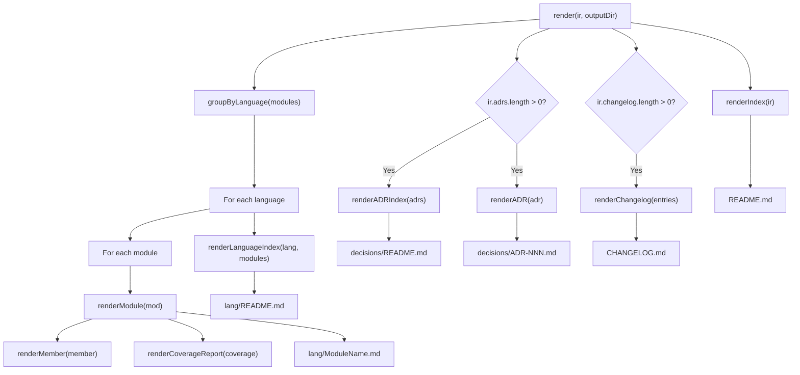

# @docgen/renderer-markdown -- Technical Reference

## 1. Overview

`@docgen/renderer-markdown` is the Markdown renderer plugin for the DocGen documentation pipeline. It consumes a fully-transformed `DocIR` (Document Intermediate Representation) and produces a tree of GitHub-flavored Markdown (GFM) files suitable for hosting directly in a GitHub repository or any Markdown-compatible documentation site.

**Where it fits:** This package sits at the **render layer** of the DocGen pipeline. The pipeline flow is:

```
Source Code --> [Parser Plugins] --> DocIR --> [Transformer Plugins] --> DocIR --> [Renderer Plugins] --> Output Files
                                                                                  ^^^^^^^^^^^^^^^^^^^
                                                                          @docgen/renderer-markdown
```

- **npm package:** `@docgen/renderer-markdown` v1.0.0
- **Single dependency:** `@docgen/core` v1.0.0
- **Source file:** `packages/renderer-markdown/src/index.ts` (603 lines, single-file implementation)
- **Export:** `MarkdownRenderer` class (named + default export)
- **Plugin type:** `renderer`
- **Supported formats:** `["markdown", "md"]`

---

## 2. Installation & Setup

Install the package alongside `@docgen/core`:

```bash
npm install @docgen/renderer-markdown @docgen/core
```

Register the renderer in your `.docgen.yaml` configuration:

```yaml
plugins:
  - "@docgen/renderer-markdown"

output:
  markdown:
    includeSourceLinks: true
    collapsibleSections: true
```

Or instantiate programmatically:

```typescript
import { MarkdownRenderer } from "@docgen/renderer-markdown";

const renderer = new MarkdownRenderer();

await renderer.initialize({
  projectConfig: resolvedConfig,
  workDir: "/path/to/repo",
  options: {
    includeSourceLinks: true,
    collapsibleSections: true,
  },
  logger: consoleLogger,
});

const result = await renderer.render(docIR, "./docs/api");
console.log(`Generated ${result.stats.filesGenerated} files`);
```

---

## 3. Architecture

### Single-File Design

The entire renderer is implemented in a single 603-line TypeScript file. There are no sub-modules, no template engine, and no external Markdown libraries. All Markdown is constructed by concatenating string arrays and joining with newline characters.

### Class Structure

`MarkdownRenderer` implements the `RendererPlugin` interface from `@docgen/core`. It exposes the standard plugin lifecycle methods (`initialize`, `validate`, `cleanup`, `render`) and contains 14 private methods that handle specific rendering concerns.

### Output Strategy

The renderer generates **one `.md` file per module**, plus index files at the root and per-language level. ADR (Architecture Decision Record) pages, a changelog, and coverage reports are generated when the corresponding data exists in the DocIR.

### File Generation Flow



---

## 4. Public API Reference

### MarkdownRenderer class

```typescript
export class MarkdownRenderer implements RendererPlugin {
  readonly manifest: PluginManifest & { type: "renderer" };
  async initialize(config: PluginConfig): Promise<void>;
  async validate(): Promise<PluginValidationResult>;
  async cleanup(): Promise<void>;
  async render(ir: DocIR, outputDir: string): Promise<RendererOutput>;
}
```

#### `manifest` property

A read-only object describing the plugin identity:

```typescript
{
  name: "@docgen/renderer-markdown",
  version: "1.0.0",
  type: "renderer",
  description: "Renders DocIR to GitHub-flavored Markdown files",
  supports: ["markdown", "md"],
}
```

#### Private Configuration

| Option               | Type      | Default | Description                                              |
|----------------------|-----------|---------|----------------------------------------------------------|
| `includeSourceLinks` | `boolean` | `true`  | Whether to show source file paths on module pages        |
| `collapsibleSections`| `boolean` | `true`  | Whether to wrap member examples in `<details>` elements  |

#### `initialize(config: PluginConfig): Promise<void>`

Reads `includeSourceLinks` and `collapsibleSections` from the plugin config if they are provided as booleans. Any non-boolean values are silently ignored, preserving the defaults.

**Source lines:** 35--42

#### `validate(): Promise<PluginValidationResult>`

Always returns `{ valid: true, errors: [], warnings: [] }`. The Markdown renderer has no external dependencies or system requirements to validate.

**Source lines:** 44--46

#### `cleanup(): Promise<void>`

No-op. The renderer holds no persistent resources, file handles, or connections.

**Source line:** 48

#### `render(ir: DocIR, outputDir: string): Promise<RendererOutput>`

The primary entry point. Orchestrates all file generation and returns a complete manifest of generated files with statistics.

**Execution flow:**

1. Creates the output directory recursively via `fs.mkdirSync`.
2. Generates the root `README.md` via `renderIndex()`.
3. Groups modules by language via `groupByLanguage()`.
4. For each language group: creates a language subdirectory, generates the language index via `renderLanguageIndex()`, and generates one module page per module via `renderModule()`.
5. If ADRs are present: creates a `decisions/` directory, generates the ADR index via `renderADRIndex()`, and generates one page per ADR via `renderADR()`.
6. If changelog entries are present: generates `CHANGELOG.md` via `renderChangelog()`.
7. Computes total byte size across all files via `Buffer.byteLength`.
8. Returns the `RendererOutput` with file list and stats.

**Return value:**

```typescript
{
  files: OutputFile[],         // Array of { path, content, encoding }
  stats: {
    filesGenerated: number,    // Total count of .md files written
    totalSizeBytes: number,    // Sum of all file sizes in bytes
    renderTimeMs: number,      // Wall-clock render duration
  }
}
```

**Source lines:** 50--135

---

### Index Generation

#### `renderIndex(ir: DocIR): string` (private)

Generates the root `README.md` file -- the main entry point for all generated documentation.

**Sections produced (in order):**

1. **Title** -- `# {project name} -- API Documentation`
2. **Description** -- Blockquote of `metadata.description` (if set)
3. **Badges row** -- Three shields.io badges:
   - Version badge (blue): `version-{version}-blue`
   - Coverage badge (color depends on average): `doc_coverage-{avg}%-{color}`
   - Languages badge (informational): `languages-{lang1 | lang2}-informational`
4. **Overview table** -- Metrics table with module count, member count, languages, doc coverage percentage, and generation date
5. **API Reference section** -- For each language, a table of modules with columns: Module (linked), Kind, Coverage (badge), Description (truncated to 80 chars)
6. **Architecture Decisions link** -- If ADRs exist, a link to `./decisions/README.md` with count
7. **Changelog link** -- If changelog entries exist, a link to `./CHANGELOG.md`
8. **Footer** -- Horizontal rule and "Generated by DocGen" attribution

**Coverage color logic for the badge:**
- `>=80` -> `brightgreen`
- `>=60` -> `yellow`
- `<60` -> `red`

**Sample DocIR input:**

```typescript
const ir: DocIR = {
  metadata: {
    name: "my-api",
    version: "2.1.0",
    description: "REST API for user management",
    languages: ["typescript", "python"],
    generatedAt: "2026-01-15T10:30:00Z",
    generatorVersion: "1.0.0",
  },
  modules: [
    {
      name: "UserService",
      kind: "class",
      language: "typescript",
      description: "Handles user CRUD operations and authentication flows.",
      coverage: { total: 85, breakdown: { /* ... */ }, undocumented: [] },
      members: [/* 3 members */],
      /* ... other fields */
    },
  ],
  adrs: [],
  changelog: [],
  readme: null,
};
```

**Generated Markdown (abbreviated):**

```markdown
# my-api -- API Documentation

> REST API for user management

  

## Overview

| Metric | Value |
|--------|-------|
| **Modules** | 1 |
| **Members** | 3 |
| **Languages** | typescript, python |
| **Doc Coverage** | 85% |
| **Generated** | 1/15/2026 |

## API Reference

### TypeScript

| Module | Kind | Coverage | Description |
|--------|------|----------|-------------|
| [`UserService`](./typescript/UserService.md) | class |  | Handles user CRUD operations and authentication flows. |

---
*Generated by [DocGen](https://github.com/docgen/docgen) v2.1.0*
```

**GitHub rendering:** Displays as a polished project documentation landing page with colored shields.io badges rendered inline, a formatted statistics table, and clickable links to each module page organized by language.

**Source lines:** 139--210

---

#### `renderLanguageIndex(language: string, modules: ModuleNode[]): string` (private)

Generates a per-language `README.md` file that groups modules by their `kind` field.

**Sections produced:**

1. **Title** -- `# {Language Name} API Reference`
2. **Back link** -- `[<- Back to Index](../README.md)`
3. **Per-kind sections** -- For each distinct `ModuleKind` found among the modules, a heading using `pluralize()` and a table with columns: Name (linked), Coverage (badge), Description (truncated to 100 chars)

**Sample DocIR input:**

```typescript
const modules: ModuleNode[] = [
  { name: "UserService", kind: "class", coverage: { total: 90 }, description: "User management service" },
  { name: "AuthService", kind: "class", coverage: { total: 75 }, description: "Authentication service" },
  { name: "Serializable", kind: "interface", coverage: { total: 60 }, description: "Serialization contract" },
];
```

**Generated Markdown:**

```markdown
# TypeScript API Reference

[<- Back to Index](../README.md)

## Classes

| Name | Coverage | Description |
|------|----------|-------------|
| [`UserService`](./UserService.md) |  | User management service |
| [`AuthService`](./AuthService.md) |  | Authentication service |

## Interfaces

| Name | Coverage | Description |
|------|----------|-------------|
| [`Serializable`](./Serializable.md) |  | Serialization contract |
```

**GitHub rendering:** A clean table of contents page for a language, with modules grouped under headings like "Classes", "Interfaces", "Enums", etc. Coverage badges render as colored images inline in the table.

**Source lines:** 212--242

---

### Module Rendering

#### `renderModule(mod: ModuleNode): string` (private)

Generates a complete documentation page for a single module (class, interface, or enum). This is the most complex rendering method.

**Sections produced (in order):**

1. **Title** -- `# {Class|Interface|Enum} \`{name}\`` (kind is mapped: `interface`->"Interface", `enum`->"Enum", everything else->"Class")
2. **Back link** -- `[<- Back to {Language} Index](./README.md)`
3. **Metadata badges** -- Kind badge (blue), coverage badge, exported badge (green, if applicable)
4. **Source link** -- `**Source:** \`{filePath}\`` (only when `includeSourceLinks` is `true`)
5. **Description** -- Full module description text
6. **Type Parameters** -- Bulleted list of generic type params with constraints and defaults
7. **Inheritance** -- `**Extends:** \`{parent}\`` and `**Implements:** \`{iface1}\`, \`{iface2}\``
8. **Decorators** -- Bulleted list of raw decorator strings
9. **Members TOC table** -- Table of public/protected members with columns: Name (anchor-linked), Kind, Description (truncated to 80 chars). Deprecated members get a warning emoji.
10. **Detailed member sections** -- Full rendering of each public/protected member via `renderMember()`
11. **Documentation Coverage** -- Coverage report via `renderCoverageReport()`
12. **Examples** -- Code blocks with optional title and description

**Member filtering:** Only members with `visibility` of `"public"` or `"protected"` are included. Private members are excluded from the output.

**Anchor generation:** Member names are lowercased and all non-alphanumeric characters are replaced with hyphens for the anchor link.

**Sample DocIR input:**

```typescript
const mod: ModuleNode = {
  name: "UserService",
  kind: "class",
  language: "typescript",
  filePath: "src/services/UserService.ts",
  description: "Provides user management operations including CRUD and authentication.",
  exported: true,
  generics: [{ name: "T", constraint: { name: "BaseEntity" }, default: null }],
  extends: "BaseService",
  implements: ["Cacheable", "Loggable"],
  decorators: [{ raw: "@Injectable({ scope: 'singleton' })", name: "Injectable", arguments: {} }],
  members: [/* ... */],
  coverage: { total: 85, breakdown: { /* ... */ }, undocumented: [] },
  examples: [{
    title: "Basic usage",
    language: "typescript",
    code: "const svc = new UserService<User>();\nconst user = await svc.findById('123');",
    description: "Create a service instance and fetch a user."
  }],
  tags: [],
  dependencies: [],
  typeParameters: [],
};
```

**Generated Markdown (abbreviated):**

```markdown
# Class `UserService`

[<- Back to TypeScript Index](./README.md)

  

**Source:** `src/services/UserService.ts`

Provides user management operations including CRUD and authentication.

**Type Parameters:**

- `T` extends `BaseEntity`

**Extends:** `BaseService`

**Implements:** `Cacheable`, `Loggable`

**Decorators:**

- `@Injectable({ scope: 'singleton' })`

## Members

| Name | Kind | Description |
|------|------|-------------|
| [`findById`](#findbyid) | method | Retrieves a user by their unique identifier. |

---

### `findById`
...

## Documentation Coverage

**Overall: 85%** ████████░░

...

## Examples

### Basic usage

Create a service instance and fetch a user.

\`\`\`typescript
const svc = new UserService<User>();
const user = await svc.findById('123');
\`\`\`
```

**GitHub rendering:** A full API reference page for a single class/interface/enum. Badges render as colored pills at the top. The members TOC provides quick navigation via anchor links. Code examples render with syntax highlighting.

**Source lines:** 246--360

---

### Member Rendering

#### `renderMember(member: MemberNode): string[]` (private)

Renders a single member (method, property, constructor, etc.) as a section within a module page. Returns an array of lines (not a joined string) so the caller can integrate it into the module page.

**Sections produced (in order):**

1. **Header** -- `### {modifiers} \`{name}\`` where modifiers are italicized and include: `static`, `async`, `abstract`, and visibility (if not `public`)
2. **Deprecation warning** -- Blockquote with warning emoji, deprecation message, and optional replacement suggestion
3. **Code signature** -- TypeScript fenced code block containing the full signature string
4. **Description** -- Member description text
5. **Parameters table** -- Table with columns: Name, Type, Required (Yes/No based on `isOptional`), Description (falls back to default value display or em-dash)
6. **Return type** -- `**Returns:** \`{type}\`` with optional `@returns`/`@return` tag description appended
7. **Throws list** -- Bulleted list of exception types and descriptions
8. **Examples** -- Code blocks wrapped in `<details><summary>Examples</summary>` when `collapsibleSections` is `true`; rendered flat when `false`

**Modifier prefix logic:**

The method builds a modifier list in this order: `static` -> `async` -> `abstract` -> `{visibility}` (only if not `public`). These are joined with spaces and wrapped in Markdown italics (`*...*`).

**Return type filtering:** The return type section is only rendered when `returnType` exists and its `name` is not `"void"`.

**Sample DocIR input:**

```typescript
const member: MemberNode = {
  name: "findById",
  kind: "method",
  visibility: "public",
  isStatic: false,
  isAsync: true,
  isAbstract: false,
  signature: "async findById(id: string): Promise<User | null>",
  description: "Retrieves a user by their unique identifier.",
  parameters: [
    {
      name: "id",
      type: { name: "string", raw: "string", isArray: false, isNullable: false, isUnion: false },
      description: "The unique user identifier",
      isOptional: false,
      isRest: false,
    },
  ],
  returnType: { name: "Promise<User | null>", raw: "Promise<User | null>", isArray: false, isNullable: true, isUnion: false },
  throws: [
    { type: "NotFoundError", description: "When no user matches the given ID" },
  ],
  tags: [
    { tag: "returns", name: "returns", description: "The user if found, or null", type: "" },
  ],
  examples: [
    { language: "typescript", code: "const user = await svc.findById('abc-123');", title: undefined, description: undefined },
  ],
  deprecated: null,
  decorators: [],
};
```

**Generated Markdown:**

```markdown
### *async* `findById`

\`\`\`typescript
async findById(id: string): Promise<User | null>
\`\`\`

Retrieves a user by their unique identifier.

**Parameters:**

| Name | Type | Required | Description |
|------|------|----------|-------------|
| `id` | `string` | Yes | The unique user identifier |

**Returns:** `Promise<User | null>`
-- The user if found, or null

**Throws:**

- `NotFoundError` -- When no user matches the given ID

<details>
<summary>Examples</summary>

\`\`\`typescript
const user = await svc.findById('abc-123');
\`\`\`

</details>
```

**GitHub rendering:** Each member appears as an H3 section. The modifier prefix ("async", "static", etc.) renders in italics before the monospaced member name. The code signature renders in a syntax-highlighted block. The parameters table renders as a formatted table. The examples section renders as a collapsible disclosure widget that users can expand.

**Deprecated member example:**

```typescript
const deprecatedMember: MemberNode = {
  name: "getUser",
  deprecated: { message: "Use findById instead.", replacement: "findById", since: "1.2.0" },
  // ...other fields
};
```

**Generated Markdown for deprecation:**

```markdown
### `getUser`

> :warning: **Deprecated:** Use findById instead.
> Use `findById` instead.

\`\`\`typescript
getUser(name: string): User
\`\`\`
```

**GitHub rendering:** The deprecation warning renders as a blockquote with a yellow warning emoji, making it visually prominent.

**Source lines:** 364--456

---

### ADR Rendering

#### `renderADRIndex(adrs: DocIR["adrs"]): string` (private)

Generates the `decisions/README.md` file containing a summary table of all Architecture Decision Records.

**Sections produced:**

1. **Title** -- `# Architecture Decision Records`
2. **Back link** -- `[<- Back to Index](../README.md)`
3. **Summary table** -- Columns: ID (linked to individual ADR page), Title, Status (with emoji), Date

**Status emoji mapping:**

| Status       | Emoji |
|-------------|-------|
| `accepted`   | `+`   |
| `proposed`   | clipboard |
| `deprecated` | warning |
| `superseded` | arrows  |
| `rejected`   | `x`    |

**Sample DocIR input:**

```typescript
const adrs = [
  { id: "ADR-001", title: "Use PostgreSQL for persistence", status: "accepted", date: "2025-06-01" },
  { id: "ADR-002", title: "Adopt event sourcing", status: "proposed", date: "2025-07-15" },
  { id: "ADR-003", title: "Replace REST with GraphQL", status: "rejected", date: "2025-08-20" },
];
```

**Generated Markdown:**

```markdown
# Architecture Decision Records

[<- Back to Index](../README.md)

| ID | Title | Status | Date |
|----|-------|--------|------|
| [ADR-001](./ADR-001.md) | Use PostgreSQL for persistence | ✅ accepted | 2025-06-01 |
| [ADR-002](./ADR-002.md) | Adopt event sourcing | 📋 proposed | 2025-07-15 |
| [ADR-003](./ADR-003.md) | Replace REST with GraphQL | ❌ rejected | 2025-08-20 |
```

**GitHub rendering:** A clean table with clickable ADR IDs linking to detail pages. Status emojis render as colored icons providing immediate visual scanning of decision states.

**Source lines:** 460--473

---

#### `renderADR(adr: DocIR["adrs"][0]): string` (private)

Generates an individual ADR page with the full decision record.

**Sections produced:**

1. **Title** -- `# {id}: {title}`
2. **Metadata** -- Status, date, and authors (if any) as bold labels with trailing `  ` for line breaks
3. **Context** -- `## Context` section with the ADR context text
4. **Decision** -- `## Decision` section with the ADR decision text
5. **Consequences** -- `## Consequences` section with the ADR consequences text

Empty strings are filtered from the output via `.filter((l) => l !== undefined)`.

**Sample DocIR input:**

```typescript
const adr = {
  id: "ADR-001",
  title: "Use PostgreSQL for persistence",
  status: "accepted",
  date: "2025-06-01",
  authors: ["Jane Doe", "John Smith"],
  context: "We need a relational database that supports JSON columns and full-text search.",
  decision: "We will use PostgreSQL 15+ as our primary data store.",
  consequences: "Team needs PostgreSQL expertise. Migration from SQLite required.",
};
```

**Generated Markdown:**

```markdown
# ADR-001: Use PostgreSQL for persistence

**Status:** accepted
**Date:** 2025-06-01
**Authors:** Jane Doe, John Smith

## Context

We need a relational database that supports JSON columns and full-text search.

## Decision

We will use PostgreSQL 15+ as our primary data store.

## Consequences

Team needs PostgreSQL expertise. Migration from SQLite required.
```

**GitHub rendering:** A standard decision record page. The metadata block renders with bold labels. Each section has a clear heading. The trailing `  ` on Status and Date lines produces Markdown line breaks, keeping the metadata block compact.

**Source lines:** 475--489

---

### Changelog Rendering

#### `renderChangelog(entries: DocIR["changelog"]): string` (private)

Generates `CHANGELOG.md` following the [Keep a Changelog](https://keepachangelog.com/) format.

**Sections produced:**

1. **Title** -- `# Changelog`
2. **Per-version sections** -- `## [{version}] -- {date}` with sub-sections for each change category

**Change categories (in order):**

| Key          | Heading       | Description                      |
|-------------|---------------|----------------------------------|
| `added`      | `### Added`    | New features                     |
| `changed`    | `### Changed`  | Changes to existing functionality |
| `deprecated` | `### Deprecated` | Features to be removed           |
| `removed`    | `### Removed`  | Removed features                 |
| `fixed`      | `### Fixed`    | Bug fixes                        |
| `security`   | `### Security` | Security-related changes         |

Only categories with at least one entry are rendered. Empty categories are skipped entirely.

**Sample DocIR input:**

```typescript
const entries = [
  {
    version: "2.1.0",
    date: "2026-01-15",
    sections: {
      added: ["User avatar upload endpoint", "Rate limiting middleware"],
      changed: ["Increased default page size from 20 to 50"],
      deprecated: [],
      removed: [],
      fixed: ["Fixed null pointer in user deletion flow"],
      security: [],
    },
  },
];
```

**Generated Markdown:**

```markdown
# Changelog

## [2.1.0] -- 2026-01-15

### Added

- User avatar upload endpoint
- Rate limiting middleware

### Changed

- Increased default page size from 20 to 50

### Fixed

- Fixed null pointer in user deletion flow
```

**GitHub rendering:** A standard changelog page. Each version is a level-2 heading. Change categories appear as level-3 headings with bulleted lists underneath. This format is widely recognized and renders cleanly on GitHub.

**Source lines:** 494--523

---

### Coverage Rendering

#### `renderCoverageReport(coverage: CoverageScore): string[]` (private)

Generates a documentation coverage report section for a module. Returns an array of lines.

**Sections produced:**

1. **Overall score** -- `**Overall: {total}%** {ASCII bar}` using `coverageBar()`
2. **Breakdown table** -- Table with columns: Check, Status. Each row shows a coverage criterion with a status icon:
   - Module description: checkmark if `hasDescription` is `true`, x-mark otherwise
   - Parameter docs: checkmark if `>=80%`, warning if `>=50%`, x-mark otherwise, with percentage
   - Return type docs: checkmark/x-mark based on `returnCovered`
   - Throws docs: checkmark/x-mark based on `throwsCovered`
   - Examples: checkmark/x-mark based on `hasExamples`
3. **Undocumented list** -- If `coverage.undocumented` is non-empty, a bulleted list of undocumented member names in code formatting

**Sample DocIR input:**

```typescript
const coverage: CoverageScore = {
  total: 72,
  breakdown: {
    hasDescription: true,
    paramsCovered: 65,
    returnCovered: true,
    throwsCovered: false,
    hasExamples: false,
  },
  undocumented: ["internalHelper", "parseConfig"],
};
```

**Generated Markdown:**

```markdown
**Overall: 72%** ███████░░░

| Check | Status |
|-------|--------|
| Module description | ✅ |
| Parameter docs | ⚠️ 65% |
| Return type docs | ✅ |
| Throws docs | ❌ |
| Examples | ❌ |

**Undocumented:**

- `internalHelper`
- `parseConfig`
```

**GitHub rendering:** The ASCII bar provides a quick visual gauge of coverage (filled block characters vs empty blocks). The table renders with emoji icons for instant status scanning. Undocumented members are listed in monospace for easy identification.

**Source lines:** 527--552

---

#### `coverageBadge(score: number): string` (private)

Returns a shields.io Markdown image badge for a coverage percentage.

**Color thresholds:**

| Score Range  | Color         | Example Badge URL                                                       |
|-------------|---------------|-------------------------------------------------------------------------|
| `>= 80`     | `brightgreen` | `https://img.shields.io/badge/coverage-85%25-brightgreen`               |
| `>= 60`     | `yellow`      | `https://img.shields.io/badge/coverage-72%25-yellow`                    |
| `< 60`      | `red`         | `https://img.shields.io/badge/coverage-45%25-red`                       |

**Returns:** A Markdown image string, e.g., ``

**Source lines:** 589--593

---

#### `coverageBar(score: number): string` (private)

Generates a 10-character ASCII progress bar using Unicode block characters.

**Logic:** Divides the score by 10 and rounds to determine filled positions. Uses `█` (U+2588 FULL BLOCK) for filled segments and `░` (U+2591 LIGHT SHADE) for empty segments.

**Examples:**

| Score | Output          |
|-------|-----------------|
| `100` | `██████████`    |
| `85`  | `█████████░`    |
| `72`  | `███████░░░`    |
| `50`  | `█████░░░░░`    |
| `0`   | `░░░░░░░░░░`    |

**Source lines:** 595--599

---

### Helpers

#### `groupByLanguage(modules: ModuleNode[]): Map<string, ModuleNode[]>` (private)

Groups an array of `ModuleNode` objects by their `language` field into a `Map`. Iteration order follows insertion order (first occurrence of each language).

**Parameters:**
- `modules` -- Array of `ModuleNode` objects

**Returns:** `Map<string, ModuleNode[]>` keyed by language string

**Source lines:** 556--564

---

#### `formatLanguageName(lang: string): string` (private)

Maps internal language identifiers to human-readable display names.

**Mapping:**

| Input          | Output         |
|----------------|----------------|
| `"java"`       | `"Java"`       |
| `"typescript"` | `"TypeScript"` |
| `"python"`     | `"Python"`     |
| (other)        | Returns the input string unchanged |

**Source lines:** 566--573

---

#### `pluralize(kind: string): string` (private)

Maps `ModuleKind` values to their plural display names for use in section headings.

**Mapping:**

| Input             | Output              |
|-------------------|---------------------|
| `"class"`         | `"Classes"`         |
| `"abstract-class"`| `"Abstract Classes"`|
| `"interface"`     | `"Interfaces"`      |
| `"enum"`          | `"Enums"`           |
| `"module"`        | `"Modules"`         |
| `"namespace"`     | `"Namespaces"`      |
| `"function"`      | `"Functions"`       |
| `"type-alias"`    | `"Type Aliases"`    |
| (other)           | `"{kind}s"`         |

**Source lines:** 575--587

---

## 5. Output File Structure

For a project with TypeScript and Python modules, 2 ADRs, and a changelog, the renderer produces the following file tree:

```
outputDir/
├── README.md                          # Root index (renderIndex)
├── CHANGELOG.md                       # Changelog (renderChangelog)
├── typescript/
│   ├── README.md                      # TypeScript language index (renderLanguageIndex)
│   ├── UserService.md                 # Module page (renderModule)
│   ├── AuthController.md              # Module page (renderModule)
│   └── Serializable.md               # Module page (renderModule)
├── python/
│   ├── README.md                      # Python language index (renderLanguageIndex)
│   ├── DataProcessor.md               # Module page (renderModule)
│   └── ConfigManager.md              # Module page (renderModule)
└── decisions/
    ├── README.md                      # ADR index (renderADRIndex)
    ├── ADR-001.md                     # Individual ADR (renderADR)
    └── ADR-002.md                     # Individual ADR (renderADR)
```

**File naming conventions:**

- Root and language indexes are always `README.md` (rendered automatically by GitHub when browsing directories)
- Module files use the module `name` field directly: `{name}.md`
- ADR files use the ADR `id` field: `{id}.md`
- The changelog is always `CHANGELOG.md`
- Language directories use the raw language string (e.g., `typescript`, `python`, `java`)
- The ADR directory is always `decisions`

---

## 6. Rendering Examples

### renderIndex -- Full round-trip

**Input (DocIR):**

```typescript
{
  metadata: {
    name: "acme-sdk",
    version: "3.0.0",
    description: "Official SDK for the ACME platform",
    languages: ["typescript"],
    generatedAt: "2026-03-10T14:00:00Z",
    generatorVersion: "1.0.0",
  },
  modules: [
    { name: "Client", kind: "class", language: "typescript", coverage: { total: 92 }, members: [{}, {}], description: "Main API client" },
    { name: "Config", kind: "interface", language: "typescript", coverage: { total: 78 }, members: [{}], description: "Configuration options" },
  ],
  adrs: [{ id: "ADR-001", title: "Use fetch", status: "accepted" }],
  changelog: [{ version: "3.0.0" }],
}
```

**Output (README.md):**

```markdown
# acme-sdk -- API Documentation

> Official SDK for the ACME platform

  

## Overview

| Metric | Value |
|--------|-------|
| **Modules** | 2 |
| **Members** | 3 |
| **Languages** | typescript |
| **Doc Coverage** | 85% |
| **Generated** | 3/10/2026 |

## API Reference

### TypeScript

| Module | Kind | Coverage | Description |
|--------|------|----------|-------------|
| [`Client`](./typescript/Client.md) | class |  | Main API client |
| [`Config`](./typescript/Config.md) | interface |  | Configuration options |

## [Architecture Decisions](./decisions/README.md)

1 decision records documented.

## [Changelog](./CHANGELOG.md)

---
*Generated by [DocGen](https://github.com/docgen/docgen) v3.0.0*
```

**GitHub visual result:** A documentation homepage with three colored badges at the top (blue version, green coverage, teal languages). A statistics overview table. A table of modules with inline coverage badges showing green for Client (92%) and yellow for Config (78%). Links to the ADR section and changelog at the bottom.

---

### renderMember -- Deprecated static method

**Input:**

```typescript
{
  name: "fromJSON",
  kind: "method",
  visibility: "public",
  isStatic: true,
  isAsync: false,
  isAbstract: false,
  signature: "static fromJSON(json: string): Config",
  description: "Parse a Config from a JSON string.",
  parameters: [
    { name: "json", type: { name: "string" }, isOptional: false, isRest: false, description: "Raw JSON string" },
  ],
  returnType: { name: "Config" },
  throws: [{ type: "SyntaxError", description: "If the JSON is malformed" }],
  tags: [{ tag: "returns", name: "returns", description: "A validated Config instance" }],
  examples: [{ language: "typescript", code: "const cfg = Config.fromJSON('{\"timeout\": 5000}');" }],
  deprecated: { message: "Use Config.parse() for better error handling.", replacement: "Config.parse" },
}
```

**Output:**

```markdown
### *static* `fromJSON`

> ⚠️ **Deprecated:** Use Config.parse() for better error handling.
> Use `Config.parse` instead.

\`\`\`typescript
static fromJSON(json: string): Config
\`\`\`

Parse a Config from a JSON string.

**Parameters:**

| Name | Type | Required | Description |
|------|------|----------|-------------|
| `json` | `string` | Yes | Raw JSON string |

**Returns:** `Config`
-- A validated Config instance

**Throws:**

- `SyntaxError` -- If the JSON is malformed

<details>
<summary>Examples</summary>

\`\`\`typescript
const cfg = Config.fromJSON('{"timeout": 5000}');
\`\`\`

</details>
```

**GitHub visual result:** The heading shows "static" in italics followed by the method name in monospace. A yellow blockquote warning box highlights the deprecation. The signature renders in a syntax-highlighted code block. Parameters appear in a clean table. The example is hidden inside a collapsible section with a "Examples" toggle.

---

### renderChangelog -- Multiple versions

**Input:**

```typescript
[
  {
    version: "2.0.0", date: "2026-02-01",
    sections: {
      added: ["New streaming API"],
      changed: ["Renamed Client to ApiClient"],
      deprecated: ["Legacy auth methods"],
      removed: ["Support for Node 14"],
      fixed: [],
      security: ["Updated TLS configuration"],
    },
  },
  {
    version: "1.5.0", date: "2026-01-10",
    sections: {
      added: ["Retry middleware"], changed: [], deprecated: [],
      removed: [], fixed: ["Connection timeout handling"], security: [],
    },
  },
]
```

**Output:**

```markdown
# Changelog

## [2.0.0] -- 2026-02-01

### Added

- New streaming API

### Changed

- Renamed Client to ApiClient

### Deprecated

- Legacy auth methods

### Removed

- Support for Node 14

### Security

- Updated TLS configuration

## [1.5.0] -- 2026-01-10

### Added

- Retry middleware

### Fixed

- Connection timeout handling
```

**GitHub visual result:** A clean changelog following the Keep a Changelog standard. Each version has its own heading. Only non-empty change categories appear. The Fixed section is absent from v2.0.0 (no entries), and Changed/Deprecated/Removed/Security are absent from v1.5.0 (no entries).

---

### renderCoverageReport -- Low coverage module

**Input:**

```typescript
{
  total: 35,
  breakdown: {
    hasDescription: true,
    paramsCovered: 40,
    returnCovered: false,
    throwsCovered: false,
    hasExamples: false,
  },
  undocumented: ["connect", "disconnect", "handleError"],
}
```

**Output:**

```markdown
**Overall: 35%** ████░░░░░░

| Check | Status |
|-------|--------|
| Module description | ✅ |
| Parameter docs | ❌ 40% |
| Return type docs | ❌ |
| Throws docs | ❌ |
| Examples | ❌ |

**Undocumented:**

- `connect`
- `disconnect`
- `handleError`
```

**GitHub visual result:** A mostly-empty ASCII progress bar (4 filled, 6 empty). The breakdown table shows mostly red X marks with only the description passing. Three undocumented members are listed in monospace, making it easy to identify what needs documentation work.

---

## 7. Integration Guide

### Using with the DocGen Orchestrator

The standard way to use the renderer is through the DocGen orchestrator, which handles plugin loading, parsing, transformation, and rendering automatically:

```typescript
import { Orchestrator } from "@docgen/core";

const orchestrator = new Orchestrator({
  configPath: ".docgen.yaml",
  workDir: process.cwd(),
});

const result = await orchestrator.generate();
```

The orchestrator discovers `@docgen/renderer-markdown` via the plugin configuration in `.docgen.yaml`.

### Standalone Usage

For programmatic use outside the orchestrator:

```typescript
import { MarkdownRenderer } from "@docgen/renderer-markdown";
import { createEmptyDocIR } from "@docgen/core";

// Build or obtain a DocIR
const ir = createEmptyDocIR({ name: "my-project", version: "1.0.0" });
// ... populate ir.modules, ir.adrs, ir.changelog ...

// Create and configure the renderer
const renderer = new MarkdownRenderer();
await renderer.initialize({
  projectConfig: {/* ... */},
  workDir: process.cwd(),
  options: {
    includeSourceLinks: true,
    collapsibleSections: false, // Flat examples instead of collapsible
  },
  logger: console,
});

// Validate (always succeeds for this renderer)
const validation = await renderer.validate();

// Render
const output = await renderer.render(ir, "./docs/api");

console.log(`Files: ${output.stats.filesGenerated}`);
console.log(`Size: ${(output.stats.totalSizeBytes / 1024).toFixed(1)} KB`);
console.log(`Time: ${output.stats.renderTimeMs}ms`);

// Cleanup (no-op for this renderer)
await renderer.cleanup();
```

### Configuration Options

Add renderer-specific options under the `output.markdown` key in `.docgen.yaml`:

```yaml
output:
  markdown:
    # Show source file paths on module pages (default: true)
    includeSourceLinks: true

    # Wrap member examples in collapsible <details> sections (default: true)
    collapsibleSections: true
```

Setting `includeSourceLinks: false` is useful when generating documentation for a private repository where source paths would not be meaningful to consumers.

Setting `collapsibleSections: false` is useful when targeting documentation systems that do not support HTML `<details>` elements.

---

## 8. Internal Implementation Notes

### File I/O Strategy

The renderer uses **synchronous file I/O** via `fs.mkdirSync` and `fs.writeFileSync` for all output operations. This is a deliberate design choice: the render phase is I/O-bound by directory creation and file writes, and the synchronous API simplifies error handling since each write either succeeds or throws immediately.

- `fs.mkdirSync(dir, { recursive: true })` -- Used to create the output root, language subdirectories, and the `decisions/` directory. The `recursive` flag ensures parent directories are created as needed.
- `fs.writeFileSync(path, content, "utf-8")` -- All files are written with explicit UTF-8 encoding.

### String Construction

All Markdown content is built by pushing strings into a `string[]` array and joining with `"\n"` at the end. This avoids repeated string concatenation and makes the rendering logic readable and maintainable.

The `renderMember()` method is notable in that it returns `string[]` rather than a joined string. This allows the caller (`renderModule()`) to spread the lines into its own array with `lines.push(...this.renderMember(member))`.

### File Size Calculation

Total output size is calculated after all files are generated:

```typescript
const totalSize = files.reduce(
  (sum, f) => sum + (typeof f.content === "string" ? Buffer.byteLength(f.content) : f.content.length),
  0
);
```

This uses `Buffer.byteLength` for string content (accounting for multi-byte UTF-8 characters like emoji) and `.length` for Buffer content. This ensures accurate byte-level size reporting in the render statistics.

### Output File Paths

The `OutputFile.path` values are always **relative** to the output directory (e.g., `"typescript/UserService.md"`, `"decisions/ADR-001.md"`). The absolute paths used for `fs.writeFileSync` are constructed internally using `path.join(outputDir, ...)` but are not exposed in the return value.

### No External Template Engine

Unlike many documentation generators, this renderer does not use a template engine (Handlebars, EJS, etc.). All Markdown is generated through direct string manipulation. This eliminates template compilation overhead and external dependencies, keeping the package lightweight with only `@docgen/core` as a runtime dependency.

### Coverage Score Access

The renderer accesses coverage data through two different shapes depending on context:

- **Module-level coverage** (`mod.coverage.total`) -- Used for badges and the overview score
- **Coverage breakdown** (`coverage.breakdown`) -- Used for the detailed coverage report table, accessing boolean and percentage fields like `hasDescription`, `paramsCovered`, `returnCovered`, `throwsCovered`, and `hasExamples`

### Encoding

All output files are written with `"utf-8"` encoding. The `OutputFile` objects also carry `encoding: "utf-8"` in their metadata. This ensures correct rendering of:

- Unicode emoji characters used in status indicators (checkmarks, warning signs, etc.)
- Unicode block characters used in ASCII coverage bars
- International characters in documentation text

### ADR Author Handling

The `renderADR()` method conditionally includes the authors line only when the `authors` array is non-empty. An empty authors array results in an empty string that is filtered out by the `.filter((l) => l !== undefined)` call on the output array. This keeps the rendered page clean when author information is not available.
